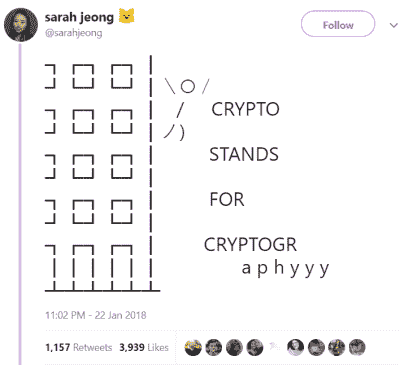
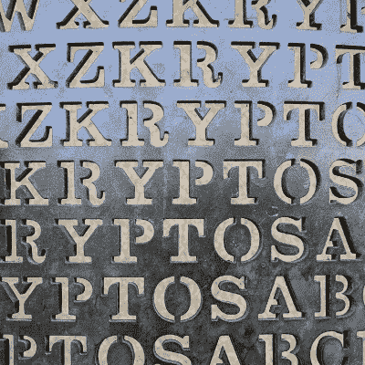

# “Crypto”实际上是什么意思？

> 原文：<https://hackaday.com/2018/04/23/what-does-crypto-actually-mean/>

这篇文章是关于加密的。它在标题和第一句话中，但主题仍然是隐藏的。

在 Hackaday，我们非常关注语言。部分原因是我们是一个纯粹基于文本的出版物，是的，但更好的原因就在刊头。这是黑客时代，十多年来，我们一直反对“黑客”只是坏演员的观点。我们一直反对在生活中使用语言，我们更成功的故事完全是关于语言的使用和滥用。

这部分是由于互联网的性质。看起来，卖弄学问是智慧的一种可接受的替代品，选择正确的词不仅仅是一个语义问题——这是一个编译器错误。一个错误的词会让所有的讨论停止。当描述基于细丝的 3D 打印机时，使用短语“熔融沉积建模”，一些人将不可避免地伸手去拿干草叉和火把；正确的说法是“熔丝制造”，RepRap 社区更喜欢这个术语，因为它在法律上不受专利的限制。这实际上是一个有趣的消息，但是描述一项技术的短语被一个商标所覆盖，而不是专利。

互联网的技术方面，或者至少是关注后门、0-days 和对 hodl 的承诺的人群，现在正处于语义十字路口。“Crypto”开始意味着“加密货币”。互联网上的网络安全和技术人员现在非常关注语言。加密货币爱好者已经篡夺了“crypto”这个词，三十年前用 DES 乱搞的人不高兴了。DH 密钥交换与用 Etherium 购买的虚拟猫没有任何关系，任何因 ICO 诈骗而损失金钱的人都不可能想出像 ROT-13 这样优雅的加密协议。

但是语言会变。现在，密码学家正在处理黑客在 90 年代遇到的同样的问题，这次没有什么比滑旱冰到吉布森更酷的事情可以依靠了。‘crypto’是指‘密码学’，还是‘crypto’是指加密货币？如果使用频率决定了正确的定义，那么快速浏览一下我电子邮件中的新闻稿就能很快发现赢家。这绝对是加密货币。然而，密码学比加密货币存在的时间要长得多。“密码”的正确定义是什么？是指密码学，还是指加密货币？

## “Crypto”是指“密码术”吗？

到目前为止,“crypto”的意思是“密码术”,最有说服力的论据来自 cryptoisnotcryptocurrency.com。争论和结论暴露在红色背景和怀疑的表情符号下。“Crypto”不是指加密货币，而是指密码术。一个到[的有用链接，谷歌搜索‘密码术’](http://lmgtfy.com/?q=cryptography)加强了这个论点。

 其他人也参与进来。《The Verge》的资深作家 sarah jeong 给出了她的观点。[‘Crypto’是‘密码术’的意思](https://twitter.com/sarahjeong/status/955651919279722496)。约翰·霍普金斯大学教授密码学的马修·格林(Matthew Green)说，这是他将死的山头(T6)。

[Lorenzo Franceschi-Bicchierai]为《主板》撰稿，[也持这种观点](https://motherboard.vice.com/en_us/article/43nk9b/cryptocurrency-are-not-crypto-bitcoin)。他写关于密码学的文章已经有几年了，甚至是[斯蒂芬·利维]2001 年的书《T3 Crypto 的粉丝。“‘Crypto’不是指加密货币。”Franceschi-Bicchierai 说，他有证据证明这一点。如果你在 Google、Merrium-Webster 甚至 OED 上搜索“crypto”这个词，只能得出一个结论:“crypto”就是“密码学”的意思。

说‘crypto’代表‘cryptography’的不仅仅是记者和密码学研究者。[Ian Miers]是康奈尔理工大学的博士后，密码学研究者，非常有趣的是，他是 Zcash(一种加密货币)的创始人之一。[他说](https://twitter.com/secparam/status/935668604779024384)， *Crypto 就是密码术的意思。即使是创造了“加密货币”这个术语的人。“这就是他们使用它的原因。什么，你真的以为加密货币是因为尼斯湖水怪才以“crypto”开头的吗？”*这是一个有效的观点，即使它确实援引了神秘动物学。

## *咳嗽*希腊词根*咳嗽*

*Antipodes* by Jim Sanborn is a famous work of cryptographic art. It makes no references to Bitcoin.

即使世界上所有的专家和记者都同意，也不代表他们是对的。“Crypto”并不意味着“cryptography”，因为“crypto”是一个前缀，可以应用于许多单词。例如,《Vice》和《Motherboard》的作者是*隐法西斯*,因为他们命令别人使用语言。*隐孢子虫*是一种寄生虫，其孢子有坚硬的外壳，使其能够留在体外，抵抗氯化作用。它可以潜伏好几个月——如果你愿意，可以说是隐藏。 *Cryptomnesia，*一个有两个希腊词根的单词，是被遗忘的记忆又被想起。

“crypto”一词来自希腊语 *kruptós* ，意思是“隐藏的”或“秘密的”。在过去的三千年里,“Crypto ”,或者不管你怎么拼写这个音节序列，都意味着隐藏的*。“Crypto”只是一个前缀。它并不意味着“密码术”，因为“密码术”意味着*隐藏的文字*,“加密货币”意味着*秘密的金钱*(或者对于那些在文化中投入最多的人来说*秘密的 Lambos* )。把它想象成英语对德语复合名词的接受；单词可以互相附加以获得新的意思。*

 *那么这篇文章是关于什么的呢？关于前缀的争论。毫无疑问，这场争论将继续下去，就像我们为黑客这个词辩护一样。但在这种情况下,“Crypto”确实意味着隐藏。从荷马时代起,“加密”就意味着隐藏，它不会因为比特币而改变。*