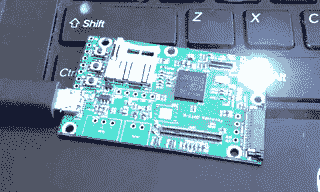

# 解锁和通话:开源引导加载程序和调制解调器

> 原文：<https://hackaday.com/2018/04/19/unlock-talk-open-source-bootloader-modem/>

在手机的早期，寿命主要受到硬件的限制(按钮磨损、手机掉落或水渍)，软件是今天手机被取代的主要原因。升级通常是由于对缓慢的手机不满意，或者制造商在最多几年后就停止更新手机软件。[奥利弗·史密斯]和 postmarketOS 项目正在努力解决更新问题，[已经开始在将定制软件加载到手机处理器和控制手机调制解调器上取得进展。](https://postmarketos.org/blog/2018/04/14/lowlevel/)

自从[汤姆·纳尔迪] [向 postmarketOS](https://hackaday.com/2018/01/09/postmarketos-saves-old-smartphones/) 推出 Hackaday 阅读器以来，该团队在为联发科片上系统(SoC)处理器编译标准引导程序方面取得了进展。许多 Android 手机使用麻省理工学院许可的[小内核](https://github.com/littlekernel/lk/wiki/Introduction)作为其引导加载程序的基础，然后应用定制的闭源修改。[McBitter]已经通过将 Little Kernel 移植到 Coolpad Modena 2 中使用的 MT6735P 来消除这种封闭源代码。通过了解联发科技用于这一特定 SoC 的修改，postmarketOS 团队希望将他们修改的开源小内核引导程序用于其他基于联发科技的设备。虽然进展艰难，并且使用仿真器探测引导加载程序内存的尝试失败了，但是[McBitter]能够通过搜索配置字符串的泄漏部分来解码 DRAM 配置设置。既然他可以设置 DRAM，那么运行 Little Kernel 应该没有什么障碍了。

OsmocomBB running on Fernvale Development Board, blinking.

他们正在开发的第二个功能是蜂窝调制解调器，作为运行辅助操作系统的外围设备，它存在严重的安全风险。虽然这种操作系统的开源替代品已经开发出来，称为 OsmocomBB，但它是为一个废弃的 TI 调制解调器设计的。使用来自[Bunnie Huang]的[Fernvale](https://media.ccc.de/v/31c3_-_6156_-_en_-_saal_1_-_201412282145_-_fernvale_an_open_hardware_and_software_platform_based_on_the_nominally_closed-source_mt6260_soc_-_bunnie_-_xobs)开发板，[unrznbl]一直致力于将 OsmocomBB 的最低硬件接口层移植到 fern vale。[unrznbl]已经完成了每个人最喜欢的第一个项目，闪烁的 led，并继续使用 USB 引导程序通过 PC 运行 OsmocomBB。一旦 OsmocomBB 全部使用 Fernvale 硬件，您将能够使用所有 2G 语音和数据功能，并通过从操作系统内核管理调制解调器来消除 PC。

免责声明:不要指望它会很快取代你的主手机。他们正在合作的联发科 SoC 在美国手机中并不常用，主要出现在低端或国际市场。第二，OsmocomBB 只能处理 2G 连接，而这种连接在世界上的许多地方正在被淘汰。因此，需要做更多的工作来实现使用 3G 和更高版本的连接。

如果你想帮忙， [postmarketOS 正在寻求帮助](https://postmarketos.org/blog/2018/04/14/lowlevel/#how)。如果你对类似的项目感兴趣，我们已经展示了由 FR4 制造的[手机、](https://hackaday.com/2016/11/28/building-beautiful-cell-phones-out-of-fr4/)[粒子电子通过手机连接](https://hackaday.com/2016/02/10/particle-electron-the-solution-to-cellular-things/)在任何地方拥有物联网，以及在机器人中使用[智能手机。](https://hackaday.com/2016/05/17/smartphone-based-robotic-rover-project-goes-open-source/)