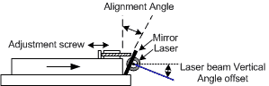
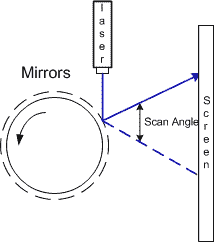

# 旋转滚筒激光投影仪沟槽振镜

> 原文：<https://hackaday.com/2018/04/20/laser-projector-ditches-galvanometer-for-spinning-drum/>

在 2D，像那些在俱乐部或激光表演中流行的激光投影仪经常使用镜式电流计来反射激光和绘画。没有了 galvos，在预算紧张的情况下，[Vitaliy Mosesov]决定不降低质量，而是寻求一种完全不同的解决方案:[旋转镜筒](http://portablelaserprojector.blogspot.co.uk/)。

他向一个有 12 个镜面的旋转滚筒发射激光，每个镜面都有不同的可调垂直角度。根据反射镜的反射，激光将击中投影面上更高或更低的点，这将产生 Y 方向的分辨率。

对激光脉冲进行计时，使其以某一水平角度从镜子反射，从而提供 X 分辨率。

正如你已经知道的，速度和时机对这个工作是至关重要的。以至于[Vitaliy]决定将他的 Arduino 超频——从 16 MHz 到 24.576 MHz。由于这改变了波特率，在修改后 AVR ISP II 被用于编程，并且“duino”的硬件串行初始化也必须被破解。

对于激光器本身，[Vitaliy]设计了一些漂亮的驱动电路，可以快速响应所需的> 50 kHz 调制，提供高电流，并过滤掉电源上的电压瞬变(半导体激光器没有电流尖峰保护)。

在电机方面，闭环控制是必不可少的。一个光电断路器被添加到滚筒上，用于精确的速度检测，以及一个微分器来清理信号。哦，我们有没有提到马达来自软盘驱动器？

我们以前实际上见过这样的构建，包括一个带有多个激光器的[点阵版本](https://hackaday.com/2008/09/23/laser-led-pov-projector/)和一个显然由 Meccano 和热熔胶制成的[版本](https://hackaday.com/2012/09/14/16x8-pixel-laser-projector/)，它可以投射一个快乐的扳手。但是这个建筑，有着多重可调节的镜子，是一个美丽的建筑。看看下面的行动吧。

 [https://www.youtube.com/embed/vvbzIy2U1J0?version=3&rel=1&showsearch=0&showinfo=1&iv_load_policy=1&fs=1&hl=en-US&autohide=2&wmode=transparent](https://www.youtube.com/embed/vvbzIy2U1J0?version=3&rel=1&showsearch=0&showinfo=1&iv_load_policy=1&fs=1&hl=en-US&autohide=2&wmode=transparent)

