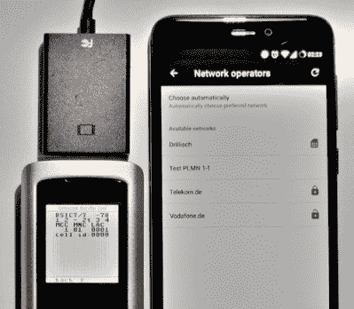

# 使用 USB 转 VGA 适配器欺骗蜂窝网络

> 原文：<https://hackaday.com/2018/04/23/spoofing-cell-networks-with-a-usb-to-vga-adapter/>

RTL-SDR 为大众带来了廉价且无处不在的软件定义无线电(SDR ),开辟了以前普通黑客根本无法获得的整个 RF 频谱带。因为 RTL-SDR 支持的设备被设计为电视调谐器，它们没有传输能力。就价格而言，它们仍然是一笔绝对划算的交易，值得成为任何现代黑客的工具包，但有时你想伸出手去触摸某人。

GSM network broadcast from a VGA adapter

现在你可以了。在 OsmoDevCon [[Steve Markgraf]发布了 osmo-fl2k](https://osmocom.org/projects/osmo-fl2k/wiki/Wiki) ，这是一款工具，它允许通过廉价的 USB 3.0 将仅传输 SDR 传输到基于 Fresco Logic FL2000 芯片的 VGA 适配器。这些设备通常由海外供应商提供，价格仅为 5 美元，可以不加修改地用于传输低功率 FM、DAB、DVB-T、GSM、UMTS 和 GPS 信号。

在项目页面的演示中，这些 USB VGA 适配器中的一个用于广播 GSM 蜂窝网络，该网络由相邻的手机接收。另一个例子展示了如何用它来广播调频广播。已经建立了一个包含更多例子的 GitHub 库。从 FL2000 芯片传输的信号显然很弱，但下一步将是逻辑上的硬件修改，以提高传输到更有用的水平。

说这是一件大事有点轻描淡写。花几块钱，你就能得到一个欺骗蜂窝网络和 GPS 信号的设备。[当然，这在以前是可能的](https://hackaday.com/2016/04/08/build-your-own-gsm-base-station-for-fun-and-profit/)，但是 SDR 硬件通常超出了普通实验者的预算。[如果你买了 HackRF](https://hackaday.com/2013/08/01/hackrf-or-playing-from-30-mhz-to-6-ghz/) 或 Ettus 研究设备，你可能有足够的责任心不会惹上麻烦，但现在不一定了。尽管这项技术令人兴奋，但我们明智的做法是谨慎对待。在一个日益自动化的世界里， [GPS 欺骗可能会产生一些非常糟糕的结果](https://hackaday.com/2012/07/01/spoofing-gps-and-getting-your-own-uav/)。