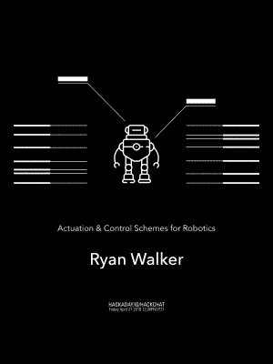

# 星期五黑客聊天:机器人控制方案

> 原文：<https://hackaday.com/2018/04/25/friday-hack-chat-control-schemes-for-robotics/>

如果你还没听说，Hackaday 大奖正在如火如荼地进行中。这是开放硬件的奥斯卡奖，也是你的机会——是的，*你*——为每个人创造下一个伟大的硬件和更美好的未来。现在，我们在[机器人模块挑战赛](https://hackaday.io/prize/details#two)中获奖。这是你建立一个可以在全世界机器人项目中使用的模块的机会！展示你的机电技能，并建立一个机器人模块，可转移到其他建设！

 并非巧合的是，在本周的黑客聊天中，[我们谈论的都是机器人模块](https://hackaday.io/event/151725-actuation-control-schemes-for-robotics)。我们正在深入研究机器人的驱动和控制方案，诚邀您的参与。每个人都想要买得起的机器人，步进电机和伺服电机不再是高预算工业机器人的领域。每个人都可以制造一个机器人，但是你怎么做呢？这就是我们将在本周五的黑客聊天中发现的！

我们本周黑客聊天的嘉宾是[瑞安·沃克]。他拥有 BCIT 大学的机电一体化和机器人学文凭。他从事过从假肢到工业自动化的各种工作，他目前的爱好包括设计和构建驱动电子设备的控制算法，使廉价硬件脱颖而出！如果你想学习机器人技术，这是适合你的聊天工具。

在本次聊天中，我们将讨论:

*   控制方案
*   如何启动您的项目
*   轮子、tweels 和让您的项目移动的方法
*   自动化机器人

当然，我们鼓励你在讨论中提出自己的问题。你可以在 [Hack Chat 活动页面](https://hackaday.io/event/151725-actuation-control-schemes-for-robotics)上发表评论，我们会将其放入 Hack Chat 讨论的队列中。【T2

我们的 Hack Chat 是在 [Hackaday.io Hack Chat 群发消息](https://hackaday.io/messages/room/2369)上的实时社区活动。这一周和其他周一样，我们将在太平洋时间 4 月 27 日星期五中午聚集在我们的视频终端前。[这里有一个倒计时钟，直到黑客聊天开始](https://www.timeanddate.com/countdown/generic?iso=20180427T12&p0=137&msg=Robotics+Hack+Chat&font=cursive)。

点击右边的语音气泡，你会被直接带到 Hackaday.io 上的黑客聊天群。

你不必等到星期五；随时加入，你可以看到社区在谈论什么。