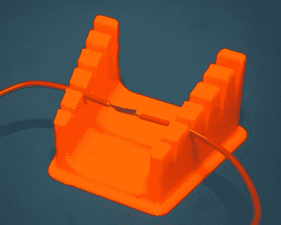
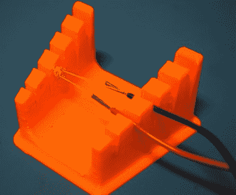
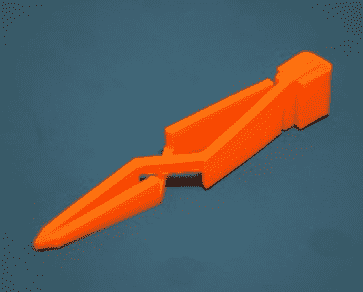
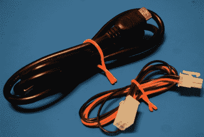
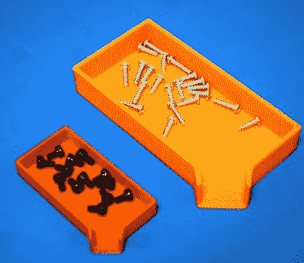
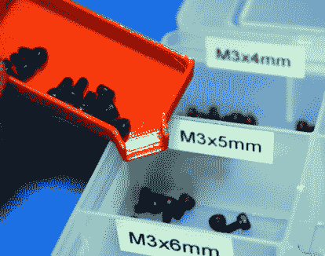

# 印花 It:工具袋必备

> 原文：<https://hackaday.com/2018/05/07/printed-it-toolbag-essentials/>

虽然由 3D 打印组件组装的复杂设备的确令人印象深刻，但对我个人来说，简单的打印一直最具吸引力。能够从你的打印机上拿起一个物体并立即投入使用，几乎不需要额外的工作，这是我们能够接近的*星际旅行*风格的复制器。这是展示 3D 打印机效用的一个很好的演示，但更重要的是，立即使用这些工具和小工具可能会让你有一天摆脱困境。

考虑到这一点，我认为我们应该为这一期的 [*做一点不同的事情，把它打印成*](https://hackaday.com/tag/printed-it/) 。我们将不再关注单一的 3D 模型，而是着眼于一些你可以立即投入实际工作的印刷品。我开始选择模型是基于这样的想法:它们应该在某种程度上对普通的电子爱好者有用，并且打印起来相对较快。然后每一个都被打印出来并进行评估，以确定其在现实世界中的效用。不是所有人都达标了。

这里展示的每个模型都设计得很好，易于打印，最重要的是，非常有用。我可以自信地说，每一个都以某种方式进入了我的标准“锦囊妙计”，我敢打赌有几个也会进入你的锦囊妙计。

## 焊接手指(LED 模块)

这个小工具就像它们来的时候一样简单:一个顶部有锥形槽的大塑料块，你可以将一根电线压入其中以保持它不动。由于两侧都有槽，电线可以很容易地固定在合适的位置进行拼接。[这个模型是由【Tristan Fritz】](https://www.thingiverse.com/thing:2610383)创造的，实际上是由【Domenic】对早期的[焊接辅助工具的修改。通过在一侧增加一系列孔，可以将电阻和 led 等元件固定到位，以便快速焊接。](https://www.thingiverse.com/thing:1725308)

  Splicing  Soldering a 5mm LED

传统上，人们会使用“第三手”焊接辅助工具来完成这些任务，但我真的很喜欢这个版本的更小更轻。你可以把它扔进你的包里，任何时候你需要它的时候都可以得到它。在底部放一块毛毡可能不是一个坏主意，但除此之外，一旦打印机完成它的工作，它就准备好了。就我个人而言，我已经在 PLA 中打印了这个，焊接时没有问题，但是如果你用熨斗有点重，并且担心它可能会太热，在 PETG 做不会有伤害。

## 十字镊子

镊子有很多可打印的设计，选择一个是相当困难的。无论你需要超长的还是超强的，总有人为你准备了一款。但最终我选择了[【约翰内斯】](https://www.thingiverse.com/thing:25587)的【十字镊子】。这些镊子不是打印成一个整体，而是三个独立的组件，然后组装起来(一滴胶水会有帮助，但不是严格要求)。这些镊子的巧妙设计与塑料的天然弹性相结合，使它们能够以足够的力不断将自己闭合，从而轻松提起小部件。

    

我真的对这些镊子印象深刻。它们的握力非常适合你使用这种东西的工作，而且它会自动锁定你拿起的任何东西，防止手疲劳。作为一个额外的奖励，它在敏感的电子产品周围比传统镊子更安全，因为它是塑料的。这些既快又容易打印，尽管如果你没有良好的床粘附力，镊子的尖端可能会卷曲。

## 电缆挂钩

 它们有多种尺寸可供选择，适用于从细电线到粗电线的各种产品。它们以不同的颜色印刷，也可以用于将电线分成易于识别的束。

与“十字镊子”一样，这种设计依赖于薄印刷结构固有的灵活性。多次打开和关闭领带似乎不会对材料产生任何不良影响，尽管他们如何长时间保持潮湿还没有定论。

这些最好大批量印刷；用它们填满你的整张床，开始大规模生产。然而，这是另一个特别容易受到床粘附问题影响的模型，所以在运行一批这些之前，请确保您的第一层被拨入，否则您可能会回到充满塑料意大利面的床上。

## 小零件漏斗托盘

这些由[Sean Charlesworth] 设计的[小零件托盘非常方便，我已经开始打印更多不同尺寸和颜色的小零件，以帮助在拆卸物品时保持小零件有序。当你想把里面的东西倒入一个袋子或你的螺旋组织器时，漏斗边是很棒的。](https://www.thingiverse.com/thing:918864)

    

如果你看不出来，这是一个非常简单的印刷。当放大时，可能需要一段时间来打印，所以在某些时候，走不同的路线可能更有意义。但是像图中红色的小版本只需要几分钟就可以完成 0.3 毫米的图层高度。

## 剥线器 v2

 好吧，不可否认的是，我确实对自己的规则做了一点变通。显然，你需要一个刀片来完成这个打印，以及一个 M3 螺母和螺钉来固定它。但是考虑到【龙在莫斯科】的这个[小剥线钳是多么有用，我认为它值得加入列表。诚然，你可能已经拥有一双像样的剥线钳，但这将是你的“B”套工具的完美选择，或者](https://www.thingiverse.com/thing:1868193)[放在电子“Bugout Bag”](https://hackaday.com/2018/04/09/ask-hackaday-whats-in-your-digital-bugout-bag/)中。

钳口上的凹痕支持剥离相当广泛的金属丝尺寸，并且用于固定剃刀刀片的简单布置工作得相当好。这个模型的官方文档说你应该以几乎 100%填充的方式打印它，但是我觉得没有必要。就功能而言，剥离器能够通过快速旋转切断我尝试的每根电线的绝缘层，甚至能够在不损坏内部电线的情况下移除网线的外层绝缘层。

## 塑料小器具的广阔天地

在搜索我将在本文中重点介绍的模型时，我被有这么多整洁的可打印工具和小工具所震惊。在我的搜索过程中，这些精选的少数几个给我留下了最深刻的印象，但肯定还有很多更有用的设计我没有看到。

Hackaday 的好读者有没有最喜欢的可打印工具？你从打印机床上捡起来并一直使用至今的东西？我们很想听听社区认为他们打印过的最有用的东西是什么；也许我们将不得不在 Hackaday 评论区的无限知识支持下重新审视这个话题。