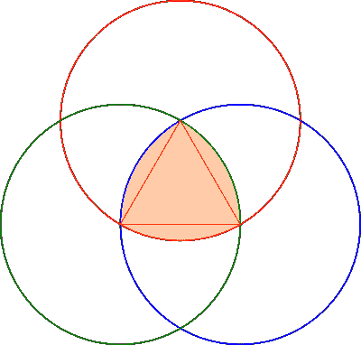

# 对罗勒三角方位的探索

> 原文：<https://hackaday.com/2018/04/30/the-quest-for-the-reuleaux-triangle-bearing/>

[Angus Deveson]在近一年前发表了一个关于“等宽固体”的视频。视频发布后，他收到了大量的请求，询问他是否能从中找到方位。从那以后，他尝试了许多不同的方法，但都没有奏效。[到现在…](https://www.youtube.com/watch?v=rr5cGBId360)

什么是等宽立体？一种在所有方向上直径都相同的形状，尽管它们不是圆形。特别是，罗勒三角是有趣的；如果你听说过方形钻头，那么很可能是一个罗勒三角形。它们由三个圆构成，构成了一个简洁的几何研究。当放置在两个表面之间并滚动时，表面将保持平行，尽管三角形的中心不会保持水平。

理论上，这意味着它们可以很容易地取代传统滚柱轴承中的球体，但这被证明是有问题的——第一次尝试确定了让形状滚动而不是滑动有多难。

经过社区的大量建议和多次尝试，安格斯终于找到了一个可行的方向，直到他能够实现自己的目标。诀窍是为三角形边缘的中心创建一个灵活的插件(也是 3D 打印的)，它可以抓住三角形接触的表面。一个框架也被用来固定轴承，并允许它们的中心根据需要上下移动。

如果你内心的寻求刺激者仍然不满足，也许你应该试试[罗洛过山车](https://hackaday.com/2017/09/29/reuleaux-coaster/) …

 [https://www.youtube.com/embed/rr5cGBId360?version=3&rel=1&showsearch=0&showinfo=1&iv_load_policy=1&fs=1&hl=en-US&autohide=2&wmode=transparent](https://www.youtube.com/embed/rr5cGBId360?version=3&rel=1&showsearch=0&showinfo=1&iv_load_policy=1&fs=1&hl=en-US&autohide=2&wmode=transparent)

