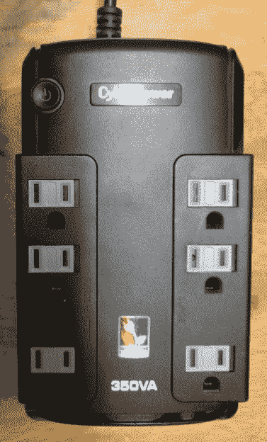

# 备用电池隐藏了一个测试点

> 原文：<https://hackaday.com/2018/05/01/battery-backup-conceals-a-pentesting-pi/>

在过去的几年里，有一件事已经变得非常清楚:黑客喜欢把树莓派塞进东西里。从经典游戏系统到镜像，很少有地方没有被大家最爱的 Linux SBC 入侵过。从灵感到奇异，我们已经用最少的编辑把这样的项目带给你的注意。正如我们之前说过的:黑客日的工作不是问*为什么*，我们是来研究*如何做到的。*

 也就是说，有些建筑确实鹤立鸡群。其中一个项目是[“Pentesting BBU Dropbox”[B1 tbang 3r]最近发布到 Hackaday.io](https://hackaday.io/project/157100-pentesting-bbu-dropbox) 上。注意到廉价的 Cyberpower 350VA 备用电池中的电池槽与 Raspberry Pi 的大小差不多，他决定将其转换为一种秘密渗透测试设备。当然，这种幻觉并不完美，因为电池备份功能本身已经不起作用了。但是如果你把这个东西藏在办公室或者服务器机房，几乎没有人会怀疑它不属于这里。

最终设备的合理性的关键是，从股票它有双 RJ-11 插孔模拟调制解调器浪涌保护。将这些插孔换成 RJ-45 网络连接器，给了 BBU Dropbox 一个接入网络的借口。至少粗略地看了一眼。内部有一个 TRENDnet 以太网交换机，当以太网电缆插入备用电池时，它允许 Pi 进入网络。

我们特别喜欢放入的小细节[b1tbang3r]，让最终的设备看起来尽可能真实。“重置”按钮和“布线故障”LED 已经连接到 Pi 的 GPIO 引脚，允许一个特别离散的用户界面。例如，LED 可以设置为在扫描完成时闪烁，或者按钮可以用于在紧急情况下擦拭设备。

这个版本让我们想起了 Pwnie Express 在 2012 年发布的 [Power Pwn。该设备基于一个相对笨重的电源插座，看起来这种 DIY 构建的唯一“功能”是专业版缺少的 1300 美元的价格。](https://hackaday.com/2012/07/22/power-pwns-price-tag-is-as-dangerous-as-its-black-hat-uses/)