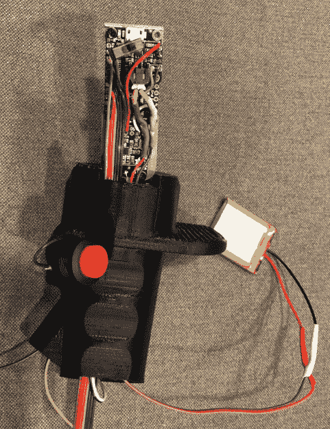

# AH-1 眼镜蛇水龙头处理倒在乐趣

> 原文：<https://hackaday.com/2018/05/07/ah-1-cobra-tap-handle-pours-on-the-fun/>

安·兰德说，“如果值得做，就值得做得过分。”就我们而言，这些是我们赖以生存的话语，也是这个网站上大多数帖子的例证。她还说了一些关于残疾人和土著美国人以及现实的真正可疑的东西，但是你必须接受好的和坏的，等等。

 我们不知道兰德(威尔·韦伯)读过多少书，但我们敢打赌，他会同意过度阅读。他最近记录了一个非常酷的 3D 打印水龙头手柄[，它被设计成看起来像 AH-1 眼镜蛇直升机](https://www.thingiverse.com/thing:2876021)的 B8 飞行杆。但这不是一块静止的塑料，在休息后的视频中，他演示了飞行杆上的每个按钮如何触发不同的武器声音效果。

3D 打印被分割成许多部分，这样棍子就可以一片片地组装起来。这不仅使它更容易打印，它还允许电子设备的安装。

对于 Arduino 爱好者来说，我们有一些坏消息。没有放入通用微控制器，[威尔]走了一条简单的路线，使用了一个 [Adafruit Audio FX 迷你声卡](https://learn.adafruit.com/adafruit-audio-fx-sound-board)。这些板有自己的板载存储音频文件，不需要微控制器来工作。它可以非常容易地为你的项目添加音效甚至音乐；只需将它与电源、几个按钮和扬声器配对即可。

印刷部分的最后加工看起来非常好。我们只能想象[威尔]为了获得如此平滑的最终结果，在所有的小角落和缝隙中打磨有多有趣。虽然有些人可能会抱怨水龙头手柄需要偶尔充电，但我们认为每次拿起杯子时发射几枚火箭的满足感是值得的。

虽然这不是我们在 Hackaday 上报道的第一个独特的 tap 手柄，但它肯定是最适合飞行的。

 [https://www.youtube.com/embed/Ddd8Gp_7R2w?version=3&rel=1&showsearch=0&showinfo=1&iv_load_policy=1&fs=1&hl=en-US&autohide=2&wmode=transparent](https://www.youtube.com/embed/Ddd8Gp_7R2w?version=3&rel=1&showsearch=0&showinfo=1&iv_load_policy=1&fs=1&hl=en-US&autohide=2&wmode=transparent)

