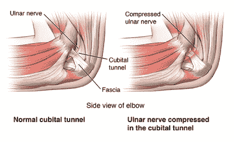
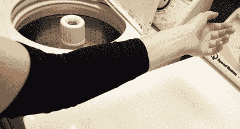
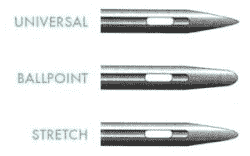
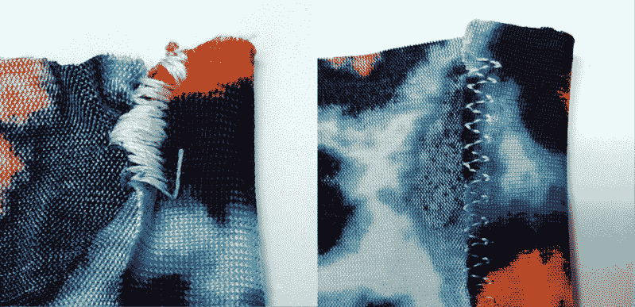
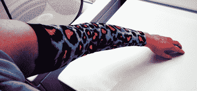
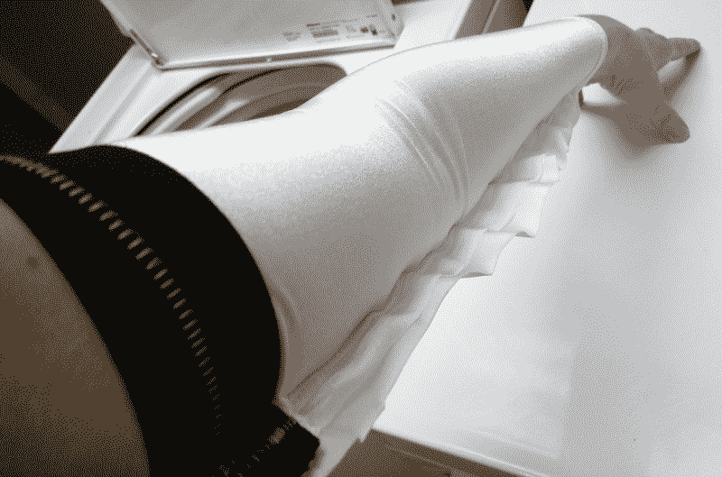

# 拓展我的技能:我如何(以及为什么)制作自己的压缩袖子

> 原文：<https://hackaday.com/2018/05/28/stretching-my-skills-how-and-why-i-made-my-own-compression-sleeves/>

你有没有注意到“一个尺寸适合所有人”通常意味着“一个尺寸不适合所有人”？当我开始在手臂上使用加压套时，这一点变得尤为明显。像任何黑客一样，这似乎是我可以解决的事情，所以我尝试了一下。天哪，我在这个过程中学到了很多。

一年多前，我开始掉东西。如果我左手拿着什么东西，它很有可能会突然掉在地上。这种现象很快伴随着疼痛和麻木，尤其是在敲了一整天键盘之后。

充其量，我的小指和无名指一直很累，感觉半死不活。最糟糕的是，疼痛从我的腋窝一直扩散到我的指尖。感觉我的手臂像被电击了一样。长话短说，我看了一两个神经科医生，几个自付额之后我得到了诊断:[肘管综合征](https://orthoinfo.aaos.org/en/diseases--conditions/ulnar-nerve-entrapment-at-the-elbow-cubital-tunnel-syndrome/)。

What’s in your elbow? Via [St. Luke’s](https://www.saintlukeskc.org/health-library/cubital-tunnel-syndrome)

## 痛苦的隧道

你肯定听说过腕管综合症。这是它讨厌的表亲。我的尺神经被挤压在肘部，恼人的不适让我想咬断我的胳膊。

去年夏天我做了手术，把神经移到一个不那么痛的地方。射击的疼痛现在消失了，对此我感激不尽。但是我的胳膊还是有点问题。那两根手指几乎每天还是会累。

## 挤压游戏:我短暂的商店购买

我决定尝试用压缩套筒来支撑。你知道，那些运动员穿的香肠肠衣可以增加血液流动和肌肉恢复。我从药店买了一个便宜的、没有多余装饰的袖子，基本上是一个紧密的尼龙/氨纶管，在宽的一端有一条粗的松紧带。我一戴上它，我的胳膊感觉棒极了。甚至充满活力。我可以一天大部分时间都戴着它，只感到一点点疲劳。

See how it sags? So agitating.

只有一个问题:合身程度一直在变。过了一天左右，弹力带就拉长了，我每隔五分钟就要把它往胳膊上远足一次。我把它放在洗衣机里洗了洗，它又变得很贴身了，但是仅仅过了几个周期，松紧带就开始磨损了。

当我爱上压缩袖的时候，我对它们的缺陷感到沮丧。同样令人失望的是，它们只有几种尺寸。

所以，我决定试着做我自己的，我相信黑客世界会理解的。我知道这些也会走样，但如果我能迭代，直到锁定一个为我的手臂量身定制的图案，我就可以有一堆袖子来洗/穿/搭配我所有的斯迪利·丹 t 恤。

## 定制服装能有多难？

我有一些缝纫经验，但没有处理奇怪或有弹性或特别难处理的布料的经验。另一方面，压缩套筒的设计很简单。我个人感觉，大部分支持神经的压迫都发生在弹性带，而贴身的袖子提供了肌肉支持和保护，防止丁丁。所以我想如果我能让松紧带合身，我就成功了一半。

房子里有一块有弹性的豹纹布料，纤维成分不明，已经有很长时间了。这是一个太美好的感觉留在垃圾箱里的残余。我决定从这些东西开始，看看会发生什么。如果有用的话，我会去买更多氨纶含量高的残余物，然后继续迭代。

我的计划很简单:只要量一下商店里买的袖子，把它变小就行了！我剪出一个大致的长方形，用针压住前臂末端的线缝，然后试着用直针缝上。我的线立刻缠在一起，而[送布牙](https://en.wikipedia.org/wiki/Feed_dogs)——那些抓住布料并送布的小排金属齿——没有线。我试着用之字形针脚代替。它有点工作，但之字形和之字形如此接近，看起来更像一个骗子的测谎仪，而不是原理图上的电阻。

Basic needle types via [DIBY](https://doitbetteryourself.club)

## 处理弹力织物的专用工具

向下但不向外，我向 le goog 提出了这个问题:*我如何缝制有弹性的布料*？它返回了[一个相关的 YouTube 视频](https://www.youtube.com/watch?v=3GhepZqOzYE)，告诉我有一种叫做圆头伸缩针的东西。

这种设计让针慢慢穿过织物，而不是刺进去，然后期待最好的结果。后来，我给当地的缝纫机公司打了一个简短的电话，就在去市区买一包 5 美元的弹力针的路上。

同一段视频让我想到了弹力缝线。一条规则、笔直的缝线没有弹性。但是任何锯齿形线迹都会自然伸展。把它们想象成一个手风琴式的锉刀或一个剪式千斤顶:它们是为扩展而设计的。许多机器都有一种或多种特殊的、看起来很直的弹力缝线，但 T2 的是相当低端的。

Same stitch, different needle. On the left, we have the liar’s polygraph output from the standard needle. On the right, the multi-stitch zig-zag with the stretch needle.

##  概念验证:更长的覆盖范围，更光滑的锥形

用弹力针要容易得多，所以我一直坚持，直到做完为止。合身不是很好，但也不可怕。

我买的松紧带比市售的袖子要宽，我认为这样可以在它变松之前延长舒适的时间。我还故意把它做得比商店买的袖子长。

我从布料商店买了一些新的布料，包括 82%尼龙/ 18%氨纶的。这比商店购买的袖子多了 6%的氨纶，这可能是一件坏事。我想，氨纶含量越高，我出错的空间就越大。也就是说，它应该更容易迭代，直到我有一个舒适的袖子，但没有血压袖带那么紧。

我做的这个有点不同。我没有从矩形开始，而是量出了一个与我手臂的锥度相对应的圆弧，然后沿着固定的曲线缝合。我想切出一个长的梯形，但那块太小了。

第二个袖子看起来很棒，但是有点松，所以我在第一个袖子里面又缝了一条缝。然后我就把多余的素材剪掉了。这里有一条缝衣机就很好了，因为他们在缝纫时会剪掉多余的部分。但这没多大关系，因为我做了一个比我能买到的便宜很多的东西，而且是为我量身定做的。

Sleevie Nicks! This was before I cut off the excess fabric.

## 找到了。定制服装的回归

我以为这个项目会以失败告终，事实也差不多如此。但是在接受了一点教育之后，我兴奋地再次尝试，并且我最终比我想象的更加成功。我打算做更多，尝试一些不同的东西，比如做一个大下摆而不是用松紧带，或者用不同颜色的氨纶来增加视觉吸引力，比如 ringer t 恤。[一些袖子在肘部有硬壳保护](http://www.kansascity.com/sports/mlb/kansas-city-royals/wbxu4t/picture173141956/alternates/FREE_768/whit%20merrifield(3))，用 3D 打印复制可能会很有趣。

全球化对服装的影响很有趣。过去，人们可以裁剪所有的衣服，并且不假思索地快速说出他们的帽子尺寸、衣领和内缝。随着时尚放松，人口增加，女性进入劳动力市场，我们看到了成衣和“一刀切”的兴起。当它不合适的时候，就像偷工减料，让身体蒙羞。但是定制剪裁的技巧和工具是我们力所能及的。

那么，黑客读者们，你们会定制什么样的服装呢？你已经做了吗？请在评论中告诉我们。