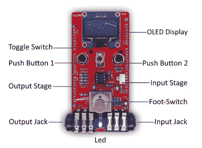
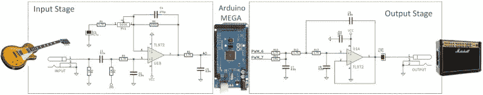

# 踩微控制器:Arduino 大型吉他效果踏板

> 原文：<https://hackaday.com/2018/05/08/stomping-microcontrollers-arduino-mega-guitar-effects-pedal/>

效果踏板:对一些人来说，这是一个令人沉迷的对象，但对许多人来说，这是一个黑客的机会。任何弹吉他的人(或给弹吉他的人买礼物的人)都知道踏板的无限选择。有这么多的踏板，因为把你听到的音调钉在你的头上是一种上瘾的追求，一种必须被挠的痒痒。迎接这一挑战的是新一代可编程踏板，它们可以以巧妙的方式调整效果。

考虑到这一点，[electro mash]带着另一个开源产品回来了:pedal shield MEGA。针对想要学习更多关于音频、DSP 和编程的音乐家和黑客，这是一个用于 Arduino MEGA 的开放硬件/开放软件屏蔽，可以将其转换为效果踏板。

硬件由一个模拟输入级和一个输出级组成，前者在将输入信号传递给 Arduino 之前对其进行放大和滤波，后者对 Arduino 的 PWM 输出进行 DAC 转换，以及一些其他滤波/放大功能。同时使用两个 8 位 PWM 输出来实现伪 16 位分辨率——你可以在他们方便的论坛指南中阅读更多关于[的技术。](https://www.electrosmash.com/forum/pedalshield-uno/111-configure-arduino-uno-pwm-outputs-to-play-audio?lang=en)

当前实现的效果列表涵盖了你所期望的所有基础，并为编写自定义效果提供了一个良好的起点。也许一些常用配置/操作的库会有用？当然，当使用 Arduino for DSP 时，会有一些计算上的限制，不过这是一个令人沮丧的事实，还是一个编写一些很好的优化代码的机会，这取决于你。

[electro mash]也不只是做踏板:这是他们的[开源吉他放大器](https://hackaday.com/2015/11/30/1wamp-an-open-hardware-guitar-amplifier/)。

 [https://www.youtube.com/embed/bhdZ3ekHsBg?version=3&rel=1&showsearch=0&showinfo=1&iv_load_policy=1&fs=1&hl=en-US&autohide=2&wmode=transparent](https://www.youtube.com/embed/bhdZ3ekHsBg?version=3&rel=1&showsearch=0&showinfo=1&iv_load_policy=1&fs=1&hl=en-US&autohide=2&wmode=transparent)

