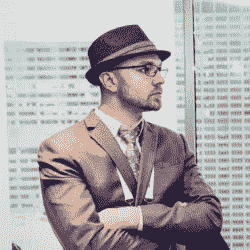
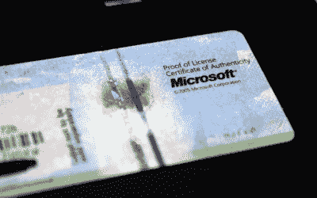

# 埃里克·伦德格伦的故事:当自由不再自由

> 原文：<https://hackaday.com/2018/05/14/the-eric-lundgren-story-when-free-isnt-free/>

在这一点上，你几乎肯定听说过埃里克·伦德格伦的故事，这位电子产品回收者现在正面临 15 个月的监禁[，因为他复制了免费提供的 Windows restore 光盘](https://www.washingtonpost.com/news/true-crime/wp/2018/04/24/recycling-innovator-eric-lundgren-loses-appeal-on-computer-restore-discs-must-serve-15-month-prison-term/)。对于没有 Windows 授权的人来说，这些恢复光盘几乎没有任何货币价值。事实上，作为个人，如果你想在零售点买，你是买不到的。因此，复制这些光盘似乎是一种没有受害者的犯罪。

Eric Lundgren

尤其是当你听到埃里克想用这些光盘做什么的时候。为了帮助延长旧电脑的使用寿命，他打算向那些希望翻新 Windows 电脑的人低价提供这些光盘。在每台机器都重新安装了操作系统后，光盘会随计算机一起带走，希望新的所有者将来能够自己使用它。

这听起来很无辜，甚至是可敬的。但是只要快速浏览一下微软的许可协议，你就能知道整个计划与微软希望如何安装和维护他们的操作系统相冲突。这可能是一颗难以下咽的药丸，但当埃里克伦德格伦决定使用微软的产品时，他同意按他们的规则行事。不幸的是，他输了。

## 完全合乎逻辑的辩护

一言以蔽之，埃里克声称自己“盗版”微软 Windows 是无罪的；因为他复制的光盘只打算恢复操作系统的先前许可的副本。这种逻辑继续说，既然 Windows 计算机的所有者有权在计算机上安装 Windows，只要他或她愿意，安装介质应该免费提供给他们。

 事实上，微软和大多数原始设备制造商确实提供了恢复媒体的免费下载。但是下载文件并将其刻录到光盘或复制到可引导设备上可能很容易超出许多用户的能力。因此，本来可以通过全新安装操作系统来恢复运行状态的计算机被扔进了垃圾桶，转而购买了一台新机器。

到目前为止，埃里克的论点是足够合理的。我们都曾在路边捡到过一两台电脑，只需要擦一擦，重新安装一下就能重新启动。

鉴于这些基本事实，Eric 有了一个想法，那就是利用免费提供的 restore disc ISOs，让专业人员将它们压制成 CD。当他在做的时候，他想他也可以让它们看起来像真的一样，并向他正在工作的中国公司提供合法恢复光盘的图像。一直到公司标志和版权声明。

为什么不呢？毕竟是免费的。

## 免费对自由

英语是一种复杂的东西:一个词可以有多种定义，这取决于它在什么样的语境中被使用。一个很好的例子是免费提供的东西和没有使用限制的东西之间的区别。两者都被通俗地称为“自由”，但这两个概念远非同义词。

理查德·斯托尔曼，自由软件基金会(FSF)之父，[用他的“免费如啤酒”的比喻著名地总结了这个问题](https://en.wikipedia.org/wiki/Gratis_versus_libre):

> “自由软件是自由的问题，而不是价格的问题。要理解这个概念，你应该把免费看成是言论自由，而不是免费啤酒。”

为了消除这种模糊性，FSF 建议将提供给用户的软件称为“libre ”,不限制其使用。libre 来自拉丁语*l ber*，意思是“自由的状态”，它指的不是金钱成本，而是通过软件许可的方式提供给用户的自由。

微软及其合作伙伴提供的恢复介质可能是免费的，但肯定不是 T2 自由的。例如，微软下载门户网站的[使用条款清楚地说明了从他们那里下载的“自由”文件(如恢复光盘 iso)的限制:](https://www.microsoft.com/en-us/legal/intellectualproperty/copyright/)

> 个人和非商业使用限制
> 
> 除非另有说明，否则服务仅供您个人和非商业使用。您不得修改、复制、分发、传输、展示、执行、复制、发布、许可、创建衍生作品、转让或销售从服务中获得的任何信息、软件、产品或服务。

在这种情况下，很明显，埃里克伦德格伦的操作，即使这是一种利他行为，也直接违反了微软的条款。

就微软而言，它确实提供了一个为专业电脑翻新提供 Windows 恢复光盘的程序。问题是，它需要 25 美元的费用来“刷新”许可证，因为计算机被翻新以获得金钱收益。在微软看来，一旦计算机被转售给另一个人，原来的 Windows 许可证就不再适用。

## 像其他许可证一样

如果你告诉我，有一天我可能会写一篇文章，为微软在软件许可证方面的苛刻想法辩护，我绝不会相信。然而我们在这里。我不喜欢微软许可他们软件的方式，我想很多 Hackaday 的读者也有同感。但与此同时，我认识到，作为上述软件的创造者，他们有权以他们认为合适的方式授予许可。如果我们庆祝对那些违反 GNU GPL 许可条款的人的法律胜利，我们不能仅仅因为他们与黑客精神背道而驰就宽恕对专有许可的侵犯。

作为一个社区，我们对出售从 Thingiverse 下载的 Creative Commons 非商业模型的印刷品的人进行了反击，这种情况与 Eric 发现自己所处的情况几乎相同。对细则的无知并不能免除你的责任；仅仅因为你在网上免费找到了它，并不意味着你可以把它投入大规模生产并从中获利。

当他选择在他的计算机翻新计划中使用专有软件时，他承担了遵守这些软件所受的限制性许可的责任。如果他决定将 Ubuntu 或其他 GNU/Linux 发行版的安装盘投入生产，[事情会变得非常不同](https://hackaday.com/2017/07/05/free-as-in-beer-or-the-story-of-windows-viruses/)。他让旧电脑重新投入使用的目标应该已经实现了，而且他也没有违反软件许可协议。但那不是他做出的选择。

## 糟糕的决定，糟糕的判决

埃里克·伦德格伦违反微软条款的事实是毋庸置疑的。尤其是当你想到这一切以前都发生过:2012 年[微软起诉英国零售商 Comet 复制和销售恢复光盘](https://www.telegraph.co.uk/technology/microsoft/8991644/Microsoft-sues-Comet-over-fake-Windows-recovery-disks.html)作为对客户的服务。即使他有最好的意图(顺便提一句，[微软对这一点提出异议】,他也绝对犯了对他的指控:复制明确不应该复制的软件。](https://blogs.microsoft.com/on-the-issues/2018/04/27/the-facts-about-a-recent-counterfeiting-case-brought-by-the-u-s-government/)

也就是说，他不应该在监狱里度过超过一年的时间。Eric 没有犯罪记录，法庭也无法证明微软受到了任何可证实的损害。他在中国制造的 28000 张修复光盘甚至一张也没有卖出去。事实证明，没有人想买自己可以免费下载的东西。在联邦当局介入之前，埃里克已经学到了代价高昂的一课。美国地方法院高级法官丹尼尔 T.K 赫尔利(Daniel T.K. Hurley)也赞同这一事实，“这是一个艰难的判决，因为我相信你告诉我的一切，你是一个非常了不起的人。”他被命令支付 50，000 美元的罚款是一回事，但从事实来看，刑期似乎太长了。

我们已经从关于 Eric 的痛苦经历的举报热线中获得了足够多的信息，知道 Hackaday 的读者对这个案件有一些非常强烈的意见。法庭可能没有完全理解埃里克复制的软件的货币价值，施加了与罪行不相称的惩罚，无论如何，你都要感到愤怒。但是我们不要犯错误，欺骗自己相信他没有做错。