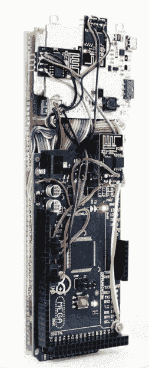

# 游击队通信的移动终端

> 原文：<https://hackaday.com/2018/05/04/a-mobile-terminal-for-guerrilla-communications/>

从报税到寻找美味的比萨饼，我们使用互联网做任何事情，但最重要的是，它满足了我们几乎所有的交流需求。不幸的是，这种依赖会被幕后操纵的人利用；如果你的政府试图做一些见不得人的事情，第一步很可能是影响你如何与外界沟通。互联网在中国受到严格审查和监控，而在朝鲜，整个国家实际上是在一个与更广泛的互联网隔绝的内部网上运行。对分散的信息服务和通信的需求是非常真实的。

 虽然它可能无法解决世界上所有的通信问题，但[::vtol::]写信告诉我们关于[一种他一直在研究的非常有趣的通信设备](http://vtol.cc/filter/works/Hot-Ninja)，他称之为“热忍者”。Hot Ninja 允许用户通过 Wi-Fi ssid 发送简单的消息，其工作原理是用户可能会在互联网关闭的情况下搜索可访问的 Wi-Fi 网络。

我们以前都见过创造性地命名的 Wi-Fi 网络，这里的想法是非常相同的。Hot Ninja 创建了一个 Wi-Fi 网络，将用户的信息作为 SSID，希望移动设备上的某个人能够看到它。根据具体情况，单独的 SSID 可能就足够了，但是 Hot Ninja 也能够为实际连接的设备提供基本的网页。在休息之后的视频中，[::vtol::]甚至通过向客户端设备呈现一个文本字段来演示一些基本的 BBS 风格的功能，文本字段的内容被保存到一个日志文件中。

在硬件方面，Hot Ninja 由一个 Arduino Mega 和三个 ESP8266 板组成，还有一个电池可以让它运行长达 8 小时，这样你就可以在移动中颠覆独裁政权。用户界面由一个小有机发光二极管屏幕和一个完全由通孔触觉开关制成的键盘提供，进一步强化了触摸打字将是反乌托邦未来的必备技能的比喻。它可能不是我们见过的最符合人体工程学的设备，但它看起来像尼尔·斯蒂芬森小说中的东西这一事实在我们的书中弥补了这一点。

这不是我们第一次看到 Wi-Fi ssid 被用作通信方式，这在很大程度上要归功于 ESP8266 让它变得如此简单。对他来说，[::vtol::]之前已经试验过[用它们来丰富大众的文化](https://hackaday.com/2016/06/06/poetic-ssids/)。

[https://player.vimeo.com/video/267195948](https://player.vimeo.com/video/267195948)