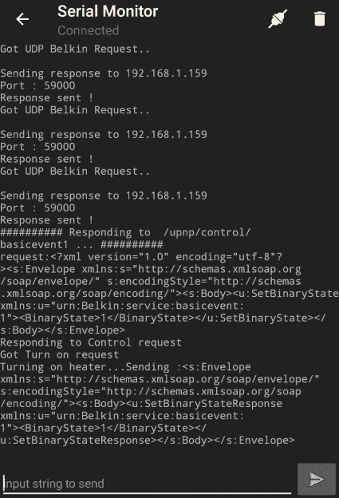

# 在 Android 上闪存和调试 ESP8266 板

> 原文：<https://hackaday.com/2018/05/07/flash-and-debug-esp8266-boards-on-android/>

拥有诸如 NodeMCU 或 Wemos D1 等 ESP8266 开发板？你现在正在看黑客日报，所以很可能。有安卓设备吗？似乎也很有可能。在这种情况下，你应该检查一下 [ESP8266 装载机由【布鲁诺电子】](https://play.google.com/store/apps/details?id=com.bluino.esploader)。这个最近发布的应用程序不仅允许您使用 FTDI、PL2303、CH34X 和 CP210X USB 芯片组将新的二进制文件闪存到任何 ESP8266 板，而且还提供了一个串行监视器，用于随时调试。

 你需要一根 USB OTG 线将你的 ESP 板接入你的 Android 设备，但你不需要 root，甚至不需要摆弄开发设置。在 Hackaday R & D Dungeon，我们随机选择了一些 Android 设备，让它们完全正常工作，这多少有些喜忧参半；所有尝试过的人至少可以打开串行监视器，并读取预编程 ESP 正在说什么，但并不是所有人都可以成功地对电路板进行编程。

即使在可以编程的设备上，速度也很慢。只是一个基本的 LED 闪烁草图花了足够长的时间来编写我们的测试 Wemos D1 迷你，我们考虑得到一个小吃。但是，它仍然显示了现场管理设备的巨大潜力，尤其是如果您的代码中没有启用空中更新。

我们尤其喜欢 ESP8266 Loader 下载了一堆示例二进制文件，其中许多可能有实际用途。有一些程序可以切换板上不同的 GPIO 引脚，创建 Wi-Fi 接入点，甚至是一个基本的网络服务器。有了这些，你就可以在你的移动设备上进行一些测试和诊断工作。

这不是我们第一次[看到 ESP8266 与移动设备](https://hackaday.com/2017/05/15/wireless-terminal-over-esp8266/)合作，但一般来说，这种神奇是通过 WiFi 或蓝牙实现的。