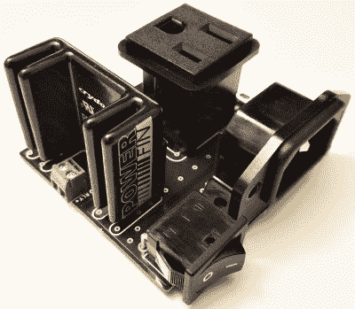

# 好好利用烤箱吧

> 原文：<https://hackaday.com/2018/05/15/reflowduino-put-that-toaster-oven-to-good-use/>

生活中很少有场景比元件顺利滑入到位时焊膏熔化的时刻更令人感动。我们敢打赌，你没有回流焊炉的唯一原因是成本。你为什么不想要一个？幸运的是，自从回流炉的开源控制器——reflow duino 的诞生，便宜得多的 DIY 路线变得容易多了。

[Timothy Woo]的这个 Hackaday 奖参赛作品提供了一个超级快速的方法来创建您自己的回流设置，使用您身边任何便宜的加热方式。[Tim]使用他花了 21 美元买的烤面包机，但是任何合适热质量的都可以。Reflowduino 的硬件都是开源的，并且有很好的文档记录——无论是在主 hackaday.io 页面上还是在[项目的 GitHub](https://github.com/botletics/Reflowduino) 上。

该板本身是围绕 ATMega32u4 构建的，并集成了 MAX31855 热电偶接口(用于非常重要的 PID 控制)、LiPo 电池充电、需要输入时提醒您的蜂鸣器和蓝牙。为什么是蓝牙？已经开发了一个 Android 应用程序来轻松控制回流，甚至可以绘制温度曲线。

当谈到控制烤面包机烤箱/其他热源时，可以使用一个“sidekick”板，一个固态继电器连接到电源插头上。这使得为 Arduino 控制设置任何电源设备变得轻而易举。

我们实际上在去年已经报道过 Reflowduino，但是从那以后【Tim】也创造了[reflow duino 32——DOIT ESP32 开发板的背包](https://www.tindie.com/products/botletics/reflowduino32-esp32-reflow-control-backpack/)。现在还有一个 [Indiegogo 活动](https://www.indiegogo.com/projects/reflowduino-circuit-board-assembly-for-everyone-arduino-diy#/)，以及一些新软件。

如果烤面包机对你来说还不够粗糙，我们有[直发器](https://hackaday.com/2014/03/30/reflowing-with-a-hair-straightener/)，甚至还有[汽车前灯](https://hackaday.com/2017/12/12/car-lights-for-reflow-heat-source/)。

The [HackadayPrize2018](https://hackaday.io/prize) is Sponsored by:     