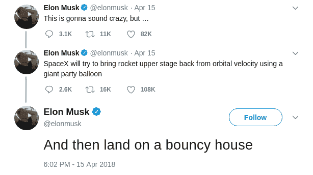

# SpaceX 的下一个巨大飞跃:第二阶段恢复

> 原文：<https://hackaday.com/2018/05/23/spacexs-next-giant-leap-second-stage-recovery/>

随着 5 月 11 日 Bangabandhu-1 卫星的成功发射，猎鹰 9 号火箭的最终版本终于可以运行了。被称为“Block 5”的这个版本的火箭是专门为重复使用而设计的。从 F9 早期建造的回收和重新发射中吸取的经验教训最终形成了火箭，SpaceX 希望它能在短短 24 小时内从回收到下一次飞行。如果有任何火箭能够实现太空飞行变得像空中旅行一样例行公事的梦想，那将是猎鹰 9 号 Block 5。

虽然在未来几年中，Block 5 仍可能会有一些小的调整和改进，但可以肯定地说，猎鹰 9 号的第一阶段回收已经接近完美。曾经是 campy 科幻小说的素材，火箭以推进器的方式从空中降下，停在伸出两侧的细长支腿上，现在已经成为现实。更重要的是，SpaceX 不仅能够可靠地从太空带回高耸的第一级，他们还能够给它加油，检查它，并将其送回，而不必为每次任务建造一个新的。

但是，尽管这是一项令人难以置信的技术成就，SpaceX 仍然没有回收整个猎鹰 9 号火箭。最好的情况是，他们已经完成了航天飞机在 1981 年首次飞行中展示的部分可重复使用性。诚然，他们比在航天飞机上做得更快、更便宜，但这仍然违背了经典的飞机类比:如果你必须在每次着陆时更换客机的一大块，商业航空旅行将完全不切实际。

SpaceX 已经开始试验回收和重复使用猎鹰 9 号的有效载荷整流罩，虽然他们还没有成功，但他们很可能会成功。这就只剩下猎鹰 9 号的一部分未被考虑:第二级。将第二级完整地带回地球可能是开发猎鹰 9 号最具挑战性的方面。但如果 SpaceX 能够做到这一点，那么他们将真正开发出人类第一枚完全可重复使用的火箭，能够以略高于燃料成本的价格向太空运送有效载荷。

## 不同阶段，不同挑战

虽然第一级是为了让有效载荷*上升*，但也可以说第二级负责将有效载荷*侧向移动*。第二级完全依赖于速度:在最近的一次发射中，它在几分钟内将有效载荷从级间分离时的 8，019 公里/小时加速到维持低地球轨道所需的 26，967 公里/小时。一旦有效载荷分离并继续执行任务，第二级实际上是它自己的航天器，以轨道速度和高度运行。

因此，让它在地球上平稳着陆面临着与其他航天器着陆同样的挑战，除了第二级没有传统上完成这一壮举所需的任何硬件。这有点像试图让一架没有起落架的飞机着陆。或者翅膀。

在 SpaceX 的早期概念视频中，第二级配备了隔热罩、着陆腿，甚至是可伸缩的发动机喷嘴。所有这些特点将共同作用，使第一级具有与第一级相同的自主推进着陆能力。但是这个“超级”第二级的问题是重量。

第二级每增加一公斤回收装置，送入太空的有效载荷就减少一公斤。对于像 SpaceX 这样的商业发射提供商来说，这是一个问题。幸运的是，猎鹰 9 号往往没有被大多数有效载荷充分利用，所以还有一些回旋的空间。例如，Bangabandhu-1 号卫星重约 3，700 公斤，不到猎鹰在地球静止转移轨道这一特定发射剖面上的能力的一半。因此，如果回收硬件可以限制在 1000 公斤左右，它应该不会对猎鹰可能遇到的有效载荷类型产生影响。

## 意想不到的解决方案

建造宇宙飞船时，重量确实会增加。考虑到猎鹰 9 号第一级的着陆腿本身重约 2000 千克。任何恢复第二级的尝试都需要用绝对最少的额外硬件来完成。像龙太空舱这样的完整隔热罩可能会消耗掉太多的质量预算，同样，当它落回地球时，用于稳定第一级的“网格鳍”也是如此。

那么如何让第二级穿过大气层并稳定下来呢？答案的第一个线索来自埃隆·马斯克最近的一条推文:

派对气球和充气屋？如果其他人说这样的话，我们会认为这是一个玩笑。但是当他在推特上说要把他的特斯拉跑车送上太空时，我们认为这是一个笑话，我们都知道结果如何。那么这一切意味着什么呢？

## 见见巴卢特人

1958 年，固特异率先提出了用充气气球来降低高空超音速飞行器速度的想法。美国宇航局证明了所谓的 ballute(因为它既是气球又是降落伞)概念可以用于航天器再入，当时在 1968 年，一个小的 ballute 被用来安全地使一个试验品从 4.2 马赫减速。不幸的是，用更大的球壳进行的试验失败了，最终这个概念从未被用于太空计划。

 [https://www.youtube.com/embed/0oZ7gWtlC_o?version=3&rel=1&showsearch=0&showinfo=1&iv_load_policy=1&fs=1&hl=en-US&autohide=2&wmode=transparent](https://www.youtube.com/embed/0oZ7gWtlC_o?version=3&rel=1&showsearch=0&showinfo=1&iv_load_policy=1&fs=1&hl=en-US&autohide=2&wmode=transparent)

从埃隆的推文来看，似乎 SpaceX 正在寻求重新审视 ballute 概念，用它来缓解猎鹰 9 号在大气层中的第二阶段旅程。在进行离轨燃烧后，第二级可以部署一个 ballute，帮助它在从太空返回时减速和稳定。但这只是问题的一半。你还是要把它放在地上，不要损坏它。

## 抓住坠落的~~星~~舞台

由于 ballute 的存在，第二级在足够低的高度和速度下，它可以使用传统的降落伞或翼伞向回收点进行最后的接近。由于重量限制，第二级可能没有任何起落架或支腿，着陆区显然将是某种类型的可充气结构，可以抓住该级而不损坏它。原则上，这与目前使用大型船载网捕获猎鹰 9 号整流罩的工作非常相似。

同样，这将大量借鉴美国宇航局早期的研究。1963 年，进行了一些实验，以确定土星火箭的第一级是否可以使用充气机翼结构回收。

 [https://www.youtube.com/embed/0feS2HYpqfU?version=3&rel=1&showsearch=0&showinfo=1&iv_load_policy=1&fs=1&hl=en-US&autohide=2&wmode=transparent](https://www.youtube.com/embed/0feS2HYpqfU?version=3&rel=1&showsearch=0&showinfo=1&iv_load_policy=1&fs=1&hl=en-US&autohide=2&wmode=transparent)

## 迭代设计

冒着贬低 SpaceX 的成就的风险，公平地说，他们的技术实际上很少是新的。相反，[他们将硅谷风格的研发和现代建筑技术](https://hackaday.com/2016/08/31/working-for-elon-musk/)与 20 世纪 60 年代太空竞赛期间开创的技术相结合，迅速产生进化改进。这使他们能够在完全从零开始的情况下花费一小部分时间到达轨道，现在他们似乎将把注意力转向迭代 NASA 双子座和阿波罗计划的回收概念，以帮助猎鹰 9 号成为世界上第一个真正可重复使用的火箭。

也就是说，这不是 SpaceX 第一次突然改变他们的方法。第二阶段恢复的最终方法可能与埃隆暗示的大不相同。也有可能他们完全抛弃了它。即使只是部分重复使用猎鹰 9 号，它们也是目前最便宜的游戏。

底线是，我们只是还不知道。这种理论很有趣，但在我们观看猎鹰 9 号第二级在气球下从太空降落的 YouTube 直播之前，一切皆有可能。不过有一点是肯定的，不管他们的计划是什么，他们已经得到了全世界的关注。