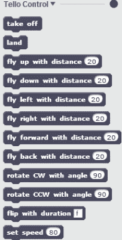
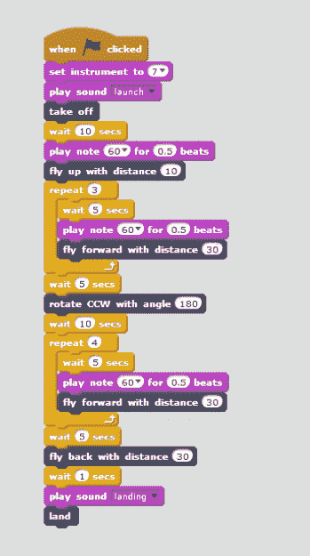
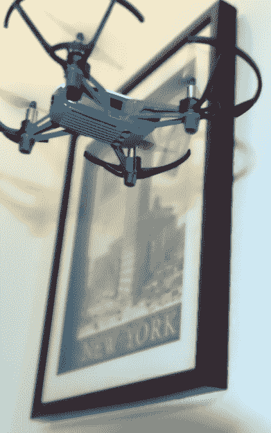

# 动手操作:用 Scratch 飞行无人机

> 原文：<https://hackaday.com/2018/05/22/scratch-your-itch-to-fly/>

我承认。我有很多无人机。坐在办公桌前，我能数出不下 10 种飞行准备状态。车库里可能还有半打。其中一些几乎不花钱。有些要花上一千多美元。但我最近花了 100 美元买了一架无人机，它不仅在技术上很有趣，而且在激励孩子们学习编程方面有很大的潜力。泰洛是一架小型无人机，来自一家你从未听说过的公司(Ryze Tech)，但它拥有 DJI 飞行技术，你可以通过 API 对它进行编程。对于一个学习编程的人来说，还有什么比用它来驾驶四轴飞行器更令人兴奋的呢？

 售价 100 美元的泰洛无人机是一个很棒的小飞行器。我甚至可以说这是我见过的最好的 100 美元的无人机。通常我不建议买没有 GPS 的无人机，因为价格已经下降了。但是只要有足够的光线，泰洛光学传感器在保持飞行器稳定方面做得很好。此外，与 GPS 不同，光学传感器在室内工作。

但如果这就是全部，它可能不会保证一个 Hackaday 职位。激起我兴趣的是你可以用个人电脑给这个东西编程序。特别是，他们使用 Scratch——麻省理工学院为年轻学生开发的语言。然而，通过一些工作，该 API 可以从其他语言中使用。

关于编程环境的信息相当少，所以我深入研究了一下它是如何工作的。

## 编程设置

 和很多硬件编程任务一样，建立工具链是最令人沮丧的部分。您需要使用需要 Adobe Air 的 Scratch 离线版本。我很难让它在 Linux 系统上工作，所以我最终放弃了，把它安装在一台 Windows 笔记本电脑上。

不过，刮擦只是其中的一部分。还需要安装 nodejs 和[Ryze Tech](https://dl-cdn.ryzerobotics.com/downloads/tello/0222/Tello+Scratch+Readme.pdf)(PDF)的几个文件。Ryze 文件是通过一个隐藏的菜单命令来安装的，在按住 shift 键的同时点击“文件”。然后，您会看到“Import Experimental HTTP Extension”选项。一旦这完成了，你将会在这里显示的“更多块”类别中得到一些块。泰洛充当 WiFi 接入点，当您用计算机连接到它并从命令提示符运行 nodejs 服务器时，就会建立控制。

如果你想深入了解的话，这里有 [API 文档](https://docs.google.com/viewer?url=https%3A%2F%2Fdl-cdn.ryzerobotics.com%2Fdownloads%2Ftello%2F0228%2FTello%2BSDK%2BReadme.pdf) (PDF)。通过阅读 API 文档，我了解到移动单位是厘米，有些有最小值和最大值。不过，这些块将允许您设置任何想要的值。就是达不到预期的效果。

## 简单的程序

 我拼凑了一个快速的小 Scratch 程序。它只是运行一个简单的模式并添加一些声音效果(来自 PC，而不是无人机)。我立即发现了一个问题。

这些块只是发出命令，但没有反馈。例如，如果您发送向前飞行命令，然后发送旋转命令，旋转命令将被置若罔闻。你必须给无人机时间来执行每个命令。从零开始，我没有看到一种等待响应的方法，所以你只需简单地猜测某件事情需要多长时间。

你大概能猜出其中的大部分。当你按下 Go 标志(Scratch 环境的一部分)时，上面的块告诉程序开始。紫色的发射和着陆声音只是电脑上的录音。金盒子都是用来控制的。

通过这个程序讲:无人机起飞，3 喷前进，旋转 180 度，然后 4 喷前进。然后它支持最后一次冲刺并着陆。

游动滑车的最小距离为 20 厘米。在我的程序中，我将“飞起”块设置为 10 来测试这一点。无人机不会对这个格挡有反应，除非你把这个格挡改成至少 20。如果您发现您的命令没有被执行，可能值得阅读我之前提到的 API 文档，看看您是否在每个块的最小和最大范围内。

## 它是如何工作的？

 这招管用。这种无人机使用光学传感器进行位置感知。这不是 GPS，它更像是一个光学鼠标传感器的工作方式。在左边的图片中，当无人机飞过纽约地平线时，你可以看到泰洛底部的光学传感器。

如果光学传感器没有充足的光线，一切都完了。但是如果你这样做了，效果会很好。旋转似乎是正确的。有一点漂移，所以起飞和降落并不总是在同一个地方，但很接近。

所以它确实有效。我不确定这对初学者来说是否理想，因为设置令人沮丧，缺乏反馈会令人困惑。为了让孩子们对编程感兴趣，你最好使用乐高头脑风暴或者类似的产品。

对于那些有编码经验的人来说，你可能想研究一下无划痕绑定。还有其他[绑定](https://github.com/microlinux/tello)到[API](https://github.com/8bitbytes/TelloSdkCoreNet)，比如使用 Go 对泰洛[编程，我们上个月已经讨论过了。还有官方应用程序使用的秘密 API，已经被一个社区的努力解码。](https://hackaday.com/2018/04/27/unlocking-drones-with-go/)

只要 100 美元，即使你不在乎编程，这些无人机也是很棒的小飞行器。添加一个 30 美元的蓝牙控制器，它们会变得更好(蓝牙连接到你的手机，而不是无人机)。当他们开始享受半价优惠时，他们会变得很自然。