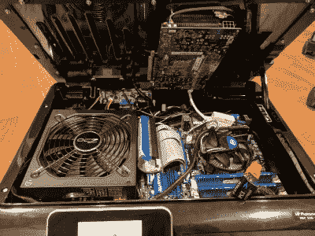

# Case Mod 将“多功能一体”打印机推向了新的高度

> 原文：<https://hackaday.com/2018/05/15/case-mod-takes-all-in-one-printer-to-the-next-level/>

你见过内置扫描仪的打印机，内置复印机的打印机，甚至还有内置“传真”这种古老技术的打印机。但你见过内置完整游戏电脑的打印机吗？没有吗？严格来说，你还是没有。这个重新设计的 HP Photosmart 6520 机箱里已经没有打印机了，但这可能是我们能得到的最接近的打印机了。

 [【雅各布·李】来信与我们分享这一令人敬畏的构建](https://imgur.com/a/pJ6Xa95)，它看到主板、显卡、ATX 电源和硬盘驱动器都无缝地装入废弃的“多功能一体”打印机的外壳中。令人难以置信的是，他甚至设法在顶部集成了一个液晶显示器；它在使用时会打开铰链，让我们可以看到这个建筑的疯狂之处。

说这里面有很多硬件是一种保守的说法。当你考虑到他并没有采取简单的方法来解决这些问题时，这就更加令人印象深刻了。他可以使用迷你 ITX 主板，或者超薄 PSU。他甚至可以为了集成而丢掉显卡。不，[雅各布]显然是“不成功便成仁”风气的支持者。

如果将所有这些设备放在一个普通外观的打印机外壳中还不够令人印象深刻，他甚至在设备的背面添加了以太网、HDMI 和 USB 的母端口，使其看起来很普通。他提到 USB 端口还有一些改进的空间，但电源开关和 IEC 端口看起来真的像是原装部件。

在树莓派和其他小型电脑的时代，我们再也看不到太多真正的桌面电脑项目了。更少有人执行得如此好，如此有创意。我们不知道有多少其他人可能会试图将电脑放入打印机机箱中，但如果他们真的存在，这一门槛就已经定得相当高了。