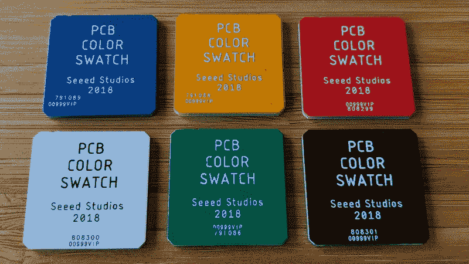
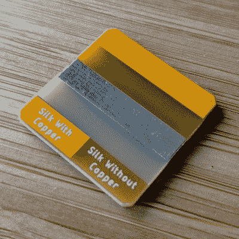

# 问 Hackaday:你的 PCB 是什么颜色的？

> 原文：<https://hackaday.com/2018/06/11/ask-hackaday-what-color-are-your-pcbs/>

10 年前，购买定制印刷电路板意味着支付一大笔钱，甚至可能使用电路板公司的专有软件来设计 PCB。现在，我们都有强大的、独立的工具来设计电路板，中国有一百家工厂会拿走你的格柏，以每平方英寸几分钱的价格给你送十份你的电路板。我们生活在印刷电路板的黄金时代，它们五颜六色。这就提出了一个问题:哪种颜色的阻焊膜最受欢迎，哪种最可取，为什么？Seeed Studio 是一家中国 PCB 公司，最近对最受欢迎的阻焊膜颜色进行了一次调查。这与他们的实际销售数据进行了比较。[哪种 PCB 颜色最受欢迎？](http://www.seeedstudio.com/blog/2017/08/17/pcb-solder-mask-colors/)看你问谁了，怎么问。

但首先，让我们来看看 PCB 选项的彩虹。Seeed 的 Fusion PCB 服务为每个 PCB 订单提供六种不同颜色的阻焊膜:白色、黑色、红色、蓝色、绿色或黄色。这些是你会在大多数板房里找到的颜色，除了少数例外，它们都保持不变；奥什公园只提供紫色，但你可以从其他几个制造商那里买到紫色。有橙色阻焊膜的传言。哑光黑和哑光绿通常是任何 PCB 制造商提供的第七种和第八种颜色。我们在野外也看到过粉红色的多氯联苯。

I just so happened to order PCB color swatches from Seeed last month for an unrelated project.

Seeed 的服务与大多数其他服务不同，不包括绿色以外的其他颜色的费用，所以在某种意义上它是一个理想的实验。在他们的调查中，Seeed 问顾客他们最喜欢什么颜色的阻焊膜。黑色阻焊膜高居榜首，蓝色紧随其后。绿色排在第三，红色稍落后于绿色，白色和黄色加起来几乎没有影响数字。但是，当您查看实际 Seeed Fusion PCB 订单时，就会发现明显的差异。到目前为止，Seeed 服务上订购的阻焊膜最受欢迎的颜色是绿色，占所有订单的近一半。黑色是第二受欢迎的颜色，其次是蓝色、红色、白色和黄色。

Yellow is a terrible soldermask color

人们所说的他们想要的和他们将要购买的之间存在差异，这一事实不会让任何人感到惊讶。然而，这种差异的原因值得讨论。阻焊膜的传统颜色是绿色[,因为它表现得更好](http://www.seeedstudio.com/blog/2017/07/23/why-are-printed-circuit-boards-are-usually-green-in-colour/),而且“略微不同的绿色阴影”比其他颜色更易于目视检查。

绿色也是通过 Seeed 的 Fusion 服务订购时的默认颜色，如果有人只是想要一个工作的 PCB，他们可能不会太在意颜色。这很容易解释为什么它在所有订单中排名较高，但在有颜色偏好的人群中排名较低。

然而，绿色阻焊膜的流行并没有说明黑色和蓝色相对于黄色阻焊膜的相对流行。为什么白色和黄色的阻焊膜如此不受欢迎，蓝色和黑色的阻焊膜却如此受欢迎？虽然痕迹在黄色上清晰可见，但我认为 Seeed 的黄色 PCB 带有白色丝网印刷，这一事实使得很难阅读黄色 PCB 上的任何名称或零件号。然而，白色阻焊膜看起来真的很好，并为黑色丝网印刷提供了很好的对比。几乎不可能追踪到铜的踪迹。

所以，我们开放评论。你的印刷电路板用什么颜色？你是追求纯粹的表演，还是考虑艺术因素？如果你曾经用黄色阻焊膜做过艺术作品，那是什么？为阻焊膜选择绿色意味着你懒惰吗？这是一个问答日，所以请把你的想法写在下面。