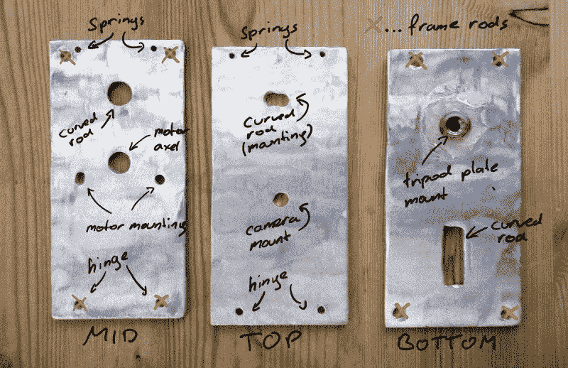

# Arduino 追星人提高了标准

> 原文：<https://hackaday.com/2018/05/16/arduino-star-tracker-raises-the-bar/>

为了证明天体摄影不必倾家荡产， [[Gerald Gattringer]最近记录了他的 DIY“谷仓门”风格的星体跟踪器](https://imgur.com/a/dAOIhfd)，它几乎完全是从零开始建造的。除了 Arduino 和步进电机之外，所有组件要么是手工制作的，要么是在标准五金店找到的。

 建造从三块铝板开始，[Gerald]用角磨机手工切割。然后，他钻了所有必要的螺丝孔和一个矩形开口，以便螺杆穿过。他甚至用环氧树脂在底板上安装了一个螺母，最终将螺母固定在三脚架上。

然后，这些盘子被粗糙化，并被喷涂成黑色，这样它们就不会反光了。增加了几个螺钉、螺母和一个标准铰链。

运动由 28BYJ-48 步进器提供，步进器通过皮带连接到驱动螺母。旋转螺母用于升高和降低打开和关闭“门”的螺杆。为了控制电机，[Gerald]正在使用 Arduino Nano 和 ULN2003 达林顿阵列，后者位于他用学校的[Qbot mini mill](https://www.minimill.at/en/)制作的布线 PCB 上。虽然有些人可能会说 Arduino 对这个项目来说是不必要的，但它确实使设备的最终校准更加容易。

在 Hackaday，[上，我们已经](https://hackaday.com/2016/12/15/build-this-barn-door-tracker-today-take-stunning-shots-of-the-galaxy-tonight/)[报道了许多类似的追星族](https://hackaday.com/2013/08/08/building-a-barn-door-tracker-for-astronomical-photography/)，包括一个你用手转动的追星族。但是专业的最终效果让这个版本非常突出。