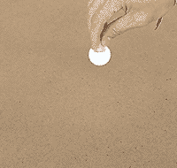
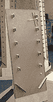

# 为学习和欢笑而黑客:奥克伍德学校的制造者

> 原文：<https://hackaday.com/2018/05/25/hacking-for-learning-and-laughs-the-makers-of-oakwood-school/>

湾区创客节的口号是“*激励未来*”，对我们的下一代有很多启发。我们有展览鼓励孩子们动手制作属于他们自己的项目，我们有许多学校展示他们的学生项目，讲述他们所做的故事。然后我们有像[奥克伍德学校蒸汽理事会](https://makerfaire.com/maker/entry/65093/)这样的参展商，他们因为巧妙地同时完成了这两项工作而获得了额外的认可。

理事会主席马科斯·阿里亚斯解释说，每个展品都有两层。不经意的展位参观者会看到旨在取悦孩子的诱人的动手活动。不太明显的是，这些经历都是奥克伍德 7 至 12 年级学生的工作成果。一些学生参加了员工活动，他们很自豪地与任何表示感兴趣的参观者谈论他们在 Maker Faire 之前的工作。

 在一项活动中，游客自己搭建 [tippe top](https://en.wikipedia.org/wiki/Tippe_top) 。每个人从库存中拿出一个 3D 打印的身体，用砂纸进行表面加工，安装一个木制的榫钉杆，然后用彩色标记进行可选的装饰。这种简单的构建可以被广泛的观众所接受，并通过有趣的玩具提供即时的满足感。但是 tippe top 的体型是怎么确定的呢？他们不只是在网上下载东西。该档案是由学生通过工作和迭代许多满足要求的想法生成的-适合 30 厘米的体积-同时最大化他们的评估指标-翻转最快并保持直立旋转最长时间。一旦一个获奖的设计被选中，它就会被大量印刷出来，成为 Maker Faire 活动中的明星。

 另一项活动邀请游客建造一辆重力赛车。就像 tippe top 活动一样，Maker Faire 参与者实际构建的设计是奥克伍德学生的获奖设计，他们努力寻找最佳形状来迎接挑战。集会的建造者可以在组装过程中用提供的零件定制他们自己的赛车，然后两名赛车手可以在一条长赛道上并肩竞争，看看他们的赛车表现如何。

主持人(马科斯·阿里亚斯)用北极星的“发挥热情达到目的”来指导奥克伍德的蒸汽项目听到这些和其他有趣的制造者集会活动背后的工作是令人着迷的。我们可以放心，创造性解决问题的黑客精神是在这样的学校培养的，以激励我们未来的黑客。