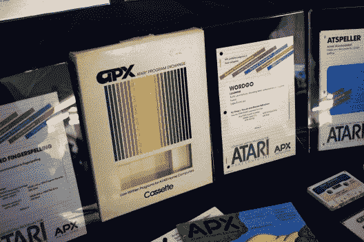
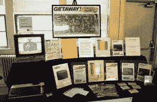
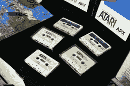

# VCF 东部:邮购应用商店

> 原文：<https://hackaday.com/2018/05/30/vcf-east-the-mail-order-app-store/>

今天，我们认为集中式软件仓库的概念是理所当然的。无论是`apt`还是 App Store，几乎我们今天使用的每一个设备都有一种方法来获取应用程序，而无需用户手动在互联网上搜索它们。这不仅对最终用户来说更方便，而且至少在理论上更安全，因为您不会从一些随机的网站上下载二进制文件。

但是集中的软件分发不仅仅使用户受益，它也能帮助开发者。正如 Steam 这样的平台所展示的那样，一旦你降低门槛，让你的软件上市只需要一个好主意，小型开发者就有机会大放异彩。你不需要去找出版商或者自掏腰包去发行一堆光盘，只要把你的游戏或者程序放在那里，看看会发生什么。Markus“Notch”Persson 看到他的爱好项目*《我的世界》*成为几十年来最大的娱乐特许经营之一，但人们不得不怀疑，如果他首先必须说服出版商有人想玩一个关于挖洞的游戏，它是否会被商业发行。

在数字发行实用化之前，情况甚至更糟。如果你想出售你的游戏或程序，它需要在某个地方做广告，需要放在物理媒体上，并且需要运送给客户。所有这一切所耗费的资金很容易超出许多独立开发商的能力，更不用说单个个人了。

但是在最近的东方复古计算机节上，[Allan Bushman]展示了早期家庭计算中鲜为人知的一章的遗物:[雅达利程序交换(APX)](https://atariwiki.org/wiki/Wiki.jsp?page=Atari%20Program%20Exchange%20%28APX%29%20Software) 。在当时一种完全独特的软件分发方法中，个人被给予一个平台，通过该平台他们的软件将被广告和销售给 8 位机器的所有者，例如 Atari 400/800 和后来的 XL 系列计算机。在早期，当计算机用户和计算机程序员之间的界限特别模糊时，APX 允许任何有技能的人将他们的想法转化为利润。

## 细则

当然，雅达利的项目目标并非完全无私。当时，雅达利急需更多的软件。以至于他们愿意自己担当发布者的角色来帮助减轻为平台发布新软件的负担。《战争模拟》 [*【东方前线(1941)*](https://en.wikipedia.org/wiki/Eastern_Front_(1941)) 的开发者克里斯·克劳福德(Chris Crawford)最终在 APX 卖出了 6 万多份，他回忆了这个程序的起源:

> 提出这个想法的人，戴尔·约库姆，试图向管理层解释说，有很多人喜欢写程序，如果我们能为他们发布这些程序，这是一个双赢的局面。他为它制定了一个商业计划，并说‘看，我们只需要一点钱，这个东西可以自给自足，它可能会赚些钱。’他们勉强同意让他来做，因为雅达利平台迫切需要一个更大的软件基础，这是当时其他出版商无法填补的空白。

通过使用非常实用的软件包装，并让开发人员自己编写手册，降低了程序的成本。雅达利所要做的就是复印并寄出去。就连分成也对雅达利非常有利:开发商每卖出一套房子，只拿到售价的 10%。

因此，APX 不仅帮助填补了雅达利软件库的空白，还为他们带来了大量的资金。考虑到《东方前线》( 1941) 在 APX 目录中标价 29.95 美元，仅这一款游戏的总销售额就接近 180 万美元(约合今天的 450 万美元)。

## APX 档案馆

虽然[Allan]确实带来了一台 Atari 800XL 来演示通过 APX 分发的一些软件，但他桌子上真正吸引人的是一批崭新的 APX 盒子、磁带、手册和目录。稀疏的盒子艺术和实用的手册是这个项目节俭的一个明显的提醒。一些手册有高中读书报告的所有轻浮之处；这一点在 VCF 东区立即引起了注意，那里并不缺乏可与之相比的当代软件。

      

[Allan]已经把扫描他能找到的所有 APX 软件的盒子和手册，包括 APX 目录本身，并在 AtariWiki 上公开这些信息作为他的任务。因此，即使你不能亲自看到他令人印象深刻的收藏，关于这个软件分发中令人着迷的实验的数据也不会输给时间。

## 历史重演

也许这次考察 APX 最有趣的方面是听到了它与现代软件市场的相似之处。通过 APX 发布的一些程序非常专业，比如一个跟踪报纸路线的应用程序和一个用于校准彩色电视的应用程序。如果没有像 APX 这样的市场，这些项目可能永远也不会问世，至少在商业上是如此。

但是随着 APX 越来越受欢迎，雅达利不得不开始收紧他们的标准。在早期，进入程序的门槛相当低，但是到最后越来越多的软件不得不被拒绝。虽然没有确切的数字表明有多少节目被淘汰，但 APX 导演弗雷德·索林在采访中承认，如果在节目后期提交，一些早期的作品永远不会被接受。

所以下一次当你看到苹果应用商店的 Google Play 商店上所有竞争下载的低努力模仿游戏和应用程序时，请记住:雅达利*试图*警告我们。