# VCF 东十三:复古天堂的另一天

> 原文：<https://hackaday.com/2018/06/22/vcf-east-xiii-another-day-in-retro-paradise/>

虽然大部分时间天气在雾和季风之间交替变化，但第十三届东部年度老式计算机节仍然取得了巨大的成功。人们来自全国各地，事实上来自世界各地，来展示比许多与会者更古老的计算机和设备。从 20 世纪 80 年代的机器人到第一台带有我们今天所理解的“计算机”名称的机器的再现，有一系列令人眼花缭乱的迷人展品可供参观新泽西州沃尔信息时代科学中心的人参观。在许多情况下，拥有和维护这些技术试金石的人就像他们拿来炫耀的硬件一样有趣；关于他们如此钟爱的现代复古装备的知识百科全书。

[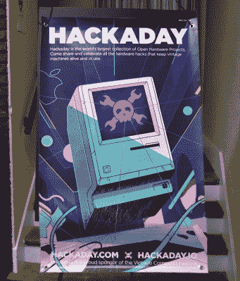](https://hackaday.com/wp-content/uploads/2018/05/vcfxiii_poster.jpg) 经历了这一切，除了短暂的幕间休息去最近的风车房拿辣椒热狗，哈卡黛也在那里。我们近距离接触了[【Brian Stuart】令人印象深刻的 ENIAC 模拟器](https://hackaday.com/2018/05/24/vcf-east-the-desktop-eniac/)，聆听了[【比尔·德格南】的 MITS Altair 8800](https://wp.me/pk3lN-1inU) 提供的一些飘渺的 chiptunes，看到了“应用商店”需要来自[【Allan Bushman】令人印象深刻的收藏](https://wp.me/pk3lN-1ioW)的邮票的时代的遗迹，并从[【Alexander Pierson】对 20 世纪 70 年代的经典套装电脑采取的更加现代的方式](https://wp.me/pk3lN-1iwJ)中获得了灵感

但是这些并不是古董电脑节上唯一展出的东西，绝对不是。今年在 VCF 有超过 100 个个人展览，这还不包括研讨会、课程、参观或日常主题演讲。说你花的钱物有所值是一种轻描淡写的说法。

公平地说，没有什么能真正替代亲自观看这样的表演。但是除了上面提到的文章，今年 VCF 的一些有趣的展品和景点的概要(排名不分先后)是一个不错的安慰奖。如果这激起了你的兴趣，我们邀请你留意下一届老式电脑节。我们会去的。

## 一台卡车电脑，没有卡车

今天，我们认为移动计算是平板电脑、智能手机，甚至可能是笔记本电脑。但是在 1956 年，当美国陆军要求一台移动计算机时，目标是制造一台可以用卡车运输到战场前线的计算机。考虑到计算机到目前为止占据了整栋建筑，这是一个相当高的要求。

最终，Sylvania 中标并建造了“移动数字计算机”，即 MOBIDIC。这台计算机被装在一辆 30 英尺长的拖车里，消耗了太多的能量，以至于另一辆装有发电机的卡车不得不跟着它到处跑。此外，车队中还增加了两辆货车，一辆装载备件，另一辆装载修理厂。就移动电脑而言，它与你的笔记本电脑相去甚远，但对于那个时代来说，它仍然相当不错。

[Jeff Salzman]多年来一直对 MOBIDIC 着迷，目前正在开发一个模拟器，以使其独特的架构重现生机。由于 MOBIDIC 是在 Camp Evans Signal Laboratory 设计的，该实验室现在是 InfoAge 和 VCF 东区的所在地，甚至有人说要弄一辆旧的军用拖车，建造一个实物大小的展览，向游客展示在 MOBIDIC 内部工作会是什么样子。在这一点上[Jeff]仍然处于非常早期的阶段，主要是介绍计算机如何工作的信息和他的研究，但这一切听起来都很有希望。这绝对是一个值得关注的项目。

 [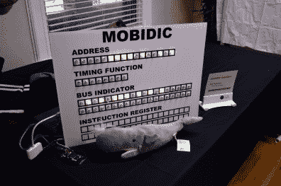](https://i0.wp.com/hackaday.com/wp-content/uploads/2018/05/vcfxiii_mobi1.jpg?ssl=1) Emulator proof of concept [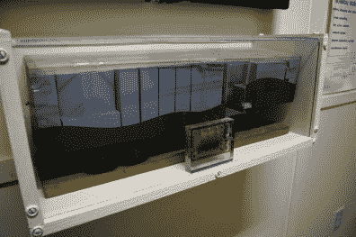](https://i0.wp.com/hackaday.com/wp-content/uploads/2018/05/vcfxiii_mobi2.jpg?ssl=1) Model of MOBIDIC at InfoAge

## 准将 64 照相亭

[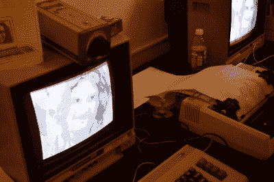](https://hackaday.com/wp-content/uploads/2018/05/vcfxiii_eyes2.jpg) 没有什么比呆在满是 1980 年以前的电脑的房间里更能提醒你科技在如此短的时间里取得了多大的进步。几乎展会上的任何展品都与我们大多数人现在携带的智能手机形成鲜明对比，但也许其中最简洁的是由[杰弗里·布雷斯]经营的“8 位数字肖像”桌子。

使用一台旧的松下闭路电视摄像机、一台 Commodore 64 和一种相对罕见的产品“计算机眼”，[Jeffery]将为自愿参与者拍照，然后在 Star NX-1000 点阵打印机上打印出来作为纪念。对于年轻的参与者来说，整个过程有点像文化冲击。由于市场上的每部智能手机都配有相对高端的相机，我们理所当然地认为自己有能力随心所欲地拍摄数百万像素的图像。

有趣的是，当我在桌子旁边停下来时，准将给他们拍照的人是[John Sutley]，他的工作涉及到我们之前在 Hackaday 上报道过的老式 CRT 显示器的[修复。](https://hackaday.com/2017/08/11/crt-cataract-surgery/)

## BBS 体验

你可以读到布告栏系统(BBS)的全盛时期，你甚至可以通过互联网拨入一些现代系统，但是没有什么比在老式硬件上以老式*速度使用 BBS 更好的了。*以防有人忘记在这些系统风靡一时的时候，在其中一个系统上实际发送消息是什么感觉，[李名炀]带来了某个时代合适的硬件，供与会者在多元化论坛上聊天时使用。

一台 Apple IIe 作为主机运行，使用 Hayes 微型模块进行连接。在客户端，DEC VT-100 和 220 终端配备了声学耦合器。甚至对于那些年纪~~*经验*足以使用拨号连接或在最初的 BBS 上聊天的观众来说，在这么多年后再次面对这项技术也感到震惊。看着信息被一个字符一个字符地打印出来，与会者发出了阵阵笑声。怀旧有一种有趣的方式，让事情看起来比原来好多了。~~

 [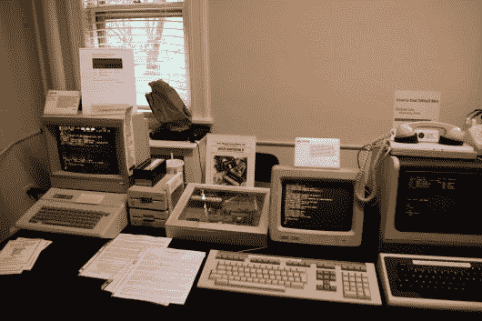](https://i0.wp.com/hackaday.com/wp-content/uploads/2018/05/vcfxiii_bbs1.jpg?ssl=1)  [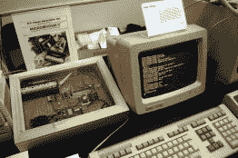](https://i0.wp.com/hackaday.com/wp-content/uploads/2018/05/vcfxiii_bbs2.jpg?ssl=1)  [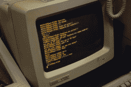](https://i0.wp.com/hackaday.com/wp-content/uploads/2018/05/vcfxiii_bbs3.jpg?ssl=1) 

## VCF 博物馆

虽然真正的东方老式计算机节每年只在信息时代举行一次，但是老式计算机联合会一年到头都有一个计算机博物馆，里面有数量惊人的硬件。从从美国海军收回的巨大的 Univac 1219-B 主机到 20 世纪 80 年代和 90 年代的几乎所有重要的台式计算机，收藏中确实有适合每个人的东西。

许多台式电脑都是通电的，游客可以使用，尽管自然是在工作人员的监督下。大型主机演示，让与会者有机会看到这些庞然大物的工作。如果你对计算机历史感兴趣，并且距离泽西海岸不远，这是一个不容错过的收藏。

 [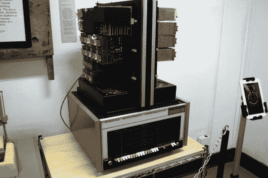](https://i0.wp.com/hackaday.com/wp-content/uploads/2018/05/vcfxiii_museum1.jpg?ssl=1)  [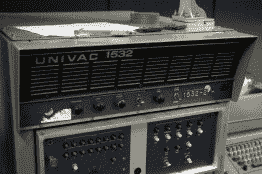](https://i0.wp.com/hackaday.com/wp-content/uploads/2018/05/vcfxiii_museum9.jpg?ssl=1)  [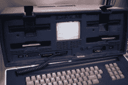](https://i0.wp.com/hackaday.com/wp-content/uploads/2018/05/vcfxiii_museum6.jpg?ssl=1)  [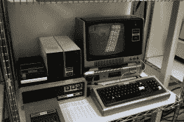](https://i0.wp.com/hackaday.com/wp-content/uploads/2018/05/vcfxiii_museum5.jpg?ssl=1)  [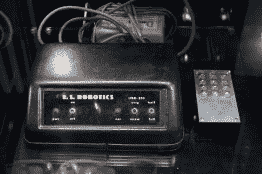](https://i0.wp.com/hackaday.com/wp-content/uploads/2018/05/vcfxiii_museum4.jpg?ssl=1)  [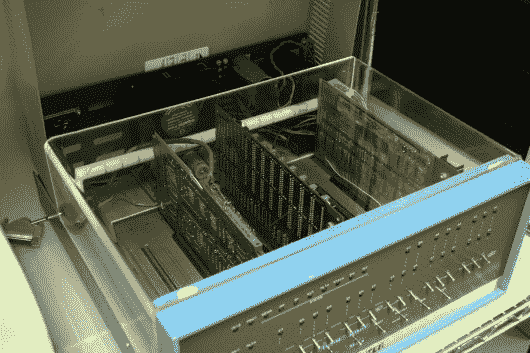](https://i0.wp.com/hackaday.com/wp-content/uploads/2018/05/vcfxiii_museum2.jpg?ssl=1)  [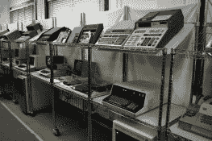](https://i0.wp.com/hackaday.com/wp-content/uploads/2018/05/vcfxiii_museum3.jpg?ssl=1)  [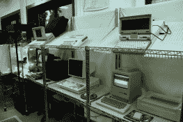](https://i0.wp.com/hackaday.com/wp-content/uploads/2018/05/vcfxiii_museum8.jpg?ssl=1)  [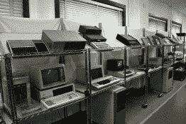](https://i0.wp.com/hackaday.com/wp-content/uploads/2018/05/vcfxiii_museum7.jpg?ssl=1) 

## 寄售室

寄售室绝对是一个宝库，里面有各种各样的物品，有些价格低得离谱。那些带着他们的旧硬件去 VCF 出售的人显然是为了不让这些东西被填埋，而不是为自己谋利。尊重。

像 VCF 的其他地方一样，寄售室展示了令人难以置信的大量物品，尽管也有一些突出的东西。这款 HP 64000 逻辑开发系统配有大量文档和用于 Z80 和 8088 等芯片的适配器，是您在其他地方很难看到的一个特别好的例子:

 [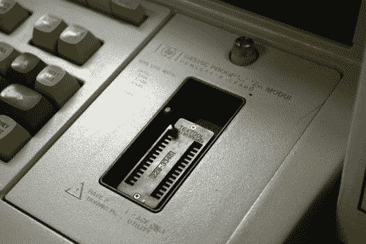](https://i0.wp.com/hackaday.com/wp-content/uploads/2018/05/vcfxiii_condev4.jpg?ssl=1)  [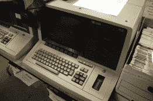](https://i0.wp.com/hackaday.com/wp-content/uploads/2018/05/vcfxiii_condev3.jpg?ssl=1)  [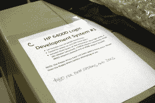](https://i0.wp.com/hackaday.com/wp-content/uploads/2018/05/vcfxiii_condev1.jpg?ssl=1) 

也不是所有出售的都是旧电脑。从经典游戏到测试设备，有大量的交易。

 [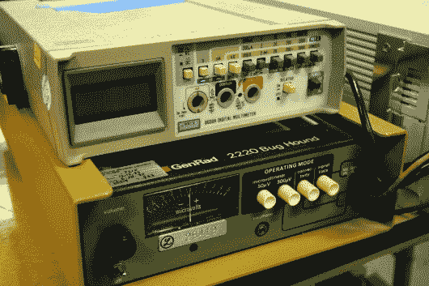](https://i0.wp.com/hackaday.com/wp-content/uploads/2018/05/vcfxiii_conodd4.jpg?ssl=1) Vintage test gear. [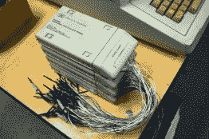](https://i0.wp.com/hackaday.com/wp-content/uploads/2018/05/vcfxiii_conodd5.jpg?ssl=1)  [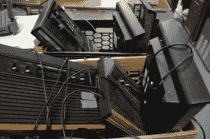](https://i0.wp.com/hackaday.com/wp-content/uploads/2018/05/vcfxiii_conodd6.jpg?ssl=1)  [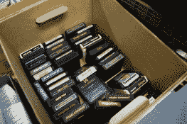](https://i0.wp.com/hackaday.com/wp-content/uploads/2018/05/vcfxiii_conodd2.jpg?ssl=1)  [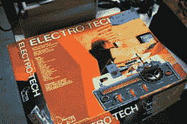](https://i0.wp.com/hackaday.com/wp-content/uploads/2018/05/vcfxiii_conodd3.jpg?ssl=1) Spoilers: the box was empty [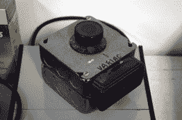](https://i0.wp.com/hackaday.com/wp-content/uploads/2018/05/vcfxiii_conodd1.jpg?ssl=1) Feeling brave?

## 供应商房间

不要和由志愿者组成的寄售区相混淆，售货室是专业卖家展示商品的地方。在这里你可以找到新制造的成套电脑和电子设备。甚至还发现了一些树莓。就条件而言，供应商区域中可用的老式硬件也稍高一些，但正如所料，价格也是如此。

   [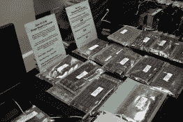](https://i0.wp.com/hackaday.com/wp-content/uploads/2018/05/vcfxiii_vend4.jpg?ssl=1)  [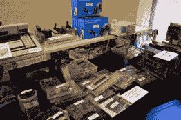](https://i0.wp.com/hackaday.com/wp-content/uploads/2018/05/vcfxiii_vend2.jpg?ssl=1)  [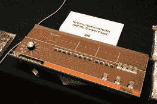](https://i0.wp.com/hackaday.com/wp-content/uploads/2018/05/vcfxiii_vend5.jpg?ssl=1)  [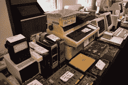](https://i0.wp.com/hackaday.com/wp-content/uploads/2018/05/vcfxiii_vend6.jpg?ssl=1)  [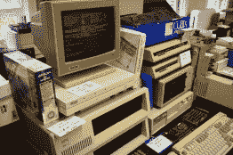](https://i0.wp.com/hackaday.com/wp-content/uploads/2018/05/vcfxiii_vend3.jpg?ssl=1) 

在供应商区引起特别兴趣的是 Corsham Tech 的桌子，它[展示了一个非常光滑的 KIM-1 克隆体](http://www.corshamtech.com/product/kim-clone/)，以及为原机器制造的新配件:

   [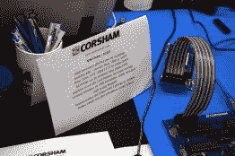](https://i0.wp.com/hackaday.com/wp-content/uploads/2018/05/vcfxiii_vendkim1.jpg?ssl=1)  [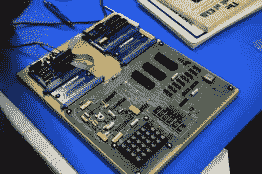](https://i0.wp.com/hackaday.com/wp-content/uploads/2018/05/vcfxiii_vendkim2.jpg?ssl=1) 

## 展望未来

老式计算机节东十三是一个惊人的事件，但像所有美好的事情一样，它也不得不结束。但不要绝望，那里有更多的老式计算。VCF 东区可能要到明年才会举行，但 VCF 西区将于 8 月 4 日和 5 日在加州山景城举行。如果你的下一个理想的系统升级是一个纸带阅读机，并且你可以去美国不那么沉闷的地方，我们强烈建议你去看看。