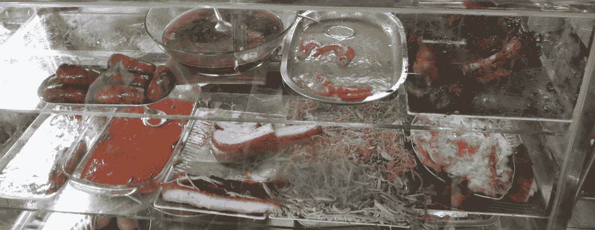
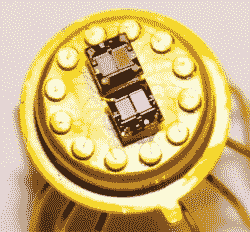
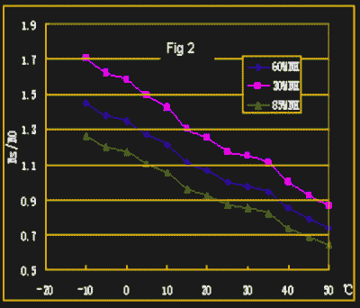
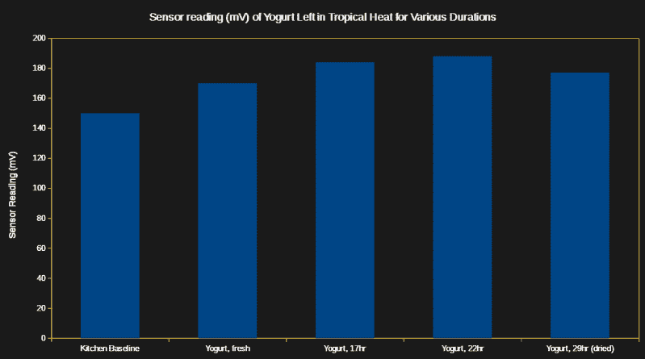
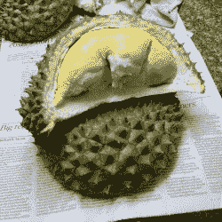
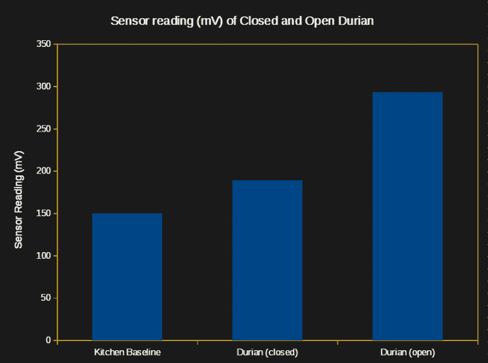

# 气味网络:让机器嗅出变质的食物

> 原文：<https://hackaday.com/2018/05/31/internet-of-smells-giving-a-machine-the-job-of-sniffing-out-spoiled-food/>

你储藏室里的食物变质了吗？有时候，令人作呕的腐烂气味告诉你有什么不对劲。但是有没有办法在它让生活变得不愉快之前抓住它呢？要是有机器能在食物变臭之前闻出变质的味道就好了。

5 月初，我有幸参加了第四届 FabLab 亚洲网络大会( [Fan4](http://fan4.fablabs.vn/) )。他们今年活动的主题是“共同创造一个更美好的世界”。会议的一个主要特点是，会上介绍了许多项目，这些项目往往来自农村地区，在整个会议期间都在请求援助。

总的来说，许多聪明人用有限的资源解决了难题。我就是这样认识[Yogesh Kulkarni]的，他在 Pabal 经营一家私人实验室，Pabal 是一个离印度浦那不远的农业社区。[Yogesh]也出现在 TED 演讲上(这里是[视频](http://www.youtube.com/watch?v=wK5fGsv7SR0))。他向我解释说，在他所在的地区，小贩们出售以牛奶为原料的甜点。这些不是真正冷藏的，有时人们会因为吃了它们而生病。如果有一种方法可以让供应商避免出售偶尔有害的产品，那就太好了。

在我所在的地区(越南)，我也有过类似的食品安全担忧，虽然几乎一直都很好，但几年前我差点死于一种可以预防的食源性疾病。我有足够的动力做一些研究。

## 从化学角度来说，这食物变质了吗？

我们可以闻到腐烂的食物，但我们能闻到最近变得不安全的食物吗？这两者之间有一个巨大的鸿沟，让事情变得更加困难的是，我们正在寻找一种可以充当探测器的机制。



**This place for example is fantastic: the ribs in the upper right approximate glazed and roasted smoked ham. They are to die for — but not literally.**



**Sensor with multiple types of metal-oxide gas detectors. Source: [Fraunhofer IPM](https://idw-online.de/en/news368718)**

我发现在印度已经有一些关于使用挥发性有机化合物(VOC)传感器来识别变质牛奶的研究。更普遍的是，这些传感器[用于商业设备，检测各种食品中的腐败和掺假](http://www.mdpi.com/1424-8220/10/4/3882/pdf)。这些装置有时被称为“电子鼻”。

在我们继续之前，让我们先弄清楚一件事。“电子鼻”不是一个好名字，“现场嗅觉仪”也不是。Smelloscope 是一个客观上更好的术语，所以我们就用它吧。某部动画片的粉丝可能也会认为这是个好消息。

## 表征 VOC 传感器

继续，有两个价格合理的模拟 VOC 传感器随时可供我使用:MQ-2 可燃气体传感器(PDF [数据表](http://www.pololu.com/file/0J309/MQ2.pdf))和 MQ-135 气体传感器(PDF [数据表](http://www.elecrow.com/download/MQ-135.pdf))。我不确定哪一个对检测变质的牛奶最有用，所以我把两个都拿起来，连接到一个运行 NodeMCU 的 WeMos 迷你 D1 上。

这里的一般概念是使用这些传感器中的一个或两个来确定特定新鲜和变质食品的正常范围，并看看它是否能在某种程度上可靠地区分这两者。MQ-135 传感器对这种应用特别感兴趣，因为它对包括二氧化碳在内的更相关范围的气体敏感。

[](https://hackaday.com/wp-content/uploads/2018/05/temphumi-themed.png)

Effect of Temperature (-20 to +50 Celcius) and Humidity (top to bottom: 30%, 60%, and 85% RH) on sensor resistance. Source: [MQ-135 PDF Datasheet](http://www.china-total.com/product/meter/gas-sensor/mq135.pdf)

这些传感器需要相对较大的稳定功率(5V 时每个约为 750 mW)，因此两者都可以通过 7805 线性稳压器供电，尽管我发现当采用 9V 供电时会变得相当热，而在 12v 时会过热，因此在为两个传感器供电时请记住这一点。它们的输出不仅会随着目标气体的变化而变化，还会随着温度和湿度的变化而变化，因此也需要进行跟踪。在这种情况下，我使用了流行的 DHT-22 组合温度/湿度传感器，因为我们只需要粗略的值。

下一个问题是，在我的迷你 D1 上只有一个模拟输入，所以借用一些示波器的技巧，一个小的 5v SPDT 继电器一次只能将一个传感器连接到模拟输入。晶体管触发继电器来切换传感器。事后看来，更简单的方法是用单刀双掷(SPTD)开关将目标传感器的输出连接到模拟输入。我想离开电子控制的可能性，所以这是好的。

组装完成后，该器件的代码非常简单，只需每秒读取 ADC 和温度/湿度传感器:

```

pin = 7
function amount()
    x = adc.read(0)
    status, temp, humi, temp_dec, humi_dec = dht.read(pin)
end

tmr.alarm(0,1000,tmr.ALARM_AUTO,amount)

```

最后，我添加了一个小屏幕(SSD1306 128×32 有机发光二极管)和一个 7.4v 电池电源的桶形插孔，因为在我的工作台上没有太多的街头食品出售。如果你对更多的细节感兴趣，我之前已经用 NodeMCU 介绍过使用这个屏幕的[。](http://hackaday.com/2018/05/02/using-blockchain-explorer-apis-on-nodemcu/)

```

pin = 7
function amount()
    x = adc.read(0)
    status, temp, humi, temp_dec, humi_dec = dht.read(pin)
    print(&quot;DHT Temperature:&quot;..temp..&quot;;&quot;..&quot;Humidity:&quot;..humi)
    print (x)
end

-- Setup screen
sda = 2
scl = 1
sla = 0x3C
i2c.setup(0, sda, scl, i2c.SLOW)
disp = u8g.ssd1306_128x32_i2c(sla)
disp:setFontRefHeightExtendedText()
disp:setDefaultForegroundColor()
disp:setFontPosTop()
disp:firstPage()
repeat
-- choose font
disp:setFont(u8g.font_profont15)
-- display data
disp:drawStr(2, 12, &quot;smell / temp / humi&quot;)
disp:drawStr(2, 26, x..&quot; / &quot;..temp..&quot; / &quot;..humi)

until disp:nextPage() == false

end

tmr.alarm(0,1000,tmr.ALARM_AUTO,amount)

```

## 关于传感器性能，我们学到了什么？

最初的结果喜忧参半。首先，MQ-2 可燃气体传感器并不特别敏感——当我在附近喷洒丁烷时，输出仅从 8mV 增加到 10mV。快速测试表明它正确连接到 ADC，我怀疑传感器有缺陷。我以前使用过这种传感器，记录的基线读数约为 70mV，在有少量丁烷的情况下增加到约 500mV，在有轻微发酵的天然蜂蜜的情况下增加到约 350mV。调整输出增益并不能解决问题，所以我暂时把这个传感器放在一边。

另一方面，MQ-135 传感器工作得很好。一项快速测试显示，当我对着它呼吸时，电压增加了，超过了湿度增加的原因，因此它可能正确地检测到了二氧化碳。它对丁烷也非常敏感，在丁烷源附近输出接近 1V。

下一步是检查垃圾桶。我刚刚清空了它，但它仍然有淡淡的食物垃圾的味道，并导致垃圾箱盖附近的传感器输出从 136mV 增加到 196mV。到目前为止一切顺利——它至少在检测变质食物方面有潜在的用途，为气味互联网技术铺平了道路。

## 那次我故意让食物变质

为了模拟变质的牛奶甜点…我实际上只是让一些食物变质。我留出了四个装有活性细菌培养物的天然酸奶塑料容器。一个我放在外面 29 小时，一个 22 小时，另一个 17 小时。最后的样品在实验前 15 分钟一直放在冰箱里，所以它和其他样品的温度大致相同。在让设备预热 2 分钟后，我用嗅镜对每个样品进行了取样。

最终，这并不像我希望的那样提供信息，测量值只是随着时间的推移略有增加，直到 29 小时的样本下降，这明显是由于在室外放置了这么长时间而变得更干燥:

[](https://hackaday.com/wp-content/uploads/2018/05/yogurt-smells-themed.png)

Environmental conditions were 28-32 degrees Celsius, and 80-90% relative humidity.



根据这些数据，我可以得出结论，这种类型的传感器很可能能够识别变质的食物，但它需要大量的数据收集才能达到实用的程度。换句话说，它没有我希望的那么有用——但是没有必要为变质的牛奶哭泣。我环顾我的厨房寻找其他应用，我记得我买了一个榴莲…

根据你的口味，榴莲要么是世界上最好的水果，要么就像旧运动袜一样开胃。我碰巧非常喜欢它们(榴莲，不是袜子)，但有一点是肯定的:它们非常香，以至于在一些国家的酒店、出租车和公共场所被禁止。

无论如何，对合上的和打开的水果进行快速测量表明，我可以用这个装置在市场上挑选最香的水果，而不用打开它。进一步的美味实验显然是有序的，但我的好奇心(和食欲)现在已经得到满足。

[](https://hackaday.com/wp-content/uploads/2018/05/durian-smell-themed.png)