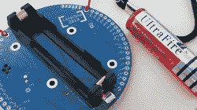
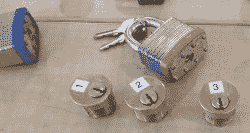
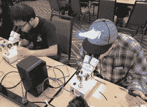
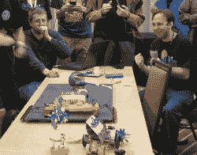
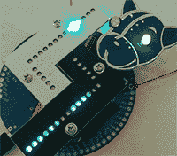

# LayerOne 2018 上的徽章闪亮和更多

> 原文：<https://hackaday.com/2018/05/29/badge-bling-and-more-at-layerone-2018/>

LayerOne 2018 安全会议于上周末在加州帕萨迪纳举行。日程冲突意味着我们的大部分工作人员都在 [Hackaday Belgrade](https://hackaday.com/2018/05/26/hackaday-belgrade-is-on-join-in/) ，但我第一次去 LayerOne 查看。这是一个充满破译神秘徽章、动手学习物理安全、欣赏令人印象深刻的演示和制作蹩脚机器人的周末。

## 你好会议徽章

一报到参加会议，与会者就被发给一块组装好的电路板和一块电池，然后被集中起来，以便其他人也能报到。与过去几年的故事相比，这是绝对的奢侈，当时与会者得到的是一个空白的 PCB 和一袋零件。“徽章是做什么的？”是这里乐趣的一部分，也是我们互相交谈和交换意见的极好的破冰方式。之前的几个 LayerOne 徽章[在 Hackaday.io](https://hackaday.io/charliex) 上有记录，但不是这个。(还没？)

顶部的 ESP32-WROOM-32 告诉我们这是一个联网设备。板上只有四个 led，但有一个扬声器和麦克风模块告诉我们，徽章是一个听觉展示，而不是视觉展示。人的手指有五种控制。三个相当简单:电源开关加上“启动”和“重置”按钮。伴随它们的是一个标有“不要按”(是的，没错)的按钮和一个标有我们第一个提示的按钮:“[米塞克先生](http://rickandmorty.wikia.com/wiki/Mr._Meeseeks)”

 由于这是一次安全会议，一些与会者认为他们不想在脖子上戴一个带有录音功能的神秘网络设备。他们创造 100%安全的物联网设备的徽章黑客是根本不安装电池:一个 18650 电池，自豪地戴着它令人惊讶的名字“UltraFire”。

大多数选择安装电池的人都得到了发光二极管的奖励。一些之后是一段“我是米索克斯先生，看着我！”这个公告会随机打断整个周末的会议进程。

那些想一头扎进徽章的人直奔硬件黑客村，但会议还有许多其他部分。最大的房间专用于整个周末的安全讲座以及周六晚餐和游戏之夜。一个房间进行会议夺旗比赛。有一个房间专门用于物联网设备，还有一个“放松”房间，里面有游戏，人们可以在上面的所有活动中休息一下。遗憾的是，我一次只能呆在一个地方，所以我选择去开锁村看看。

## 开锁村

 LayerOne 的开锁村邀请人们玩物理安全装置。不是所有人都能学会打败他们，但我们都学会了如何去信任他们。今年一半的房间都被用来装物理锁。一天两次的弹子锁基础课程给完全的初学者足够开始使用基本的工具来训练桌子上的锁。然后，我们可以看看展示的高安全性/深奥的锁，看看他们的设计师是如何试图使撬锁变得困难。

撬锁村的另一半致力于防盗封条。这些简单的设备并不是为了防止访问，因为很容易将它们分开。它们的目的是显示这种篡改已经发生的证据。LayerOne 与会者面临挑战，以挫败他们的目的:打开他们*没有*留下篡改的证据。人们手头上有各种各样的这种印章，可以选择他们希望解决的困难程度，从基本上是花哨的拉链到越来越聪明的装置。

开锁村对初学者来说比预期的要友好得多。整个房间非常有趣，也很有教育意义，即使对于一个只做了 4 针锁的人来说也是如此，当我打开我的防篡改封条时，留下了明显的篡改证据。

## 硬件黑客村

回到硬件黑客村，徽章上的单词是它在活动中连接到 WiFi AP，并通过它连接到亚马逊的 Alexa。“我是米索斯先生，看着我！”音频通知设备在线并准备就绪。遗憾的是，有些东西不能很好地扩展到整个会议，所以徽章被下线了。他们重新联系的努力解释了整个周末频繁和随机的通知。

 活动组织者预见到会有人怀念自己焊接电路板的体验，或者怀念闪烁的发光二极管的存在。因此，一个附加套件被出售，以建立一个闪烁的 LayerOne 标志。由微小的表面贴装器件制成，这是一个挑战，人们在不同程度上取得了成功。一些工作人员在现场提供了非常受欢迎的指导。

 HHV 还举办了一些其他活动，包括小组讨论、[演示派对](http://l1demo.org/)和[电子竞技:蹩脚机器人比赛](https://www.layerone.org/events/hebocon-robot-battles/)。作为第一次参加会议的人，我没有做好准备，直到我注意到 Hebocon 的筹备工作，我才认为我可以参加。人们把零件从箱子里拿出来，热粘在一起，做成简单的装置。大多数竞争者都是在比赛开始前一个小时内建成的，所以在比赛还剩 40 分钟的时候，我决定一起黑一个。由于没有时间进行测试和打磨，这是一个用可怕的 Tindie 闪烁徽章恐吓敌人的机器人……然后把自己赶出竞技场。

 到周末，许多会议徽章上都挂着官方闪烁的附加标志。但由于你永远不会有太多的 led，我修改了我的 Tindie 徽章，以接入会议徽章电源轨，并坐在发光的 LayerOne 徽标旁边。

除了 [Github 仓库](https://github.com/charlie-x/ESP32_Alexa)之外，组织者承诺为那些希望继续为他们的徽章工作的人提供更多信息。这是一个很棒的设备，已经有音频外设和电池电源管理，加上 ESP32 引脚引出到周边的通孔焊点。LayerOne 2018 徽章是进一步黑客攻击的伟大基础，我期待着承诺的未来发布的文档。在那之前，徽章必须自己说话。

“你最喜欢的颜色是什么？”

“我最喜欢的颜色是海泡石。”