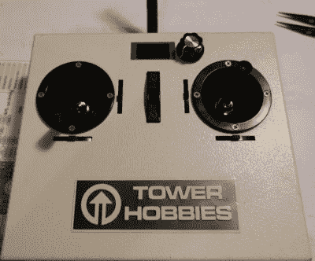

# 被黑的遥控发射器控制着一切

> 原文：<https://hackaday.com/2018/06/05/hacked-rc-transmitters-control-all-the-things/>

如果你有很多 RC 作品，每个都有自己的接收器，你会知道每个项目的新接收器的成本会很快增加——尽管 RC 接收器现在很便宜。如果您可以使用成本不到 3 美元的 NRF24L01+模块会怎么样？

这正是[鲁道夫]为他的黑客奖参赛作品 rud remote 所做的。虽然许多人已经用 NRF24 模块构建了自己的 RC 链路，但这是一个完整的、经过深思熟虑的解决方案，很容易扩展到大量接收机。

发射机可以由手边的任何东西制成；粘一个 NRF24 模块和 Teensy 在里面，如果需要，一些万向节，你有一个 rudRemote 发射机。游戏控制器、三明治盒子和成堆的激光切割零件都是受鼓励的选择。[鲁道夫]使用了一些有 40 年历史的发射器，除了一个小有机发光二极管和用于功能菜单的旋转编码器之外，它们在外观上保持不变。万向接头连接简单地重新路由到小型 I/o。

使用的协议是 CRTP(疯狂实时协议)；这部分是因为[鲁道夫]想要控制的东西之一是 CrazyFlie 四轴飞行器。这是一个协议，可以很容易地用来控制你喜欢的任何东西，只要它适合 29 字节的有效载荷空间。CrazyFlie 只使用了其中的 14 个字节，所以有足够的空间用于辅助功能。

我们有兴趣了解该系统的延迟——在测量廉价 RC 发射器延迟时，我们得到了一些令人惊讶的结果。

The [HackadayPrize2018](https://hackaday.io/prize) is Sponsored by:     