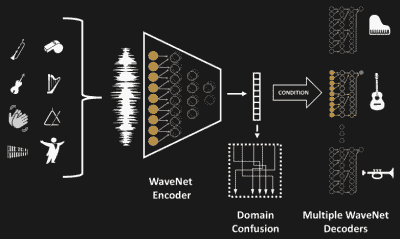

# 脸书的通用音乐翻译器

> 原文：<https://hackaday.com/2018/06/02/facebooks-universal-music-translator/>

《星际迷航》有它的通用语言翻译器，现在来自脸书人工智能研究中心的研究人员已经开发了一种通用音乐翻译器。它很大程度上基于[谷歌的 WaveNet](https://hackaday.com/2016/12/03/talking-neural-nets/) ，其中一个版本也被用于[最近发布的谷歌双工人工智能](https://hackaday.com/2018/05/10/googles-duplex-ai-has-conversation-indistinguishable-from-humans/)。

 它的灵感来自于人类能够听到任何乐器演奏的音乐，然后能够吹口哨或哼歌，从而将音乐从一种乐器转换到另一种乐器。到目前为止，这是计算机很难做好的事情。研究人员给他们的翻译输入一段演奏海顿的弦乐四重奏，并让他将音乐翻译成合唱和管弦乐队以巴赫的风格演唱和演奏。他们甚至让某人用口哨吹《印第安纳·琼斯》的主题曲，并让它把曲调翻译成莫扎特风格的交响乐。

这里显示的是他们网络的架构。注意，所有不同的音乐都被输入到同一个编码器网络中，但是音乐可以被翻译成的每个乐器都有自己的解码器网络。它在 PyTorch 中实现，并使用八个 Tesla V100 GPUs 进行了为期六天的训练。在训练期间，努力确保编码器从输入的音乐中提取高级语义特征，而不仅仅是记忆音乐。更多细节可以在他们的论文中找到。

因此，如果你想听听贝多芬是如何将金属乐队风格的电吉他演奏成钢琴的，请听下面视频中的例子。

 [https://www.youtube.com/embed/vdxCqNWTpUs?version=3&rel=1&showsearch=0&showinfo=1&iv_load_policy=1&fs=1&hl=en-US&autohide=2&wmode=transparent](https://www.youtube.com/embed/vdxCqNWTpUs?version=3&rel=1&showsearch=0&showinfo=1&iv_load_policy=1&fs=1&hl=en-US&autohide=2&wmode=transparent)

当你在下面的评论中讨论这项工作时，请欣赏下面的样本#13 的完整翻译，其中猫王的版本“永远在我心中”的 Midi 渲染被翻译成莫扎特风格的交响乐。

 [https://www.youtube.com/embed/gn7T9hSMAJ0?version=3&rel=1&showsearch=0&showinfo=1&iv_load_policy=1&fs=1&hl=en-US&autohide=2&wmode=transparent](https://www.youtube.com/embed/gn7T9hSMAJ0?version=3&rel=1&showsearch=0&showinfo=1&iv_load_policy=1&fs=1&hl=en-US&autohide=2&wmode=transparent)

