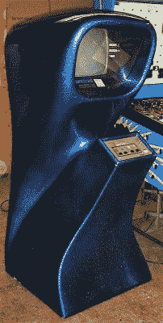
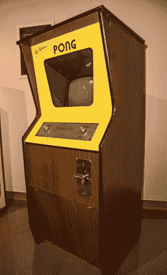

# 泰德·达布尼、雅达利和电子游戏革命

> 原文：<https://hackaday.com/2018/06/05/ted-dabney-atari-and-the-video-game-revolution/>

对于那些在电影视频游戏中长大的人来说，可能很难想象看到一个普通的白点在黑色屏幕上划过，在墙壁上反射，然后被一个对手腕的扭动立即做出反应的小桨反弹的奇迹。但是曾经有一段时间，乒乓是我们仅有的东西，这很有趣。人们排了几个小时的队来换取一枚 25 美分的硬币来分散几分钟的注意力。在一个充斥着嘈杂的弹球机、花哨的艺术品和闪烁的灯光的拱廊里， *Pong* 似乎是一片平静的绿洲，你几乎可以感觉到你的大脑在做几何运算，以确定在哪里放置球拍，以免错过击球。

虽然现在看起来很原始，但 Pong 曾站在视频游戏革命的最前沿，这个小游戏催生了一个仅在去年就获利 1080 亿美元的行业。它还催生了该行业早期的成功故事之一，雅达利公司，成立于 1972 年。就在上周，雅达利的联合创始人之一泰德·达布尼(Ted Dabney)去世，享年 81 岁。令人难过的是，我们已经到了失去一些行业先驱的地步，但事情就是这样。我们所能做的就是反思达布尼的生活和遗产，并研究使他成为视频游戏业之父之一的不可思议的道路。

## 任何东西，甚至电子产品

Ted Dabney, in the Corps. Source: [They Create Worlds](https://videogamehistorian.wordpress.com/tag/ted-dabney/)

塞缪尔·f·达布尼(Samuel F. Dabney)生于 1937 年，他更喜欢“泰德”这个昵称——经历大萧条和第二次世界大战太晚了，但正好赶上受它们的影响。作为一名土生土长的旧金山人，他似乎继承了节俭和共同牺牲的价值观，这在当时是一种文化。他的职业道德和糟糕的成绩让他进入了一所贸易学校，在那里他学习了制图，这是他十几岁时进入工作世界的敲门砖。

高中毕业后，特德做了一名测量员，但这是季节性的工作，使他在加利福尼亚的冬天陷入困境。为了寻找一份稳定的薪水，特德加入了海军陆战队，为期三年，条件是他要接受高级技术专业的培训。特德最终进入了电子学校，这是一个为期 16 周的沉浸式课程，为他提供了基础知识，并引导他从事复杂系统的工作，如多路无线电。

退伍后，特德找工作，以便能上大学。50 年代末，硅谷有很多电子行业的工作，泰德在音频和视频磁带录像机公司 Ampex 找到了一份工程工作，从事用于查看间谍飞机电影图像的军事系统的工作。一天，当他全神贯注于一个项目时，一个西装革履的人走近他的长凳，问他在做什么。泰德说:“我不知道我能不能告诉你这件事。都是军事。”西装走了，特德后来才发现，这是亚历山大·m·波尼亚托夫，在 Ampex 的“放大器”。他刚刚拒绝了公司的创始人。

## 硅谷的大创意

Computer Space, the game no one got.

在与 Ampex 公司的新雇员诺兰·布什内尔会面后，特德在军事成像系统方面的工作对他大有裨益。同为电气工程师的布什内尔具有当时硅谷常见的企业家精神。诺兰看过*太空战！犹他大学，并决定将其商业化。他最初设想在幕后有一台主机，配有硬币操作的终端来玩游戏，但当证明这太昂贵时，他说服 ted 使用他在 Ampex 学到的视频技术来帮助设计一个更便宜的游戏。*

An original Pong cabinet, signed by Al Alcorn. Source: By Chris Rand [from Wikimedia Commons](https://commons.wikimedia.org/wiki/File:Signed_Pong_Cabinet.jpg)

泰德和诺兰每人投资 100 美元，成立了一家制作游戏的公司。他们的第一个游戏将是*电脑太空*，一个*太空战的克隆版本！*在未来风格的橱柜里。尽管销售额达到了 300 万美元，这款游戏还是失败了。

但是布什内尔和达布尼有足够的钱再试一次，随着公司更名为 Atari(围棋术语)，他们开始寻找下一个伟大的想法。诺兰想要一个驾驶游戏，但 ted 认为这个想法太复杂而拒绝了，所以诺兰满足于一个类似于 Magnavox Odyssey 家用游戏机上看到的网球游戏作为练习游戏。他们雇佣了一名程序员，艾伦·奥尔康，用泰德制作的视频电路来制作游戏。三个星期后，他们都沉迷于完成的游戏，并意识到他们有一个产品。

他们建造了 12 个橱柜，安装在该地区的各个酒吧和餐馆，不知道会发生什么。然后硬币开始滚滚而来。诺兰和泰德惊讶于他们的运气，听到安装在当地一家酒吧里的原型机坏了，他们也很惊慌。他们派奥尔康去修理，奥尔康发现机器一修好，人们就在排队等着玩。问题是:他们往里面塞了太多的 25 美分硬币，硬币箱溢出来了，导致机器短路。乒乓是真正的成功。

## 砰的一声，噗的一声

更多机器的订单源源而来。泰德不得不手忙脚乱地搭建橱柜，把廉价商店的黑白电视改装成游戏显示器，然后把所有东西都组装起来。雅达利发展迅速，搬到一个更大的空间去建造他们的机器，雇佣新员工，但仍然只是勉强保持在 Pong 热潮的前沿。

但在这家年轻公司的疯狂发展中，事情开始变糟。诺兰做出的管理决策将泰德排除在外，由于担心公司会倒闭，泰德退出了。他与诺兰保持了一段时间的友好关系，甚至帮助他将他的披萨店想法变成现实，有一天会变成“查克奶酪披萨时光影院”特许经营。但是餐馆在 80 年代初陷入困境，当诺兰无力支付泰德的工作报酬时，他们就永远地分道扬镳了。

离开视频游戏行业后，Ted 回到了电气工程领域，为雷神和 Teledyne 等公司工作。但公司的场面令人恼火，最终他只好认输，和妻子搬到了乡下。他们买了一家小杂货店，加了一家熟食店，过上了当之无愧的宁静生活。

很少有人会说，“我在那里，当……”但泰德·达布尼肯定是在一场无意的革命中开创了一个行业。走自己的路，做自己喜欢的事，让他走到了那里，这对我们所有人都有借鉴意义。