# 贝尔格莱德的疯狂黑客日证实了它是世界上最大的硬件诈骗犯之一

> 原文：<https://hackaday.com/2018/06/01/a-wild-hackaday-belgrade-confirms-status-as-one-of-worlds-greatest-hardware-cons/>

周六，黑客、设计师和工程师涌入 Dom Omladine，参加只能被描述为硬件文化史诗般的庆典。这是 Hackaday 第二次在贝尔格莱德组织大型会议，闪电确实袭击了两次。

## 新老朋友的聚会

会议前一天晚上，我们开了个碰头会。贝尔格莱德的第一次 Hackaday 是在 2016 年举行的，我们没有在周五晚上预订酒吧——我们最终通过纯粹的数字接管了一家酒吧。今年我们提前预定了一个大的户外空间，然后很好地利用了它。

 [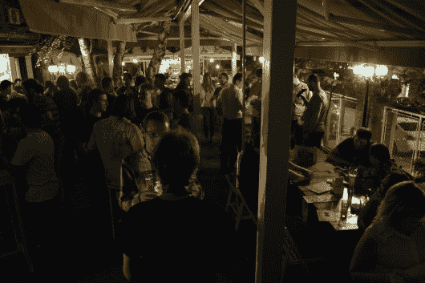](https://hackaday.com/2018/06/01/a-wild-hackaday-belgrade-confirms-status-as-one-of-worlds-greatest-hardware-cons/dsc_0911/) A great kickoff to the weekend [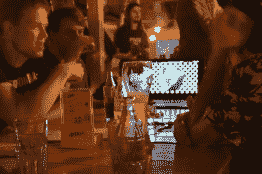](https://hackaday.com/2018/06/01/a-wild-hackaday-belgrade-confirms-status-as-one-of-worlds-greatest-hardware-cons/dsc_0924/) LED cube animation emulation demo [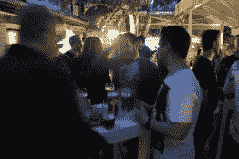](https://hackaday.com/2018/06/01/a-wild-hackaday-belgrade-confirms-status-as-one-of-worlds-greatest-hardware-cons/dsc_0909/) *No beers were wasted during this meetup

每个人都兴奋地期待着第二天的到来。在现实生活中，总会有一股激情迸发的能量。这个群体的大多数人都在 Hackaday.io 上闲逛，但只有一部分人见过面。再加上那些在之前的贝尔格莱德聚会和欧洲其他聚会上成为朋友的人的重聚，你会有回家的感觉。这些真的是你的人。

## 是的，一个会议。但是很酷的那种

黑客大会不仅仅是聚会…它们是会议。如果你以正确的方式接近它，你可以让你的雇主和你一起参加，因为你会遇到不可思议的人，学到很多东西，回来时兴奋地迎接宇宙。实际上，把你的老板也带上吧！

 [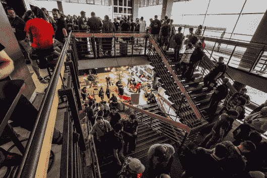](https://hackaday.com/2018/06/01/a-wild-hackaday-belgrade-confirms-status-as-one-of-worlds-greatest-hardware-cons/2018-05-26-10-28-51-_dsc3048/) Flooding into Hackaday Belgrade [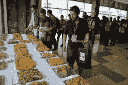](https://hackaday.com/2018/06/01/a-wild-hackaday-belgrade-confirms-status-as-one-of-worlds-greatest-hardware-cons/dsc_0954/) Breakfast spread as the doors open [")](https://hackaday.com/2018/06/01/a-wild-hackaday-belgrade-confirms-status-as-one-of-worlds-greatest-hardware-cons/2018-05-26-13-26-29-_dsc3066-1/) 

今年我们进行了 13 次令人难以置信的会谈。作为我们的惯例，我们以一个超级技术性的演讲开始，雷切尔·黄(又名 [@konichiwakitty](https://twitter.com/konichiwakitty) )讨论了她的博士研究，其中包括在实验室中培养眼睛组织。但是像所有非常聪明的人一样，她有一个创造性的出口，她也在她的主题演讲中提到了这一点。Rachel 热衷于开发可穿戴设备，通过将我们真正需要的东西包含在我们的服装和装备中来实现未来。

 [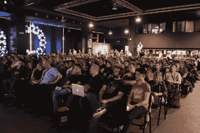](https://hackaday.com/2018/06/01/a-wild-hackaday-belgrade-confirms-status-as-one-of-worlds-greatest-hardware-cons/dsc_0001-4/) Main hall packed for the keynote address [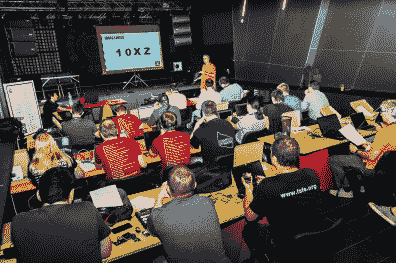](https://hackaday.com/2018/06/01/a-wild-hackaday-belgrade-confirms-status-as-one-of-worlds-greatest-hardware-cons/2018-05-26-16-55-05-_dsc1051/) The workshop area full to the brim

从无人机监控网络到机器人焊接机，以及设计有意义的硬件的概念，到使用代码来自动化乏味的 PCB 布局，这些讲座对每个人来说都有很多内容。

 [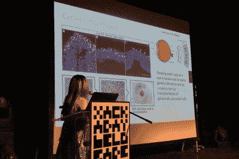](https://hackaday.com/2018/06/01/a-wild-hackaday-belgrade-confirms-status-as-one-of-worlds-greatest-hardware-cons/dsc_0016-8/) Rachel Wong on the growing of eye tissue [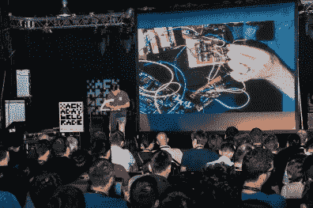](https://hackaday.com/2018/06/01/a-wild-hackaday-belgrade-confirms-status-as-one-of-worlds-greatest-hardware-cons/2018-05-26-15-16-42-_dsc1029/) Elliot Williams demos Logic Noise live on stage

我真的很喜欢埃利奥特·威廉姆斯关于逻辑噪音的演讲，他的现场演示使用简单的逻辑芯片来构建复杂的音乐。Marcel van Kervinck 带领我们踏上了 TTL 计算机设计之旅。Sophi Kravitz 关于建造非刚性飞艇的演讲让至少两个人在会议期间受到启发并设计出了他们自己的飞艇！有一个关于会谈的现场直播，所以请关注 Hackaday，我们会把它们拿出来单独展示。

[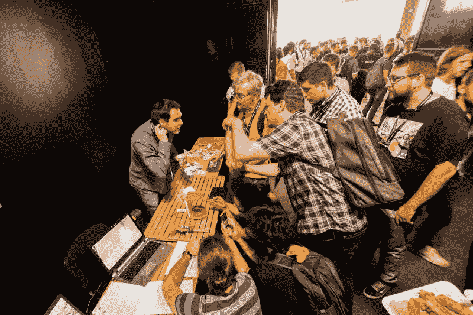](https://hackaday.com/wp-content/uploads/2018/05/2018-05-26-13-25-14-_dsc3061.jpg)

Some of the demo hardware: Acoustic levitation for lab work

研讨会只有站着的地方，因为没买到票的人可以旁听课程。我们有三节实践课，分别是构建可穿戴电路、将艺术融入 PCB 设计以及深入 FPGAs 世界。

## 欢迎，这是你的挂脖复古电脑

每个进门的人都会收到一个定制的电子徽章，可以在贝尔格莱德黑客日期间使用。Voja Antonic 设计了硬件并监督生产。我们取得了优异的成绩，这很棒，因为我们几乎(如果不是超过)100%出席了会议。我们结束了这一天，只剩下 5 枚徽章！

[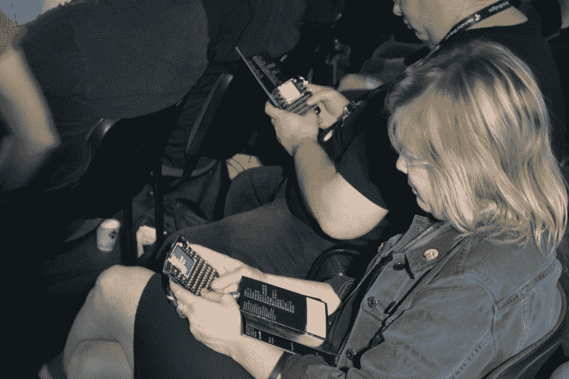](https://hackaday.com/wp-content/uploads/2018/05/dsc_0005.jpg)

这些掌上电脑真的很热！每个徽章都有 55 个按键。房间里至少有 350 人，接近 20，000 个瞬时按钮开关，一度出现短暂的“沉默”,只能听到点击按钮的声音。我们要求每个人在数百个徽章在一个辉煌的合唱中升起的同时演奏马里奥·奥弗尔德的曲子。还有一本 16 页的用户手册，其中包括入门的示例代码。

[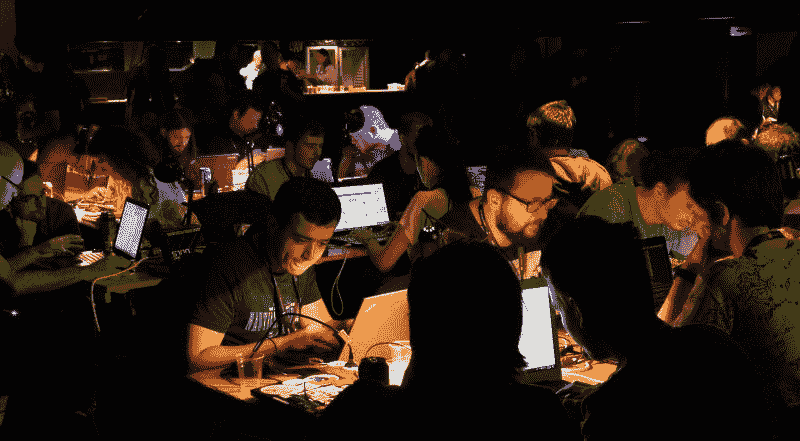](https://hackaday.com/wp-content/uploads/2018/05/badge-hacking-at-hackaday-belgrade.jpg)

黑客攻击持续了一整天，但当讲座结束时，我们把大厅变成了一个黑客村。桌子被搬进来，很快就坐满了。现场音乐充满了房间，波格丹一世·罗苏和理查德·霍本都演奏了 IDM 套装。如果你一直在看 Hackaday 的视频，你会听说他们的工作和他们今晚的表演是史诗般的。

  What is better than hacking to live music? [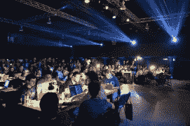](https://hackaday.com/2018/06/01/a-wild-hackaday-belgrade-confirms-status-as-one-of-worlds-greatest-hardware-cons/dsc_0255-2/) Still going strong as midnight approaches [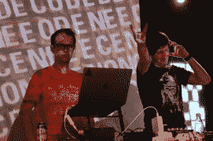](https://hackaday.com/2018/06/01/a-wild-hackaday-belgrade-confirms-status-as-one-of-worlds-greatest-hardware-cons/dsc_0399/) Rich and Bogdan join forces for the final live music set [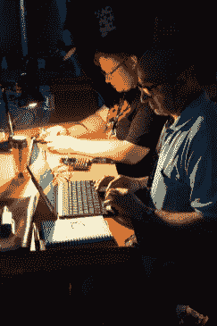](https://hackaday.com/2018/06/01/a-wild-hackaday-belgrade-confirms-status-as-one-of-worlds-greatest-hardware-cons/dsc_0412-2/) So much hacking, so little time  Head to head game called ‘Shoot my Valentine’ [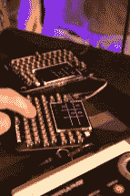](https://hackaday.com/2018/06/01/a-wild-hackaday-belgrade-confirms-status-as-one-of-worlds-greatest-hardware-cons/dsc_0296-2/) Head to head Tic Tac Toe [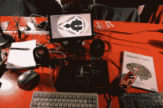](https://hackaday.com/2018/06/01/a-wild-hackaday-belgrade-confirms-status-as-one-of-worlds-greatest-hardware-cons/dsc_0233-4/) There were other hardware demos on display too [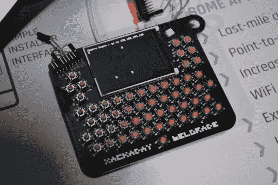](https://hackaday.com/2018/06/01/a-wild-hackaday-belgrade-confirms-status-as-one-of-worlds-greatest-hardware-cons/dsc_0190-3/) This badge was put on WiFi by lunchtime [![[Flummer]'s badge displays minimalist style](img/f91a637fdae3575ca71a9799543541b0.png "DSCF0774")](https://hackaday.com/dscf0774/) [Flummer]’s badge displays minimalist style [![Detail of [Larissa Koncz]'s Interactive Poetic Glove from the workshop](img/af561931cea6c2640b943167c2becb09.png "DSCF0785")](https://hackaday.com/dscf0785/) Detail of [Larissa Koncz]’s Interactive Poetic Glove from the workshop [![The world's slowest sinewave, calculated in BASIC: [Tom van Dijk]](img/fb918be65fc9028fd4221625ac572b11.png "DSCF0776")](https://hackaday.com/dscf0776/) The world’s slowest sinewave, calculated in BASIC: [Tom van Dijk] [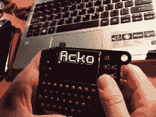](https://hackaday.com/dscf0781/) So much ASCII art! [![[Frederic] and [Manoel] got their badges talking over AFSK, when the RF interference didn't get them...](img/75ced68ccc23ef97e425453bd2572194.png "DSCF0748_bright")](https://hackaday.com/dscf0748_bright/) [Frederic] and [Manoel] got their badges talking over AFSK, when the RF interference didn’t get them… [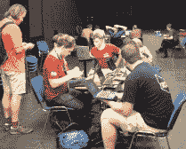](https://hackaday.com/dscf0767/) The RevSpace crew at work in the quiet workshop room

有食物，有啤酒，还有我们生活方式的工具；笔记本电脑、程序员、跳线、亮闪闪的附加设备，以及随之而来的兴奋感。徽章黑客演示在午夜开始，这个地方仍然充满了兴奋。看到我们的社区如此支持探索硬件和尝试新事物真是太好了。在 Hackaday.io 上发布您的徽章黑客和大会故事，因为我们将在未来几天内发布这些内容，并希望确保我们拥有所有有趣的细节。

## 为什么是贝尔格莱德？

请关注 Hackaday，因为将会有更多关于这一精彩事件的报道。许多人问:“为什么是贝尔格莱德？”。这是一个神奇的城市，该地区的工程社区热衷于聚在一起学习和分享想法。这包括住在贝尔格莱德的供应框架工程师，他们负责组织和管理贝尔格莱德的黑客组织。你们都做得非常出色，大会的每个人都欠你们一份情，非常感谢！我们还要感谢本次活动的赞助商 Supplyframe 和 SevenBridges。

[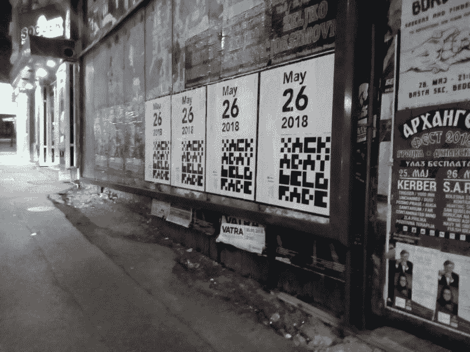](https://hackaday.com/wp-content/uploads/2018/05/hackaday-belgrade-poster.jpg)

对所有参加的人，没有你们就不会有今天！我可以代表 Hackaday 团队中的每个人说，我们共享的文化是激励、鼓励和谦逊。这正是每个人都在寻找的保持生活有趣的充电方式！我们下次再见。现在，在接下来的五个月里，我们将目光投向了黑客日超级大会。那里见！