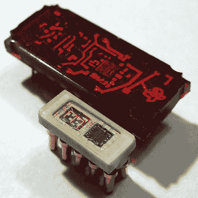

# 漫威在苏联时代的智能显示器的微小尺寸

> 原文：<https://hackaday.com/2018/06/09/marvel-at-soviet-era-smart-displays-tiny-size/>

 

苏联时代的 490IP1 LED。手指只有 2.5 毫米高。图为德州仪器 TIL306。[image:[industrialalchemy.org](http://www.industrialalchemy.org/articleview.php?item=3104)

很容易认为旧的组件会比我们想象的集成度低，体积大。然后有些东西似乎走在了时代的前面，比如前苏联生产的极小的 490IP1 LED。[AnubisTTP]获得并分享了这种微型集成单个数字 LED 显示器的图像，其中的数字只有 2.5 毫米高；在生产中，用夹在外面的外部气泡透镜放大镜可以更容易地阅读。490IP1 图片中的红砖是德州仪器 til 306(T11)，这是一个相对正常尺寸的 DIP 组件，具有类似的功能。

490IP1 被称为智能 led 显示屏，因为该封装包含一个十进制计数器和集成七段 LED 数字的驱动电路，以及一个进位信号，这意味着多个显示屏可以链接在一起。它之所以引人注目，不仅仅是因为它的尺寸，还因为玻璃盖使得人们可以很容易地看到里面的芯片，以及引线键合焊盘。

看到显示技术的发展轨迹总是令人着迷的。今天，人们很容易认为这是理所当然的，但在技术发展到今天这个地步之前，人们已经尝试了各种各样的方法。我们过去见过的例子包括神奇的(巨大的) [Eidophor](https://hackaday.com/2016/03/15/retrotechtacular-eidophor-an-unknown-widely-used-projector/) 投影仪，它通过用电子枪将图像绘制到旋转的油盘上来工作。在较小的一端，[球形显示器](https://hackaday.com/2018/01/21/the-sd-11-sphericular-display-pixels-that-arent-pixels/)使用光学和图像掩模，仅用盒子后面的几盏灯来扭曲一个紧凑的 0-9 数字显示器。