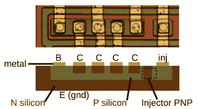

# 《太空入侵者》的声音芯片和 I2L 一起过时了

> 原文：<https://hackaday.com/2018/06/08/space-invaders-sound-chip-went-old-school-with-i2l/>

今天一定是每个人的生日，因为[肯·希尔瑞夫]给我们带来了一份礼物。他又对 20 世纪 70 年代的 76477 太空入侵者声音芯片进行了逆向工程，发现它充满了集成注入逻辑(I ² L)，这是一种双重待遇:我们可以探索这种芯片的更多部分，这种芯片为我们最喜欢的游戏制作声音，我们还可以探索一种逻辑，这种逻辑将成为 TTL 的继任者，直到 CMOS 出现。

I²L gate

这篇文章与他的上一篇文章有相似的形状，首先介绍 I ² L，然后向我们展示它在骰子上的样子，然后涵盖大量使用它的不同功能元素。第一个是噪声发生器，由一部分移位寄存器和一个环形振荡器组成。接下来是一个噪声滤波器，它不使用 I ² L，但使用电流镜。最后，他谈到了混音器，它混合了噪声发生器的输出和他上一篇文章中提到的[元件、压控振荡器和超低频振荡器。奇怪的是，正如他指出的，它不是一个模拟混音器。相反，它只是将各种输入进行 and 运算。](https://hackaday.com/2017/05/06/reverse-engineering-space-invaders-sound-chip/)

[Ken 的]把芯片放在显微镜下并不陌生。查看我们对[他在 2016 年 Hackaday 超级大会](https://hackaday.com/2016/12/27/ken-shirriff-takes-us-inside-the-ic-for-fun/)上的讲话的报道，他向我们展示了 Z80 和 555 定时器 IC 等热门产品的精髓。