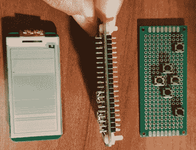

# 口袋大小的 Pi 零桌面功能的电子纸显示器

> 原文：<https://hackaday.com/2018/06/04/pocket-size-pi-zero-desktop-features-e-paper-display/>

[Ramin Assadollahi]将他的 Raspberry Pi Zero W 作为一个独立的移动桌面，当他想破解一些代码或进行一个新项目时，可以通过 VNC 从另一台计算机连接到它。但是他经常发现自己希望有某种便捷的方式在设备上显示相关信息，比如 Pi Zero 获取了什么 IP 地址。然后，他从 Waveshare 找到了 2.13 英寸的 Pi Zero 电子纸帽子，一切都很顺利。

 最终设备[被他称为 StickPi](https://assadollahi.de/stickpi-a-raspberry-pi-zero-w-with-gpio-buttons-and-an-e-paper-display/) ，它结合了 Pi Zero W、Waveshare 电子纸显示屏和一条带有几个触觉按钮的原型板，所有这些都在 3D 打印的外壳内。为了充分利用他的箱子的内部空间，[Ramin]将头部引脚焊接到中间的 Pi 零点，使他能够利用所有组件创建一个节省空间的“三明治”。

有了电子纸显示器，[Ramin]现在可以在设备上显示信息，而不必通过网络连接。但由于背面的触觉开关连接到 Pi 的 GPIO，他还拥有六个可编程按钮，可以做任何他想做的事情。

在最基本的实现中，每个按钮都可以执行 Pi 上的命令或脚本。但是[拉明]有更先进的想法。在休息后的视频中，他解释说，他的下一步将是为 Pi 的电子纸屏幕开发一个实际的用户界面，利用后部按钮的大致 gamepad 风格的布局。一个带有滚动选项的“分页”界面将允许用户快速方便地执行各种功能，我们期待着看到他的成果。

这不是我们第一次看到有人试图将 Pi Zero 变成一个更适合移动设备的平台，这里的构建方法实际上让我们想起了一个比 Zero Phone 小得多的版本，即 T2 的 T3。

 [https://www.youtube.com/embed/1h0B2MWSVmQ?version=3&rel=1&showsearch=0&showinfo=1&iv_load_policy=1&fs=1&hl=en-US&autohide=2&wmode=transparent](https://www.youtube.com/embed/1h0B2MWSVmQ?version=3&rel=1&showsearch=0&showinfo=1&iv_load_policy=1&fs=1&hl=en-US&autohide=2&wmode=transparent)

