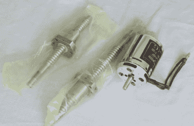

# [詹姆斯·布鲁顿]正在制作一只狗:开放狗项目

> 原文：<https://hackaday.com/2018/06/11/james-bruton-is-making-a-dog-opendog-project/>

曾经有一段时间，两条腿走路的机器人是制造的东西。但是在看到波士顿动力公司令人惊叹的四足机器人多年后，更多的 DIY 者开始转向四足机器人。现在我们可以把 DIY 机器人制造大师詹姆斯·布鲁顿(James Bruton)和他的 openDog 项目(T1)加入到这个名单中。令人兴奋的是，凭借[詹姆斯]丰富的机器人制造背景，这更像是从中间开始挑战，而不是一开始，我们应该尽快看到令人兴奋的结果。

James’ motor and ball screws

到目前为止，[James]已经完成了规划阶段，使用 Fusion 360 迭代了几个版本，现在他已经购买了部件。它将与波士顿机器人公司的 SpotMini 大小差不多，每条腿使用三个电机。他考虑过在电机上使用行星齿轮箱，但在他的 BB-9E 项目中经历了一定量的间隙或反冲，所以这次他将使用[滚珠丝杠](https://en.wikipedia.org/wiki/Ball_screw)，就像他使用外骨骼一样。(我们提到他的广泛背景了吗？)

每条腿实际上是由上腿和小腿组成的，这意味着他的处理必须包括一些反向运动学。这是代码决定脚要去哪里的地方，然后必须从那里向后计算如何调整腿的角度来达到这个目的。这一次，他再次从过去的艰苦工作中汲取经验，这次他设计了腿部的几何形状，使这些计算变得简单。在编写了一些代码来进行计算后，他将计算出的角度与他在 Fusion 360 中定位腿得到的测量值进行了比较，发现他的代码是正确的。我们对目前所看到的感到兴奋，打赌它很快就会站起来走路了。在下面的视频中查看他的进步。

我们说过，更多的 DIYers 在做四足动物。[迈克的]机器狗就是我们上个月报道过的那种狗，但是[的 hackaday.io 页面](https://hackaday.io/project/52956-mikes-robot-dog)显示他从那以后有了更大的进步。一个较小的版本，但已经运行良好的是猫的[。我们期待着有一天，我们会看到机器猫和机器狗共处一室，并发现机电猫是否会像它们的生物同类一样支配机电狗。](https://hackaday.com/2018/03/06/the-sensor-array-that-grew-into-a-robot-cat/)

 [https://www.youtube.com/embed/0BoPoWF_FwY?version=3&rel=1&showsearch=0&showinfo=1&iv_load_policy=1&fs=1&hl=en-US&autohide=2&wmode=transparent](https://www.youtube.com/embed/0BoPoWF_FwY?version=3&rel=1&showsearch=0&showinfo=1&iv_load_policy=1&fs=1&hl=en-US&autohide=2&wmode=transparent)

