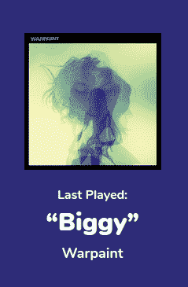

# 框架式树莓派一直在关注 Spotify

> 原文：<https://hackaday.com/2018/06/09/framed-raspberry-pi-keeps-tabs-on-spotify/>

也许你已经注意到了，但是我们在 Hackaday 对过度设计有一种轻微的迷恋。人们可以公平地说，在我们有多可能突出一个项目和它有多不必要的复杂之间存在线性关系。也就是说，这并不是说我们不能欣赏极简主义的方法。走风景优美的路线会很有趣，但有时在没油之前到达你要去的地方也不错。

 由【乔恩·阿什克罗夫特】创造的这个非常巧妙的 [Spotify“正在播放”展示就是这一原则的完美例子。硬件非常简单，几乎不值得一提:一个带有小型 HDMI 显示屏的树莓 Pi，整齐地塞在相框中。没什么好激动的。这个特殊项目的真正吸引人之处是软件。](https://jonashcroft.co.uk/2018/05/14/now-playing-screen-spotify-raspberry-pi-es6/)

[Jon]的职业是 web 开发人员，所以他自然会以同样的心态处理他的个人项目。他不是 Python 这样的 Pi 项目的“通常嫌疑人”之一，而是用 ES6 编写软件；Pi 在 kiosk 模式下通过 Chromium 运行(全屏网页内容，没有顶栏)。对于那些不了解 web 语言的人来说，ES6 是 EcmaScript 6 的缩写:JavaScript 所基于的标准的新版本。它占用的资源比严格必要的要多一些，但最终它工作得足够好。

利用 Spotify 优秀的 API，他的软件下拉当前曲目信息，并存储在本地。它大约每 4 秒钟做一次，检查音轨是否改变。[Jon]对这种暴力方法不太满意，但目前有效。它显示当前播放的歌曲和艺术家，并使用一个名为 [node-vibrant](https://github.com/akfish/node-vibrant) 的库从专辑封面中提取主色，并使用它来创建互补的背景色。非常圆滑。

[Jon]提供了他的所有源代码，并使连接到你自己的 Spotify 帐户变得很容易，所以如果你很快看到这个[在你附近的“魔镜”](https://hackaday.com/2015/12/30/magic-mirror-on-the-wall-is-pi-or-esp-fairest-of-all/)上运行，不要感到惊讶。