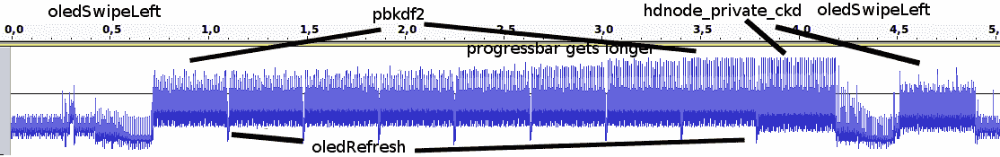

# 密切关注权力会暴露私钥

> 原文：<https://hackaday.com/2018/06/11/a-close-eye-on-power-exposes-private-keys/>

硬件钱包是专门用于存储认证加密货币交易的高度敏感的加密信息的设备。如果人们担心通用计算机的泄露会导致这些秘密的丢失(从而导致这些秘密所识别的资金的丢失)，那么它们是有用的。这个想法是将关键数据从一个更易受攻击的联网机器上转移到一个没有网络连接、无法运行其他软件的设备上。在设计硬件钱包等注重安全的硬件设备时，考虑需要防范哪些威胁非常重要。更复杂的威胁需要更复杂的防御，在极端情况下，这些预防措施可能会变得非常复杂。2015 年，当[Jochen]环顾他的 TREZOR 硬件钱包时，他发现[可能所有的预防措施都没有考虑到](https://jochen-hoenicke.de/trezor-power-analysis/)。

让我们先讨论一下微控制器面临的一些常见威胁，以及如何减轻这些威胁。在开发固件时，使用串行控制台打印调试信息是很常见的。很明显，如果最终产品出厂时启用了此功能，您就不应该在操作期间打印出敏感信息(如私钥)，以免有人连接串行适配器并看到消息！当然，您可以尝试隐藏串行控制台所连接的物理引脚，但是关于这种[“通过模糊实现安全性”](https://en.wikipedia.org/wiki/Security_through_obscurity)的常识是它是无效的，因此是不充分的。那么无论您将数据存储在哪里呢？如果它在外部设备(SD 卡、NAND/NOR 闪存、EEPROM 等)中，有人能轻敲它和微处理器之间的线路，并看到与密钥相关的消息通过吗？他们可以直接移除外部存储并自己读取吗？他们可能可以，在这种情况下，你可以加密数据，但是你把*那个*密钥放在哪里呢？一些微控制器具有“一次可编程”(OTP)闪存，用于保存此类机密。对于许多在 OTP 中存储密钥的产品，禁用调试访问并关闭调试控制台就足够了。但是对于像硬件钱包这样关注安全性的产品，其*的主要特征是安全性*，需要更严格的措施。

[旁门左道攻击](https://en.wikipedia.org/wiki/Side-channel_attack)专注于基于系统本身而非其上运行的软件来利用系统。可能的侧信道范围很广，但在这种情况下，我们感兴趣的是使用一种称为[功耗分析](https://en.wikipedia.org/wiki/Power_analysis)的技术来检查微控制器正在运行什么代码以及它正在处理什么数据。当 CPU 执行代码时，它的功耗会根据它正在运行的指令而发生细微的变化。借助足够灵敏的工具(示波器和分流电阻就足够了)，您可以测量这些波动，并随着时间的推移捕捉 CPU 的详细情况。有软件和硬件两种对策来防止功耗分析，但这些都超出了目前的范围。

回到[约亨的]特雷索。在他们发表文章时，该设备通过存储一个用于计算公钥和私钥的种子值来工作。当它连接到计算机时，可以要求它提供公钥来参与交易。[Jochen]注意到，如果他们用廉价的示波器和分流电阻监测设备的功耗，生成密钥的算法就很容易识别。设备上的显示在某种程度上模糊了 CPU 的活动，但在该过程的某些阶段，有可能观察到由用于从原始种子计算公钥和私钥的算法引起的功率尖峰。通过计算这些波动的时间并参考来自另一个设备的功率信号，有可能恢复构成私钥的一系列 1 和 0，此时该设备无效。[Jochen]担心的是攻击者可能会偷走 TREZOR，看着它快速生成密钥，然后在主人不注意的情况下归还它。通读一下[Jochen]的帖子，对正在发生的事情有一个更彻底的解释。