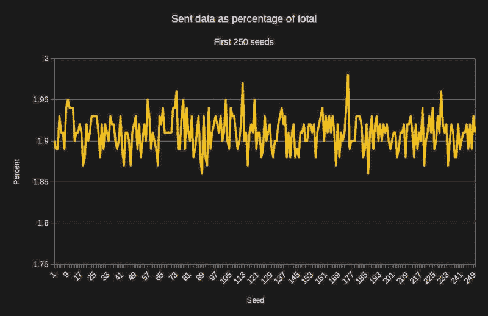

# 一种实时数据压缩技术

> 原文：<https://hackaday.com/2018/06/25/a-real-time-data-compression-technique/>

随着越来越多的嵌入式系统被连接，从一台机器向另一台机器发送状态信息变得越来越普遍。然而，在网络上发送大数据包对带宽消耗和电力使用都是不利的。当然，如果你在两台用千兆位局域网连接并由墙壁供电的 pc 机之间通话，只需每秒钟通过网络发送 100 千字节的数据包 10 次。但是如果你想更有效率，你可能会发现这一招很有用。

作为一个思想实验，我将假设一个系统，它有一个包含 1000 个条目的状态信息数据库。它看起来像一组记录:

```

typedef struct
{
  short topic;
  int data;
} RECORD;

```

主题和数据是什么并不重要。如果你的状态信息看起来像这样，真的没有关系。这只是一个例子。鉴于它是状态信息，我们将做一个重要的假设。大多数数据不会频繁更改。当然，最常见的意思是什么还有待讨论。但我的想法是，如果我每半秒钟发送一次数据，那么在一次发送和下一次发送之间不会有很大的变化。

## 压缩

最明显的答案是使用某种类型的压缩。如果您有时间对数据运行压缩器，然后在窗口中全部解压缩，那么这可能就是答案——或者至少是部分答案。当然，问题是这些程序需要时间来运行。另一个问题是，有时数据压缩得不好，如果增加压缩开销，可能不会减少数据量，甚至会导致发送更多数据。

我将为我们的系统提出一个非常简单的游程编码方案。它会将整个状态数组视为一个字节序列。然后，它会发送一堆由计数和有效载荷组成的数据包。如果计数为正，那么这就是有效载荷中的字节数，它们被复制到输出中。如果计数为负，则幅度比有效载荷字节的计数小 1(即，-1 是重复计数 2)。我任意将重复大小限制为 256。计数为 0 标志着状态信息的结束。

[](https://hackaday.com/wp-content/uploads/2018/06/compress1.png)

就压缩方案而言，这是相当糟糕的。我的状态数组有 8000 字节(1000 个条目)。如果我在一个随机状态数组上使用压缩算法，它会严重失败，比发送整个数据多花 10-12%的字节。

## 狐狸

到现在为止，你可能会笑着想，如果一个压缩算法大部分时间都失败了 10%，那它有什么用呢？但是如果有一个简单的方法可以解决这个问题呢？特别是，算法失败的原因是没有足够的数据重复进行压缩。即使您使用“真正的”压缩算法，如果要压缩的数据有更多的重复序列，它们的性能几乎总是会更好。这是已经压缩的文件格式不能很好压缩的原因之一，因为任何重复的序列都已经被删除了。

那么我们如何获得更多的重复数据呢？毕竟，国家就是国家，对吧？你不能安排温度、湿度和位置数据重复排列，对吗？如果你认为数组在时间上是固定的，那可能是真的。但如果你及时开始思考，也许不会。

还记得我说过我假设状态数组在两次传输之间变化不大吗？这是关键。以下是步骤:

1.  发送压缩的第一状态数组。它可能会比其余的更大。
2.  在发送第二个状态数组之前，与前一个进行异或运算。由于没有太大的变化，这将改变大部分的状态数组为零。重复的零。
3.  压缩并发送第二状态数组。
4.  对第三个、第四个和所有后续数组重复上述步骤。

I [](https://hackaday.com/wp-content/uploads/2018/06/compress-1.png) 如果你习惯使用 rsync 之类的程序，这也是同样的思路。不要发送所有内容，只发送发生变化的部分。在接收端，您只需使用当前状态数组反转 XOR 运算。即使您使用另一种压缩算法，将您的数据更改为几乎为零也有助于压缩程序。

不过，有一些注意事项。首先，除非您的连接是完美的，否则您需要一种方法来告诉发送方您没有获得最后的状态更新，因此它需要再次发送一个完整的数组。当你发送一个完整的帧时，你也可以添加一些额外的开销来标记。您还可以让发送方定期发送一个完整的数组来帮助同步。

## 模拟

为了测试这个想法，我写了一个简单的模拟，你可以在 GitHub 上找到。因为发送方和接收方实际上是同一个程序，所以我没有模拟 ack/nack 类型的握手，也没有为重新同步做准备。你会想在现实生活中加上这一点。

我编写模拟程序时使用了一个测试驱动程序，出于独创性，我将它命名为 test。但是，有两个测试驱动程序，您可以通过将 TEST_MANUAL 设置为 0 或 1 来选择一个。当设置为 0 时，代码使用两组不同的状态数据，可以在 setstate0 和 setstate1 函数中设置。这对于尝试特定的调试案例非常有用。为了简单起见，我只填充了前四个元素，加上第 800 个元素和状态数组的最后一个元素。这让我可以在短时间内调试输出，同时仍然能够判断事情是否正常。前四个只是随手可得。800 处的代码表明扩展数据不会失去同步，最后一个代码适用于捕捉缓冲区溢出的情况。

然而，我也想在更广泛的条件下进行测试，所以我编写了另一个测试驱动程序。它在 100 次迭代中随机地改变状态数组(每次迭代不超过 20 次改变)。您可以在命令行上提供一个种子来获得相同的随机值进行测试。

除了种子之外，您还可以在种子前面加上一个脱字符号(^)来取消 XOR 处理。如果您不想执行 XOR 运算，您将不会在数据中运行很多次，并且您的百分比将会非常高——可能超过 100%,这表明您发送了比仅仅以常规方式发送字节更多的数据。例如，这里有一次运行，在没有使用 XOR 的情况下，发送的字节比正常情况多了将近 11%。

```
alw@enterprise:~/tmp/state$ ./state ^143
TX/RX=8000000/8863392 (110.79)
Done
```

有了 XOR 之后，相同的运行是在 2%,这意味着它比原始数据小 98%。

你可以阅读代码，看看上面的想法是如何实现的。有几个关键的数据结构和函数你应该知道:

*   状态–要传输的当前状态
*   目标–当前接收器状态
*   tx _ prev–变送器使用的先前状态
*   rx _ prev–接收器使用的前一状态(见下文)
*   接收–模拟接收器
*   xmit–模拟的物理发送器(也就是说，所有想要发送到接收器的代码都调用这个函数)
*   发送–将当前状态发送给接收器

我争论过使用 rx_prev 缓冲区的问题。这保持了先前的状态，因此您可以在接收时与当前数据进行 XOR 运算。但是，您可以就地对数据进行 XOR 运算，并节省缓冲区。唯一的问题是你不能使用像 memcpy 这样有效的调用。当然，即使在 memcpy 之后，如果你要做 XOR 运算，你也必须做 XOR 运算。所以它很可能是一样长一样宽。如果你在一个真实的系统中实现它，这将是值得考虑的事情。

两个测试驱动程序都使用 memcmp 来验证接收器缓冲区与发送器缓冲区是否相同。随机测试驱动程序还计算发送数据的百分比，即接收的字节数除以发送的总字节数乘以 100。

## 限制

正如我提到的，我没有考虑模拟中的重新同步。我也不做任何完整性检查，如校验和或 CRC。这些可能在真实代码中有关联。很容易想象接收器计算 CRC，比较它，并发送应答或否定应答。也很容易想象发送器发送某种 sync 报头和标志来表示内容是否被异或。您甚至可以使用该标记来指示发送的数据根本没有压缩，这将允许您在没有压缩的情况下发送初始参考状态。这将使算法在大多数情况下更加有效。

## 结果

[](https://hackaday.com/wp-content/uploads/2018/06/graph.jpg)

“随机化”功能每次都会随机更改项目数，一次最多可更改 20 个项目。对于 1，000 条记录，这是 2%的变化。不出所料，发送的数据量与接收的数据量相比大约只有 2%,如上图所示。这种相关性并不完美，因为数据是随机的，但一般来说，算法会做得很好，直到每次状态数组都发生很大变化，以至于开销抵消了任何好处。

尽管如此，许多项目不会有经常变化的状态，这是一个只发送变化的好方法。这适用于任何类型的数据结构。然而，正如我所提议的，您可以查看哪些主题发生了变化，并找出一种只发送变化的主题的方法。但是，请注意，在我的示例中，主题只是更多的数据，而且它们也会发生变化，因此在这种特定情况下会更加困难。我的观点是，有许多方法可以解决这个问题。

有时候，似乎没有什么是 XOR 做不到的。有很多压缩技巧，包括[量化](https://hackaday.com/2016/11/22/squoze-your-data/)，如果你的数据能够经受得住的话。