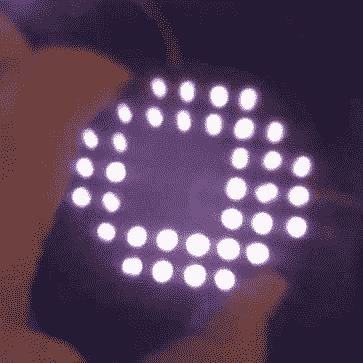
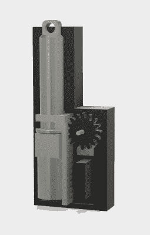

# 这二十个惊人的项目赢得了机器人模块挑战赛

> 原文：<https://hackaday.com/2018/06/12/these-twenty-amazing-projects-won-the-robotics-module-challenge/>

现在，我们正在进行这个星球上最大的硬件竞赛。[黑客日奖](https://hackaday.io/prize)是开放硬件的奥斯卡奖，我们向成千上万的硬件黑客、制造商和艺术家敞开大门，创造下一个大东西。

上周，我们完成了 Hackaday 奖的第二个挑战，机器人模块挑战。现在，我们很高兴地宣布，其中 20 个项目已被选中进入最后一轮，并获得了 1000 美元的现金奖励。祝贺 Hackaday 奖*机器人模块挑战赛* 部分的[获胜者。以下是获奖者，排名不分先后:](https://hackaday.io/list/158174-thp-2018-semifinalists-open-hardware-design)

### *机器人模块挑战赛* Hackaday 奖决赛入围者:

*   [3D 打印机器人执行器](https://hackaday.io/project/157812)
*   [noMad——开源自组装系统](https://hackaday.io/project/158470)
*   [印刷电路板电机](https://hackaday.io/project/39494)
*   [3D 打印应变波齿轮](https://hackaday.io/project/120377)
*   [rudRemote](https://hackaday.io/project/158068)
*   [Dexter](https://hackaday.io/project/158779) 的缩写形式
*   [IMcoders](https://hackaday.io/project/158496)
*   [DIY 假肢接受腔](https://hackaday.io/project/51171)
*   [3D 打印伺服线性致动器](https://hackaday.io/project/158014)
*   [PCB 步进电机](https://hackaday.io/project/85502)

*   [机器人盾](https://hackaday.io/project/85425)
*   [视觉机器人平台](https://hackaday.io/project/90613)
*   [3D 打印微型线性致动器](https://hackaday.io/project/156520)
*   [自主无限 3D 打印:3D 主力](https://hackaday.io/project/114738)
*   [四旋翼试验台](https://hackaday.io/project/85715)
*   [HEXABITZ–真正的模块化电子产品](https://hackaday.io/project/76446)
*   [红外二维码机器人导航](https://hackaday.io/project/135292)
*   [机器人神话的树莓 PI 模块](https://hackaday.io/project/86834)
*   [除草机 2018](https://hackaday.io/project/53896)
*   [机器人智能电机驱动器](https://hackaday.io/project/158429)

## 这些项目非常棒

这些是今年 Hackaday 奖机器人模块挑战赛提供的最佳项目。这些项目简直太棒了。你们响应号召，为这次挑战提供了 200 多份参赛作品，并创造了可以变成更聪明、更好的机器人的最佳项目。需要一些证据吗？只要看看这些项目中的一些。

IR QR Code Navigation will solve the problem of indoor robotic navigation

为了赢得机器人模块挑战赛，Josh Starnes 正在解决室内机器人导航的问题。他的项目 [IR 二维码导航](https://hackaday.io/project/135292-ir-qr-code-navigation-day-or-night-for-robotics)，用二维码解决了这个问题。乔希没有把难看的像素块安装在墙上，而是做了一些不同的事情。他在利用所有数码相机都有的特性。如果你从数码相机上取下红外阻挡滤光片，它就能看到红外线。通过人眼不可见的红外敏感涂料的巧妙应用，这些二维码可以被机器人视觉照亮和检测，同时对你或我完全不可见。它同时解决了不想让难看的二维码塞满墙壁的问题，并使计算机视觉更容易。太棒了，这个壮观的项目进入了 Hackaday 奖的决赛，我们对此感到惊讶。

到目前为止，Josh 已经有了一个安装在 Roomba 上的原型，Roomba 是一个方便的机器人实验平台，结果令人鼓舞。有一排红外发光二极管，一个摄像头，乔希正在拉帧和检测二维码。这是个人机器人的未来吗？我们不知道，但我们知道一件事:这是我们从未见过的东西。没有双关的意思，哈哈哈。

3D Printed Mini Linear Actuator is a tiny 3D printed mechanism

计算机视觉不适合你吗？*动*的东西怎么样？今年 Hackaday 奖的机器人模块挑战的关键挑战是将部件组装成一个令人惊叹的机器人，无论是四轴飞行器还是令人敬畏的 Voltron。让机器人移动的最大挑战之一是线性驱动——这些东西可以前后移动，而不仅仅是像轮子一样旋转。有时候，一个业余爱好的伺服系统不能满足你的要求——也许它们太大了，或者它们没有合适的投掷量——你需要一个线性致动器。

Giovanni 和 Jonathan 开发了一款 [3D 打印迷你线性致动器](https://hackaday.io/project/156520-3d-printed-mini-linear-actuator)来解决这些问题。这是一个非常非常小的装置，可以将旋转运动转化为直线运动。它通过在螺杆上添加一个电机，并使用一个连接到齿条的电位计来提供位置反馈。实际上，这是一个简单、廉价的业余爱好伺服系统，可以进进出出，而不是左右摇摆。它建造简单，造价低廉，而且效果很好。使用 Arduino 来控制整个事情，该团队设法让活塞上下移动，所有这些都是 3D 打印的零件。太棒了，外形也很棒。

现在，他们正在仿生手指上演示这种微小的线性致动器，但是这种小机器实际上有数百种应用。这就是机器人模块挑战赛的全部内容:建造将进入下一个伟大的机器人*事物*的部件。这就是这个项目如此伟大的原因，看到这个项目进入 Hackaday 奖的最后一轮真是太棒了。

## 能量收集是你的新挑战

机器人模块挑战赛的这 20 名参赛者已经赢得了 1000 美元，他们即将进入 Hackaday 大奖的最后一轮，争夺 50，000 美元的大奖。

不过，黑客日大奖还没有结束。[能量采集挑战](https://hackaday.io/prize/details#three)才刚刚开始。这是我们的比赛，向世界展示如何将环境能量转化为有用的东西。想想太阳能、热能、风能、环境光、电力线电感耦合等能源。我们真的很期待这次比赛的结果，它肯定会很精彩。本次挑战赛的 20 名参赛者将分别赢得 1，000 美元和一次大奖的机会。你还有时间在硬件大师中赢得一席之地，所以[现在就开始你的 Hackaday 奖励活动](https://hackaday.io/project/add?light&tag=2018HackadayPrize)。

The [HackadayPrize2018](https://hackaday.io/prize) is Sponsored by:     