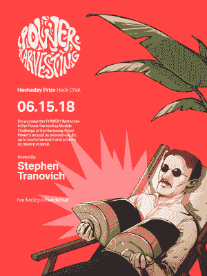

# 周五黑客聊天:所有关于黑客日奖

> 原文：<https://hackaday.com/2018/06/13/friday-hack-chat-all-about-the-hackaday-prize-2/>

现在我们深陷黑客日大奖。黑客日奖是什么？这是硬件创作的奥斯卡奖，或者至少我们是这么称呼它的，直到我们得到美国电影艺术与科学学院的叫停。

 我们已经看到了 800 多份 Hackaday 大奖的参赛作品，还有几个月的时间。我们已经通过了开放式硬件设计挑战赛，来自该挑战赛的[二十个精彩项目](https://hackaday.com/2018/05/02/these-twenty-amazing-projects-won-the-open-hardware-design-challenge/)正在进入最后一轮。昨天，[我们宣布了机器人模块挑战赛](https://hackaday.com/2018/06/12/these-twenty-amazing-projects-won-the-robotics-module-challenge/)的获胜者，我们再次被震惊了。这些是世界上最棒的硬件，我们无法想象还有比这更棒的东西。

在本周的黑客聊天中，我们将讨论黑客日大奖。这是你成为硬件英雄的机会，并最终为你所做的工作获得一些认可。现在，我们正在参加今年 Hackaday 奖的能量采集挑战，我们想看看你能想出什么从太阳能、热能、风能或随机电磁能中获取能量。这是你大放异彩的时刻，我们迫不及待地想看看你能拿出什么。

当然，你可能会对如何成功获得 Hackaday 奖有一些疑问。[在本周的黑客聊天](https://hackaday.io/event/158968-hackaday-prize-hack-chat)中，我们将与今年奖项的策划人【Stephen Tranovich】坐在一起，看看怎样才能成功入围。这是你发现如何成为下一个伟大的硬件黑客的机会，这一切都将在本周五的黑客聊天中进行。

我们将在本周的黑客聊天中讨论一些事情:

*   什么是成功的参赛作品？
*   你如何让你的项目得到宣传？
*   想在社区中分享你的项目想法吗？
*   今年种子资金混乱的背后有什么故事？

当然，我们鼓励你在讨论中提出自己的问题。你可以在 [Hack Chat 活动页面](https://hackaday.io/event/158212-hacking-the-wild)上发表评论，我们会将其放入 Hack Chat 讨论的队列中。【T2

我们的 Hack Chat 是在 [Hackaday.io Hack Chat 群发消息](https://hackaday.io/messages/room/2369)上的实时社区活动。本周和以往一样，我们将在太平洋时间 6 月 15 日星期五中午聚集在我们的视频终端前。[这里有一个倒计时钟，直到黑客聊天开始](https://www.timeanddate.com/countdown/generic?iso=20180615T12&p0=224&font=cursive)。

点击右边的语音气泡，你会被直接带到 Hackaday.io 上的黑客聊天群。

你不必等到星期五；随时加入，你可以看到社区在谈论什么。