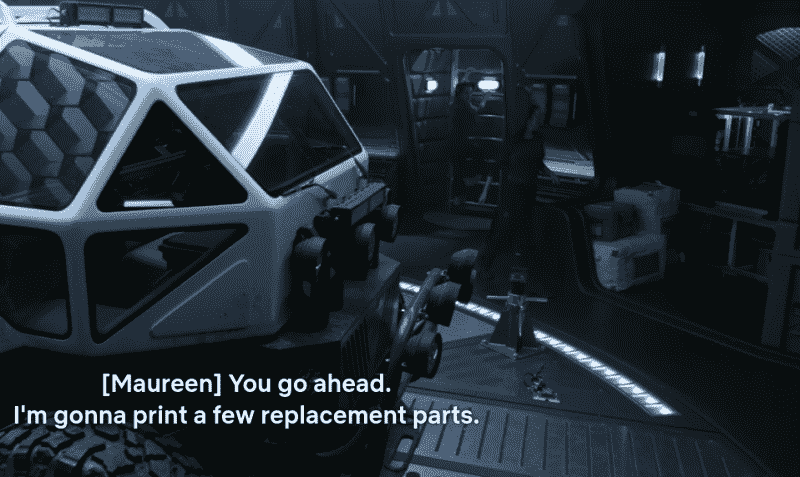
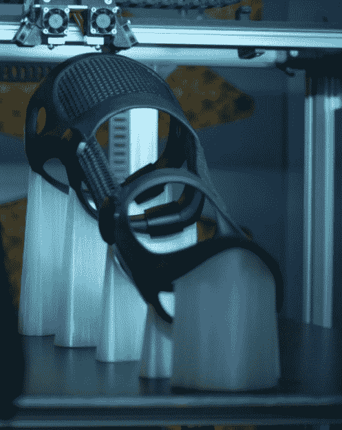
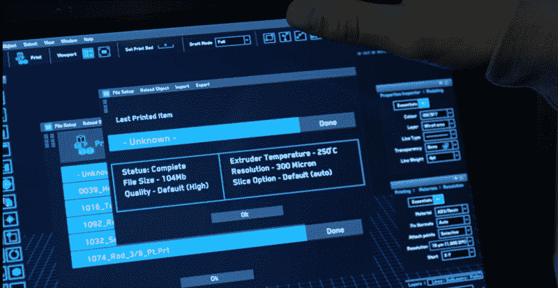
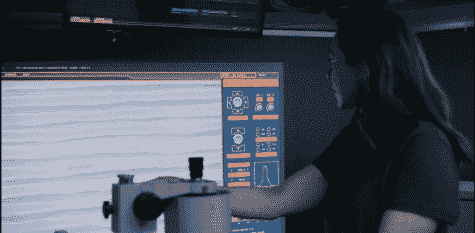
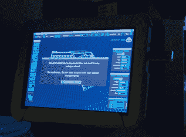

# 迷失太空获得 3D 打印权

> 原文：<https://hackaday.com/2018/06/25/lost-in-space-gets-3d-printing-right/>

当电影和电视对工程的过度渲染变得如此普遍，并且只是简单地把事情搞砸了，这里有一股清新的空气。现在有一部科幻片将 3D 打印融入故事情节，这种方式是正确的、非强制性的，是对那个虚构世界的恰当补充。

 随着网飞不断推出大量原创内容，你可能已经错过了一个事实，他们最近发布了经典的*于 20 世纪 60 年代迷失太空*系列的重新开机[。抱歉，勒布朗的粉丝们，这部关于太空旅行的罗宾逊家族的新电影假装 1998 年的电影从未发生，大多数人都是如此。正如片名所示，这部电影从这个家庭在地球上的日子开始，一直到他们在太空中迷失为止，最引人注目的可能是出色的艺术指导和特效工作，这些工作更接近于*星际*而不是过去的 campy 特效。](https://www.netflix.com/title/80104198)

但是不要害怕，亲爱的读者。这不是对该节目的评论。为此，我要直截了当地说，《迷失太空》总体来说是一部相当平庸的电视剧。这当然是华丽的，但故事线和对话就像是一部影迷电影。它过于冗长，最终并没有像你预期的那样推进整个故事。不过，这个机器人病得很重。

不，这篇文章不是关于这部剧的整体。这是这部剧的一个非常特别的元素，做得非常好，一个月后我还在想它:它对 3D 打印的使用。在*迷失太空*中，木星 2 号上搭载的 3D 打印机几乎就是一个角色本身。几乎每个主要演员都与它有某种互动，在这一季相当活跃的十集里，它直接参与了几个主要的情节发展。

我从来没有见过一个节目或电影不仅将 3D 打印作为如此重要的主题，而且还做得如此之好。这可能是迄今为止 3D 打印最真实的写照，但它也是对 3D 打印在相对不远的将来可能会是什么样子的一种似是而非的描绘。它无论如何都不完美，但我非常想听听是否有人能指出更好的东西。

## 3D 打印的标准化

 在*迷失太空*的世界里，3D 打印简直就是生活的一部分。同样，当一杯热伯爵茶出现在垫子上时，没有人会对《星际迷航》中的*感到惊讶，木星 2 号的船员从来不会表现得像 3D 打印机是某种奇异的设备。当他们需要工具或替换零件时，有人会下去，从船上的 3D 模型库中排队，然后继续他们的业务。*

角色只是简单地说他们要去打印一些零件，或者要求另一个角色为他们打印一些东西。没有人会要求澄清或需要解释如何去做；这是一项在他们生活中根深蒂固的技术，甚至连节目中的孩子们都很熟悉。

这当然很有道理。即使在今天，美国国家航空航天局也承认 3D 打印对于长期太空飞行和外星任务的重要性。为了安全起见，一式两份地储存船员可能需要的所有工具或零件根本不是一个选择。因此，如果你的航天器或空间站太远，无法及时完成补给任务，3D 打印很可能意味着生与死的区别。接下来，被派往未知星球的一组探险家将广泛使用 3D 打印，而《迷失太空的 T2》在向观众推销这一想法方面做得很好。

## 当代局限性

 尽管发生在 2048 年的一个外星球上，罗宾逊的 3D 打印机似乎受到了许多与今天的机器相同的限制。

首先，在*迷失在空间*的世界里，3D 打印仍然非常缓慢。虽然作者们小心翼翼地从不给出打印一个特定工具或作品需要多长时间的硬性数字，但很明显打印机不是你坐在那里等待的东西。你永远不会在同一个场景中看到一个角色开始印刷，然后把完成的物体从床上拿下来；事实上，在某些情况下，在我们看到有人最终带着印刷品出现之前，故事已经有了相当大的进展。

一个特别令人印象深刻的细节出现在早期，当时为一名受伤的船员打印了一个腿部支架。由于支架的形状，大量的支撑材料是必要的。支持是一个不同的颜色比打印件，果然，打印机显示了双挤出机。甚至支撑柱的位置和形状也与物体上的突出部分完全一致。

这些细节只有很少一部分观众能够认识和理解，坦率地说，我很惊讶看到他们花了这么多心思。也就是说，这种程度的细节并不总是得到遵守。展会上的一些复杂的印刷品根本没有支持材料，或者以其他方式打印，这对于显然是 FDM 打印机来说根本没有意义。

## 奇怪的现实

具有讽刺意味的是，在《迷失太空》中展示的 3D 打印实际上可能有点像《T2》。在这里，我们有一个家庭在宇宙飞船中环绕银河系飞行，然而他们在飞船上的 3D 打印机看起来并不比你今天能买到的更先进。当然，漫不经心的观察者不会注意到这一点，所以就节目的目标观众而言，这是可行的。但是对于我们这些仅凭气味就能区分 PLA 或 ABS 的人来说，这几乎是不和谐的。

这可能是最好的显示时，相机放大，让观众在打印机的控制面板一瞥。它不仅看起来非常令人想起在 OctoPrint 上运行的 [TouchUI 主题，而且显示的温度和层高度值对于当代 3D 打印机来说完全有效。如果有的话，层的高度太高:即使今天的入门级打印机应该能够达到 100 微米的分辨率。](http://hackaday.com/2018/03/05/controlling-octoprint-on-the-go/)

## 打印机数字版权管理展望

Jupiter 2 上的 3D 打印机确实有一些你的 Monoprice Mini 所缺乏的技巧，但即使在这里，显示的东西在相对不远的将来也不是完全不可能的。自从第一个 Makerbot Cupcake 做出第一个挤压产品以来，将 DRM 添加到 3D 打印机就一直是一个热门话题，显然它在*迷失在太空的世界中没有什么不同。*

有一次，一名船员试图打印一把枪，系统阻止了他，说这是一件违禁物品。自从 3D 打印枪支的可行性被证明以来，这正是立法者一直要求的功能类型。我们这些有技术经验的人明白，建造一台智能地拒绝打印武器的 3D 打印机实际上是不可能的，但这什么时候停止过政府监管呢？

在另一个场景中，一件物品通过压印在一层印刷品上的序列号被追溯到生产它的机器。虽然从未解释过，但我们可以假设这些打印机有能力将细节激光蚀刻到它们生产的物体表面上；因为喷嘴显然不能产生小于层高度的细节。使用隐写术的概念，即在 CAD 文件中隐藏识别标记以证明最初是谁创建的，经常被提议作为一种打击 3D 设计知识产权盗窃的方法。

  Using a microscope to see the serial number.  

## 庆祝出色的工作

无论 3D 打印技术顾问是谁，他们都应该从 RepRap 社区获得某种奖励。对于[媒体来说，获取技术(尤其是黑客攻击)如此可笑的错误是如此普遍](https://hackaday.com/2013/03/28/top-10-hacking-failures-in-movies/)，以至于看到一些事情做得如此之好绝对令人耳目一新。这就是我们需要并且应该支持的电视和电影中的技术写照。

《黑客日》的读者们，你们怎么看？我们已经有一段时间没有关注电影《T1》中特别出色的技术表现了；事情变好了还是变坏了？《消失在太空中的 T2》是一次意外，还是代表了现代观众期望的转变？