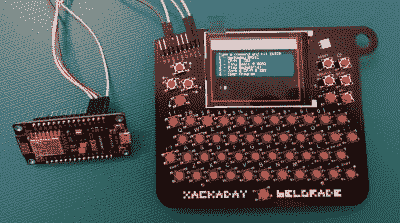

# 贝尔格莱德徽章黑客

> 原文：<https://hackaday.com/2018/07/20/belgrade-badge-hacks/>

 [https://www.youtube.com/embed/LQJ6CCXEXs4?version=3&rel=1&showsearch=0&showinfo=1&iv_load_policy=1&fs=1&hl=en-US&autohide=2&wmode=transparent](https://www.youtube.com/embed/LQJ6CCXEXs4?version=3&rel=1&showsearch=0&showinfo=1&iv_load_policy=1&fs=1&hl=en-US&autohide=2&wmode=transparent)

我们现在还在参加贝尔格莱德的黑客日会议。如果你在那里，你会知道这是有史以来最大的硬件会议。如果你不在那里，你就错过了。抱歉。(请务必参加 11 月的[黑客日超级会议](https://www.eventbrite.com/e/hackaday-superconference-2018-tickets-47386813234?aff=0720com)。)

贝尔格莱德会议的众多亮点之一当然是徽章。 [2018 Hackaday 贝尔格莱德徽章](https://hackaday.io/project/80627-badge-for-hackaday-conference-2018-in-belgrade)是一个硬件杰作，配有 55 键键盘、RGB TFT LED、扬声器和基本的解释器。

这个徽章是沃佳·安东尼奇的电子设计杰作。仅举一个设计中的小例子，看看按钮的位置。认为组成键盘的轻微旋转按钮只是一种风格选择？不是的；通过小心地旋转每个按钮，每个开关的支脚可以相互配合。太棒了。

启动硬件*这个*好，添加 Jaromir Sukuba 的惊人的软件使它活起来，并通过门给每个黑客分发一个徽章是一些惊人的黑客的完美配方。我们在 2018 Hackaday 贝尔格莱德大会上看到的最好的徽章黑客伎俩有哪些？查看[徽章破解仪式](https://youtu.be/LQJ6CCXEXs4)的视频，然后加入我们下面的几个我们最喜欢的视频。

> 我为 Hackaday 贝尔格莱德徽章做了一个演示。编码时间有限，展示也不太顺利，但事情是这样的。我对它非常满意[#巴杰利夫](https://twitter.com/hashtag/badgelife?src=hash&ref_src=twsrc%5Etfw)[#民主场景](https://twitter.com/hashtag/demoscene?src=hash&ref_src=twsrc%5Etfw)[pic.twitter.com/wRFKpJnuVk](https://t.co/wRFKpJnuVk)
> 
> — kory.io (@KoryNico) [May 28, 2018](https://twitter.com/KoryNico/status/1001030711116288000?ref_src=twsrc%5Etfw)

## Demoscene！

几十年后，演示场景已经被提升为一门艺术。这是一个围绕推动像素、blitting blitters 以及从计算机系统中榨取最后一点性能而建立的社区，唯一的目的是制作真正酷的图形和令人敬畏的音乐。

Hackaday 贝尔格莱德徽章有一个巨大的全彩色显示屏，所以我们的徽章黑客比赛只有几个演示项目才有意义。[其中最好的一个来自[kory.io]](https://hackaday.io/project/158748-scenedemo-for-the-hackaday-belgrade-badge) ，他制作了一个演示，展示了高分辨率图像和实时渲染的等离子体效果以及预渲染的动画。

当然，这需要一个视频，所以深入研究 Kory 的 Twitter 上发布的这个壮观的演示。

## 一个调制解调器！

 

【博斯科】贝尔格莱德徽章的“调制解调器”

2018 年贝尔格莱德徽章被设计成一个家用电脑的可穿戴版本。随着扩展头的包含，它乞求有更多的硬件连接。徽章有完整的 BASIC 解释器，一个串口的 TX 和 RX 线就*坐*在那里。这可能意味着什么？

对[bosko]来说，家用电脑意味着通过 BBSes 与世界连接。有了这个徽章这可能吗？当然是的，[你所需要的只是一个调制解调器](https://hackaday.io/project/158742-badge-modem)。

由于声学耦合器不适合智能手机，[bosko]的“调制解调器”实际上是一个带有 ESP8266 的 NodeMCU 板。是的，这是一个 WiFi 转串口适配器，由价值三美元的硬件和几根跳线拼凑而成。徽章上运行的代码极其简单，基本上只是将字节推送到串口。对于调制解调器，[bosko]只是使用每个 ESP 中的 AT 命令集。

 [https://www.youtube.com/embed/pw2fopublVU?version=3&rel=1&showsearch=0&showinfo=1&iv_load_policy=1&fs=1&hl=en-US&autohide=2&wmode=transparent](https://www.youtube.com/embed/pw2fopublVU?version=3&rel=1&showsearch=0&showinfo=1&iv_load_policy=1&fs=1&hl=en-US&autohide=2&wmode=transparent)

[bosko]设法将他的调制解调器连接到网络，甚至设法在徽章上打开了一个 BBS。是的，很慢，但是说真的，你还能指望什么呢。

这是一个很好的概念证明，鉴于 WiFi 到串行适配器实际上只需要两美元，我们迫不及待地想看看这个徽章还能做什么。有没有可能写一个浏览器？[我们刚刚有了那个](http://retro.hackaday.com/)的网站，徽章破解仪式上展示的另一个黑客确实设法加载了我们的复古页面！

## 拍摄我的情人

当你想到多人游戏，堡垒之夜可能是第一个想到的。实际上，很可能不是，但是在任何帖子中加入“堡垒之夜”这个词真的有助于搜索引擎优化。多人游戏已经存在了几十年，但在过去，配置它们是一件痛苦的事情。有人记得 IPX 吗？是啊，没错。

通过徽章上的家用电脑和方便的串行端口，使用杜邦连接器制成的零调制解调器电缆编写多人游戏是完全可能的。这正是[kramarb]对他的徽章黑客所做的，[射杀我的情人](https://hackaday.io/project/158740-shoot-my-valentine),结果可能比第一次想的有趣得多。

 [https://www.youtube.com/embed/jBMa6r6tFZc?version=3&rel=1&showsearch=0&showinfo=1&iv_load_policy=1&fs=1&hl=en-US&autohide=2&wmode=transparent](https://www.youtube.com/embed/jBMa6r6tFZc?version=3&rel=1&showsearch=0&showinfo=1&iv_load_policy=1&fs=1&hl=en-US&autohide=2&wmode=transparent)

这个游戏非常简单——它只是来自*太空入侵者*的宇宙飞船在屏幕上拍摄像素。两个徽章可以玩这个游戏，每个徽章都试图通过串口发送子弹来杀死对方。

这太棒了。这是一个通过串口玩的真正的多人游戏，在 Hackaday 贝尔格莱德会议上，所有代码都在几个小时内完成。更进一步说，让这个游戏无线运行不会太难，可能使用几个红外发光二极管。这将是惊人的，而且可能几乎和那些老的 DOS 游戏上的多人游戏一样可靠。

## 这不是我们复古电脑徽章的终结

2018 年 Hackaday 贝尔格莱德徽章取得了巨大的成功，也是我们利用电子会议徽章所能做的最好的例子。我们计划在今年 11 月召开一次大型会议，即第四届年度超级黑客大会。超级电脑的徽章？我们现在所能说的是，它将在很大程度上基于最好的贝尔格莱德徽章。不过，首先，我们需要购买全世界供应的一种特定品牌的轻触开关——在贝尔格莱德的房间里有超过 20，000 个轻触开关！

这是什么意思？意味着有更多的机会黑掉这个徽章。或许可以在这个徽章上加一个软驱，我们希望你能尝试一下。我们知道在互联网上获得这个徽章是可能的，我们想知道人们可以把它带到哪里。这个徽章的整个目的是在为期三天的会议期间用它做一些真正有趣的事情，我们迫不及待地想看到围绕这个平台开发的其他令人惊讶的徽章黑客。