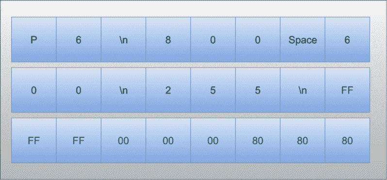

# Linux Fu:为二进制文件编写脚本

> 原文：<https://hackaday.com/2018/06/29/linux-fu-scripting-for-binary-files/>

如果你需要用传统语言如 C 写一个二进制文件，这并不难做到。你可能不得不处理的最糟糕的事情是试图在 Windows 和 Linux 之间伪造行尾，但是如果默认情况下是打开的，通常有办法关闭它。但是，如果您使用某种类型的脚本语言，二进制文件支持可能会有点困难。一个答案是使用类似 xxd 或 [t2b](https://thosakwe.github.io/t2b/index.html) (文本到二进制)的工具来处理细节。您可以在 GitHub 上找到 t2b 的代码，包括为许多平台预构建的二进制文件。您应该能够从系统存储库中安装 xxd。

这些工具采用非常不同的方法。您可能熟悉 od 或 hexdump 之类的工具，这些工具用于生成二进制文件的可读表示。xxd 工具实际上可以做同样的事情——尽管它没有那么灵活。什么 xxd 甚至可以反转自己，以便可以从自己创建的十六进制转储中重建二进制文件(这是其他工具无法做到的)。t2b 工具采用了一种非常不同的方法。您向它发出命令，使它写一个原始的十六进制文件。

这两种方法都有一些优点。如果您正在用脚本语言编辑一个二进制文件，xxd 非常有意义。您可以将文件转换为文本，对其进行处理，然后使用一个程序将其还原为二进制文件。另一方面，如果从头开始创建二进制文件，t2b 程序也有一些优势。

我决定使用 bash 编写几个测试脚本来展示它是如何工作的。这些不是生产脚本，所以它们不会像应该的那样严格，但是没有理由它们不能像您希望的那样健壮。

## 有点作弊

我决定写两个 shell 脚本。一个将生成一个图像文件。我在那里以两种方式作弊。首先，我选择了 PPM(便携式 Pix 地图)格式，这是非常简单的创建。其次，我忽略了使用 ASCII 而不是二进制的格式。严格来说，这并不算作弊，因为正如您所料，它确实生成了一个更大的文件。所以使用二进制格式是有好处的。

另一个脚本采用相同格式的文件，并将其中的颜色值减半。这展示了两个工具，因为第一个作业是从数据生成图像文件，第二个作业是处理图像文件并写出新文件。第一个作业我用 t2b，第二个用 xxd。

## PPM 文件格式

[](https://hackaday.com/wp-content/uploads/2018/05/tux2.png)PPM 格式是 20 世纪 80 年代图形格式家族的一部分。它们很容易构建和解构，尽管它们并不以小巧著称。然而，如果您需要从 Raspberry Pi 程序中创建图形，使用这种简单的文件格式创建它们，然后使用 ImageMagick 或其他工具转换成更好的格式，如 PNG，有时会很方便。

这种格式实际上有三种变体。一个用于黑白，一个用于灰度，另一个用于彩色。此外，它们每个都可以包含 ASCII 数据或二进制数据。有一个非常简单的标题，它总是在 ASCII 中。

我们只担心颜色格式。标题将以字符串“P6”开头这通常以换行符结束，尽管出于防御，您应该允许任何空白字符结束标题字段。然后 X 和 Y 的界限——以十进制和 ASCII 表示——用空格隔开。这通常是一个空格和一个换行符。标题的下一部分是另一个 ASCII 十进制值，表示图像中颜色分量的最大值。之后的数据是二进制 RGB(红/绿/蓝)三元组。顺便说一句，如果 P6 是 P3，一切都将保持不变，但 RGB 三元组将是 ASCII 码，而不是二进制码。这在某些情况下可能很方便，但是正如我提到的，会导致文件变大。

下面是一个示例头，后面有一点二进制数据:

[](https://hackaday.com/wp-content/uploads/2018/06/header.png)

绿色文本代表十六进制数字，其他框包含 ASCII 字符。您可以看到，前 15 个字节是标题，之后都是图像数据。

## T2B

t2b 程序接受各种命令来生成输出。你可以写一个字符串或者各种大小的整数。您还可以做一些事情，比如重复输出给定的次数，甚至可以根据条件选择输出什么。有一种方法可以处理变量甚至宏。

作为一个例子，我的脚本将写出一个有三个颜色条的图像。背景将是黑色的，带有白色边框。颜色条将自动调整间距以适应框的大小。我不会使用太多的 t2b 特性，但是我喜欢使用宏来使结果输出更容易阅读。下面是创建标题的代码(添加了注释):

```

strl P6  # Write P6 followed by a newline (no quotes needed because no whitespace in the string)
str $X   # Write the X coordinate (no newline)
u8 32    # a space
strl $Y  # The Y coordinate (with newline)
strl 255 # Maximum subpixel value (ASCII)

```

这就是全部了。RGB 三元组使用 u8 命令，尽管您也可以使用 24 位命令。我还为我使用的颜色设置了一些宏:

```

macro RED 
  begin 
    u8 255 
    times 2 u8 0 
    endtimes 
endmacro

```

一旦你把 t2b 语言记下来，剩下的就只是数学了。你可以在 [GitHub](https://github.com/wd5gnr/binaryscript) 上找到完整的代码，但你会看到它只计算 7 个大小相等的区域，并在嵌套的 for 循环中遍历每个像素时绘制不同的颜色。边缘周围还有一个一像素的白色边框，原因不明。

当您想要运行代码时，您可以指定 X 和 Y 坐标，或者采用 800×600 的默认值:

```
./colorbar.sh 700 700 | t2b >outputfile.ppm
```

如果您在 t2b 程序之前截取输出，您将看到命令从脚本中滚动出来。下面是 ppm 文件的默认输出:

[](https://hackaday.com/wp-content/uploads/2018/06/test1.png)

## 灰色的阴影

另一个脚本有点不同。目标是将 PPM 文件中的所有颜色值分成两半。如果它只是二进制数据，那就足够简单了，但是您需要跳过头部，以免损坏它。那需要一点额外的工作。我用 gawk (GNU awk)让工作简单一点。

代码期望来自 xxd 的输出，如下所示:

```

00000000: 5036 0a38 3030 2036 3030 0a32 3535 0aff  P6.800 600.255.. 
00000010: ffff ffff ffff ffff ffff ffff ffff ffff  ................ 
00000020: ffff ffff ffff ffff ffff ffff ffff ffff  ................ 
00000030: ffff ffff ffff ffff ffff ffff ffff ffff  ................ 
00000040: ffff ffff ffff ffff ffff ffff ffff ffff  ................ 
```

地址对我们来说不重要。你可以要求 xxd 压制，但是直接跳过也很容易。右边的字符表示也不重要。xxd 程序在重建二进制文件时会忽略这一点。以下是 awk 中的代码(嵌入在[shell 脚本](https://github.com/wd5gnr/binaryscript/blob/master/half.sh)中):

```

# need to find 4 white space fields
BEGIN  { noheader=4 }
    {
    lp=1
    }
    {
    split($0, chars, &quot;&quot;)
# skip initial address
    while (chars[lp++]!=&quot;:&quot;);
    n=0;  # # of bytes read
# get two characters 
    while (n&lt;16 &amp;&amp; lp&lt;length(chars)) { # heuristically two space characters out of xxd ends the hex dump line (ascii follows) if (chars[lp] ~ /[ \t\n\r]/) { if (chars[++lp] ~ /[ \t\n\r]/) { break; # no need to look at rest of line } } b=chars[lp++] chars[lp++]; n++; # if header then skip white space if (noheader&gt;0) {
      if (b==&quot;20&quot; || b==&quot;0a&quot; || b==&quot;0d&quot; || b==&quot;09&quot;) noheader--;
    }
    else {
    # if not header than /2
     bn=strtonum(&quot;0x&quot; b)/2;
     bs=sprintf(&quot;%02x&quot;,bn);
     chars[lp-2]=substr(bs,1,1);
     chars[lp-1]=substr(bs,2,1);
    }
  }
# recombine array and print
  p=&quot;&quot;
  for (i=1;i&lt;=length(chars);i++) p=p chars[i];
  print p
  }

```

awk 代码简单地跳过地址，然后从一行数据中取出多达 16 项。第一个任务是计算跳过标题的空白字符。我假设不会有空格，尽管一个更健壮的程序可能会消耗多个空格(很容易修复)。之后，每个字节被分割和重组。这个任务更多的是面向字符的，awk 没有技巧就不能很好地处理字符。

[](https://hackaday.com/wp-content/uploads/2018/06/fifty.png) 特别是，我使用了 split 命令将当前行转换成一个数组，每个元素包含一个字符。这包括任何空白字符，因为我使用了一个空字符串作为分割分隔符:

```
split($0, chars, "")
```

处理完数组后——这并不难——您可以像这样构建一个新的字符串:

```
p=""
for (i=1;i<=length(chars);i++) p=p chars[i];
```

输出文件将使用-r 选项反馈给 xxd，这样就完成了:

```
xxd infile.ppm | ./half.sh | xxd -r >outfile.ppm
```

## 两个人是最孤独的

这是一个很好的例子，说明了 Unix 哲学如何使构建比它们的组成部分之和更大的工具成为可能。一个简单的程序将像 awk 这样的文本处理语言转换成二进制文件操作语言。太好了。顺便说一句，如果你操作二进制的想法是英特尔十六进制或摩托罗拉的记录，一定要检查出 srec_cat 和相关软件可以操纵这些。

一旦你有了一堆二进制文件，你可能会喜欢一个在线十六进制编辑器。顺便说一下，几年前，我提到过在 awk 中使用 [od 来处理二进制文件。当然，这仍然是合法的，但是 xxd 允许您双向操作，这要有用得多。](https://hackaday.com/2015/04/02/manual-data-recovery-with-a-hex-editor/)