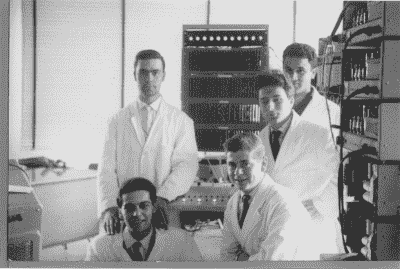
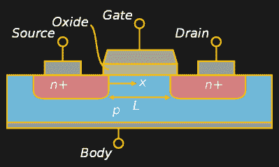
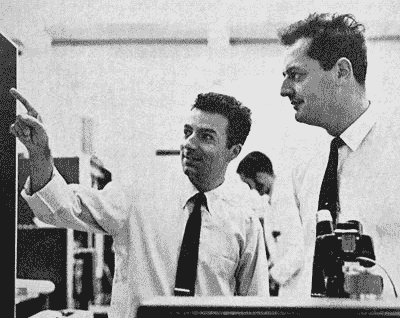
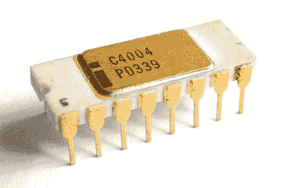
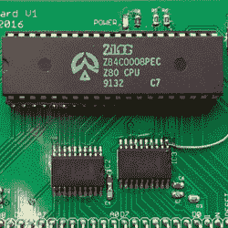
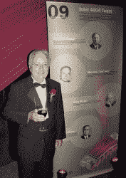

# 费德里科·费金:真正的硅人

> 原文：<https://hackaday.com/2018/06/19/federico-faggin-the-real-silicon-man/>

在为我们关于[发明集成电路](https://hackaday.com/2017/11/07/how-the-integrated-circuit-came-to-be/)、[计算器](https://hackaday.com/2017/11/27/the-flight-that-made-the-calculator-and-changed-the-world/)和[微处理器](https://hackaday.com/2018/01/29/inventing-the-microprocessor-the-intel-4004/)的文章做研究时，一个对我来说很陌生的名字不断出现，那就是费德里科·费金。然而这是一个我应该知道的名字，就像他同时代的著名的基尔比、诺伊斯和摩尔一样。

费金似乎是微处理器许多早期发展的核心。在从 TTL 到 [CMOS](https://hackaday.com/2015/08/03/how-cmos-works/) 的转变过程中，他在 MOS 处理器的开发中发挥了重要作用。他是第一个商用处理器 4004 和 8080 的共同创造者。他是 Zilog 的联合创始人，Zilog 推出了备受喜爱的 Z80 CPU。从那以后，他转向了神经网络芯片、图像传感器，并活跃在意识的科学研究中。是时候让我们近距离观察一个人了，他的核心肯定是由硅构成的。

## 学习电子学

Federico at Olivetti, middle-right. Photo: [intel4004.com](http://www.intel4004.cimg/federico_olivetti.jpg)

费金 1941 年出生于意大利维琴察。他从小就对技术产生了兴趣，甚至上过技术高中。

1961 年 19 岁毕业后，他在奥利韦蒂电子实验室找到了一份短期工作。在那里，他研究了一台小型实验性数字晶体管计算机，它有 4096 个字、12 位磁芯存储器和大约 1000 个逻辑门的 CPU。在他的老板发生严重车祸后，费金接任了项目负责人。这份工作对他未来的职业生涯是一次很好的学习经历。

接下来，他在帕多瓦大学学习物理，并于 1965 年以最优异的成绩毕业。他留了一年教三年级学生电子学。

## 在飞兆半导体创造 MOS 硅栅极技术(SGT)

1967 年，他开始在位于意大利的 SGS-Fairchild，即现在的意法半导体公司工作。在那里，他开发了他们的第一个 MOS(金属氧化物半导体)硅栅极技术(SGT)和他们的第一个两个商业 MOS 集成电路。1968 年，他们把他送到加利福尼亚的硅谷，在飞兆半导体公司工作。

在 20 世纪 60 年代，集成电路的逻辑主要是使用 TTL(晶体管-晶体管逻辑)完成的。两个 T 指的是使用双极结型晶体管进行逻辑运算，然后使用一个或多个晶体管进行放大。TTL 速度很快，但占用大量空间，限制了集成电路的容量。TTL 微处理器也消耗很多能量。

MOSFET, by CyrilB CC-BY-SA 3.0

另一方面，包含 MOSFETs 的 IC 存在制造问题，会导致速度不一致和变化，以及速度低于理论上可能的速度。如果这些问题能够得到解决，那么 MOS 将是集成电路上 TTL 的一个很好的替代品，因为更多的可以被塞进一个更小的空间。MOSFETs 也需要更少的能量。

在 20 世纪 60 年代中期，为了制造铝栅极 MOSFET，将首先定义和掺杂源极和漏极区域，接着是定义薄氧化物区域的栅极掩模，最后是薄氧化物上的铝栅极。

然而，栅极掩模将不可避免地相对于源极和漏极掩模错位。这种不对准的解决方法是使薄氧化区足够大，以确保它与源极和漏极都重叠。但这会导致栅极到源极和栅极到漏极的寄生电容，该电容既大又可变，是速度问题的根源。

费金和费尔柴尔德团队的其他成员在 1966 年至 1968 年间致力于解决这些问题。部分解决方案是首先定义栅电极，然后使用它作为掩模来定义源极和栅极区域，从而最小化寄生电容。这被称为自对准门方法。然而，制造自对准栅极的工艺提出了使用铝作为栅电极的问题。这是通过改用非晶硅来解决的。这种自对准栅极解决方案已经投入使用，但还没有达到可以为商业目的制造 IC 的程度。

Faggin and Tom Klein At Fairchild in 1967, Credit: Fairchild Camrea & Instrument Corporation

1968 年，费金负责开发飞兆半导体的自对准栅极 MOS 工艺技术。他首先致力于非晶硅栅极的精密蚀刻解决方案，然后创建了制造集成电路的工艺架构和步骤。他还发明了掩埋接触，这是一种通过使用附加层在多晶硅栅极和结之间建立直接欧姆连接来进一步增加密度的技术。

这些技术成为飞兆半导体硅栅极技术(SGT)的基础，从那时起，该技术被工业界广泛使用。

费金接着制造了第一个硅栅集成电路，Fairchild 3708。这是对 3705 的替代，3705 是一种金属栅极 IC，实现了一个带解码逻辑的 8 位模拟多路复用器，由于严格的要求，他们很难制造这种多路复用器。在其发展过程中，他进一步改进了工艺，使用磷吸杂来吸收杂质，并用气相沉积法使用的多晶硅代替真空蒸发的非晶硅。

由此产生的 SGT 意味着与 TTL 相比，IC 上可以安装更多的元件，并且功耗要求更低。与之前的 MOS 技术相比，它的速度提高了三到五倍。

## 在英特尔制造第一个微处理器

Intel C4004 by [Thomas Nguyen](https://commons.wikimedia.org/wiki/User:Fouky) CC BY-SA 4.0

Faggin 于 1970 年离开 Fairchild，加入成立两年的英特尔，为 MCS-4(微型计算机系统)项目进行芯片设计。MCS-4 的目标是生产四个芯片，最初用于计算器。

其中一种芯片，4004，成为第一个商业化的微处理器。他在 Fairchild 开发的 SGT 允许他将所有东西都集成到一个芯片上。你可以在我们的文章中读到关于这个发明的所有细节。简单地说，他成功了，到 1971 年 3 月，所有的四芯片都完全正常工作了。

费金的设计方法后来被用于所有早期的英特尔微处理器。这包括 1972 年推出的 8 位 8008 和 1974 年推出的 4040，后者是 4004 的改进版本，费金在其中起了监督作用。

与此同时，同样在 4004 上工作的 Faggin 和 Masatoshi Shima 都为 8080 开发了设计。它于 1974 年发布，是第一款高性能 8 位微处理器。

## 创造 Z80

1974 年，法金离开英特尔，与拉尔夫·昂格曼(Ralph Ungermann)共同创立了 Zilog，专注于制造微处理器。在那里，他与从英特尔加盟的 Shima 共同设计了 Z80。Z80 与 8080 软件兼容，但速度更快，寄存器和指令的数量是 8080 的两倍。

直到 20 世纪 80 年代中期，Z80 一直是家用电脑中最受欢迎的 CPU 之一，通常运行 CP/M OS。一些著名的计算机是希斯基特 H89，奥斯本 1，凯普罗系列，一些 TRS-80，以及一些天美时/辛克莱计算机。Commodore 128 与 8502 一起使用，以实现 CP/M 兼容性，许多计算机可以将其作为附加设备使用。我自己的经验是通过 Dy4。

这是一个 CPU，毫无疑问，许多黑客读者会有美好的回忆，并且直到今天仍然在制造计算机，一个这样的例子是[这个 Z80 Raspberry Pi 的外观](https://hackaday.com/2017/06/03/z80-based-raspberry-pi-look-alike/)。

Z80 以及 Faggin 构想的 Z8 微控制器至今仍在生产。

## 连续创业者

1984 年离开 Zilog 后，Faggin 创建了他的第二个创业公司 Cygnet Technologies，Inc .在那里，他构思了[通信系统](https://patents.google.com/patent/US4524244A)，这是一种位于计算机和电话线之间的设备，允许在同一会话中发送和接收语音和数据。

1986 年，他与卡弗·米德共同创立了 Synaptics，并成为首席执行官。最初，他们在人工神经网络中做了 R&D，并在 1991 年生产了第一个单片光学字符识别器 I1000。1994 年，他们推出了触摸板，随后是早期的触摸屏。

2003 年至 2008 年间，Faggin 担任 Foveon 的总裁兼首席执行官，他将公司业务转向图像传感器。

At the Computer History Museum, by Dicklyon CC-BY-SA 4.0

## 奖项和颁奖日

费金获得了许多奖项和奖励，包括马可尼奖、京都先进技术奖、计算机历史博物馆院士，以及奥巴马总统授予他的 2009 年国家技术和创新奖章。1996 年，他因参与发明微处理器而入选国家发明家名人堂。

2011 年，他和妻子成立了 Federico and Elvia Faggin 基金会，这是一个非营利组织，通过理论和实验研究支持对意识的研究，这是他在 Synaptics 工作期间产生的兴趣。他在基金会的工作现在是他的全职活动。

1968 年，他和妻子从意大利搬到了加州的硅谷，现在他仍然住在那里。一个适合硅人的家。