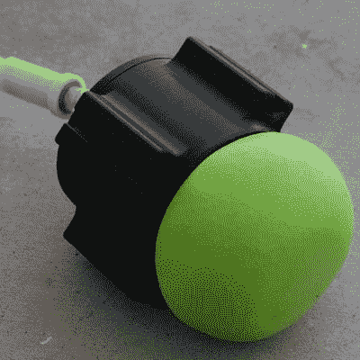

# 两个令人敬畏的安德的成就

> 原文：<https://hackaday.com/2018/06/15/two-awesome-enders-achievements/>

Hackaday 奖旨在为您提供创造下一个伟大硬件设备所需的工具。为此，我们为您的项目设立了种子基金，为您提供了项目托管网站，最重要的是，Hackaday 让您有机会与全球成千上万志同道合的硬件黑客交流。

并不是所有的黑客下班后都在车库里瞎折腾。有些人在宿舍里值夜班，平衡课程、作业、黑客和生活。学生黑客们，我们以安德的成就向你们致敬！

This robotic gripper is the solution to robotic gripping

[由[cole b.]和亚利桑那州制造商集体的一群学生开发的模块化通用干扰手爪是每个机器人都需要的东西。这是一种可以让机器人捡起任何东西的装置。旧的方法是通过奇特的机器人手指，也许是一个 Armatron，或者如果你有足够的年份或放射性，一个 Waldo。这和那完全不一样。这基本上是一个装满沙粒的气球，而不是机器人手指。为了使用它，机器人将这个粘糊糊的球塞在一个物体上，并吸出气球中的空气。其结果是末端效应器可以锁定任何小物体。](https://hackaday.io/project/158551-modular-universal-jamming-gripper)

像这样的设备以前也有过。巧合的是，我们见过的最早的类似项目也是来自工程学院的学生。然而，[科尔]和他的团队确实在改进这种设备，使其可以 3D 打印，制造成本更低。这是一个令人惊叹的项目，如果你不[查看项目页面](https://hackaday.io/project/158551-modular-universal-jamming-gripper)，你会给自己造成伤害。

如果你想要更多的证据来证明学生是我们的未来，我们应该教好他们，让他们带头，[看看这个 3D 打印机项目](https://hackaday.io/project/114738-autonomous-infinite-3d-printing-workhorse-3d)。

大多数 3D 打印机一次只能打印一个对象。当然，你可以用一堆物体来加载你的构建平台，但事实仍然是 3D 打印是一个批处理过程。[Swaleh]的主力 3D 改变了这一切。这是一台带传送带的 3D 打印机。当然，它侵犯了 MakerBot 的专利，但这不是重点。这是一台打印机，只需一点点 g 代码破解，就能生产无限量的物体。当一个打印完成时，它从床尾滚下，另一个打印开始，中间没有任何停机时间。这是一个桌面上的工厂，太神奇了。[Swaleh]是一名机械工程专业的学生，这意味着尽管他比我们其他人有更多的家庭作业，但他仍在建造这个。

像所有学生参加 Hackaday 奖的项目一样，这些项目获得了一项成就。是的，我们今年在为项目做成绩，这两个人因为令人难以置信的学生参赛作品获得了 [Ender 的成绩](https://hackaday.io/list/96829-2018-prize-enders-achievement)。不，这不是额外的奖励或积分或任何类似的东西；只是对学生所做的惊人项目的认可。这些都是最好的，如果你是一个参加了 Hackaday 奖项目的学生，我们会非常乐意将 Ender 的成就授予你的项目。

The [HackadayPrize2018](https://hackaday.io/prize) is Sponsored by:     