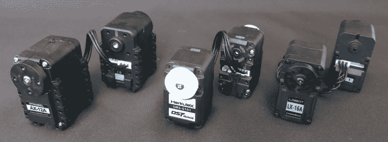
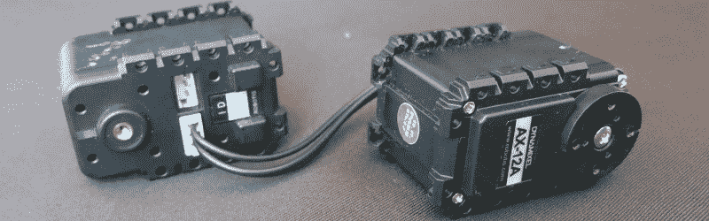
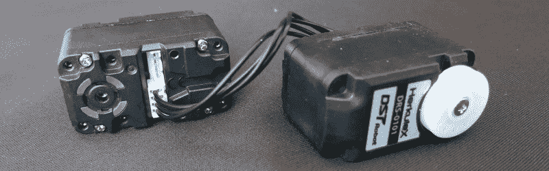

# 争论钢筋混凝土伺服成为一个麻烦？尝试串行总线伺服！

> 原文：<https://hackaday.com/2018/07/05/wrangling-rc-servos-becoming-a-hassle-try-serial-bus-servos/>

当我们的项目需要执行器时，来自遥控爱好者世界的伺服系统是一个受欢迎的解决方案。尽管随着伺服数量的增加，保持它们的电线整洁和管理它们的控制信号成为一个挑战。一旦我们开始运行比我们的手指和脚趾更多的伺服系统，就值得考虑串行总线的多样性。今天，我们将讨论它们是什么，并检查市场上的三种产品。

## 我们的朋友遥控伺服

遥控业余爱好伺服是了不起的小装置。每一个都是一个独立的闭环致动器，价格和扭矩范围很广。它们的流行意味着我们有大量的硬件来驱动它们和软件库来控制它们。对于快速和简单的黑客攻击，他们不会被击败。但是当一个项目变得越来越复杂时，爱好伺服系统的简单明了就成了限制。

*   ***通讯* :** RC 伺服信号只去出站。没办法把信息拿回来。是守住了指定位置还是被推离了目标？它运行正常还是过热了？伺服连接器是否被震松，断开连接？我们的管制员无从得知。
*   ***软件缩放* :** 每个伺服系统都需要自己精确定时的控制脉冲。随着项目中伺服数量的增加，需要更强大的控制器或独立的专用外设来保持所有伺服的精确脉冲。
*   ***硬件扩展* :** 每个伺服系统都需要自己的电线来传送精确定时的脉冲。随着伺服数量的增长，驯服相应增长的电线[也带来了挑战](https://hackaday.com/2018/03/23/servos-do-the-plucking-in-this-midi-music-box/)。

## 输入串行总线伺服

开始遇到这些问题的项目可能会受益于串行总线伺服。它们在机械上类似于我们都知道和喜爱的 RC hobby 伺服系统:一个齿轮马达与一个位置传感器相连，用于闭环反馈。它们的不同之处在于控制方案，使用 [TTL 串行](https://www.sparkfun.com/tutorials/215)与我们的控制器通信。

所有的伺服系统都是并联的(相互之间以及与控制器之间)，将一条串行线变成了一条串行总线。虽然串行通信通常在两个端点之间进行，但伺服控制协议的设计使得哪一个设备在说话是明确的。每个人都在共享的串行总线上很好地合作，避免了数据冲突，并让他们解决了上述问题。

*   ***通讯* :** 双向串行通讯允许查询伺服状态。控制器现在可以找出是否伺服到位或过热，并知道伺服是否不再响应。
*   ***软件缩放* :** 一旦接收到命令，串行总线伺服无需进一步维护。摆脱了产生规则脉冲的需要，我们的控制器可以从事其他工作。
*   ***硬件扩展* :** 由于单个伺服系统不需要一根专用电线连接控制器，它们可以与附近的伺服系统共享电源和信号线。这种自由打开了布线的可能性，对于具有多关节肢体的机器人尤其有用。(像[六足机器人](https://hackaday.com/2014/02/25/hexapod-robot-terrifies-humans-and-wallets/)和[小型人形机器人](https://hackaday.com/2014/03/25/open-source-humanoid-robot-is-awesom-o/)。)每个分支只需要一组导线，该分支上的每个伺服机构与下一个伺服机构菊花链连接。

## 三个伺服系统的故事

建立了一般概念后，让我们来看看市场上的三种产品。他们在个人项目中接受了[评估，因为他们都具有以下特征:](https://hackaday.io/project/158208-sawppy-the-rover)

*   ***记录命令协议*** :伺服制造商提供软件工具来控制他们的伺服系统，但任何人想编写自己的定制软件都可以很容易地做到。这三家公司都发布了他们的伺服命令集的文档。
*   ***变速* :** RC 伺服总是会尽可能快地移动到它的位置，这并不总是我们想要的。这些伺服系统可以被命令以指定的速度和/或在指定的时间段内移动到某个位置。
*   **:一个普通的 RC 伺服黑客通过切除任何物理终点挡板和修改位置传感器，将它们从位置致动器改变为变速齿轮马达。相比之下，这些伺服系统可以通过发送命令切换到连续旋转(或切换回来)。不需要黑客。**
***   ***超过 250 个伺服*** :理论上至少。控制协议要求为总线上的每个伺服系统分配一个唯一的地址。这个识别地址是一个 8 位数字，减去几个保留值，仍然剩下 250 多个有效 id。在我们用完地址空间之前，我们就会遇到电信号完整性问题(在许多设备之间分配一条串行线)。*   ***广播地址*** :说到预留地址，其中一个就是广播 ID。没有伺服可以分配给它，但他们都听从命令发送给它。这在两种情况下很有用:
    1.  ***查询 ID*** :当总线上只有单个伺服时，我们可以广播“你的 ID 是什么？”查询，服务器将使用其实际 ID 进行响应。当我们有一个伺服在手，但失去了先前分配给它的 ID 跟踪时，这是有用的。
    2.  ***协调动作*** :我们一次只能向一个伺服系统发送命令，但有时多个伺服系统一起动作很重要。为了协调行动，伺服命令可以推迟:“伺服 1，到我的信号 X。”"伺服 2 号，听我的信号去 Y . ""伺服 3 …"。一旦单个伺服系统接到命令，就会发出“现在，出发！”命令触发等待伺服系统立即行动。*   **:这些伺服系统可以直接从锂化学电池组(Dynamixel AX-12A 的 3 节电池，其他两节电池)获取电机功率，无需外部电压调节器。****

 ****这些对于他们来说都是非常有用的特性，但是这三个伺服系统在某些方面也有所不同，这对于一个特定项目的需求来说可能是非常重要的。

*The Seasoned Veteran*

### 机器人动力公司 AX-12A

Robotis 的 Dynamixel 系列是这个市场上最成熟的产品。爱好者和研究实验室可以在 Hackaday.io 和其他地方的许多项目中找到它。Dynamixel 拥有强大的文档和软件支持，从低级的[串行命令参考](http://emanual.robotis.com/docs/en/dxl/ax/ax-12a/)到高级的第三方库，如 [pypot](https://github.com/poppy-project/pypot) 。AX-12A 是大型产品线的入门级产品，因此如果一个项目超出了它的伺服范围，有很多升级选项。AX-12A 通过半双工串行通信，其中发送线和接收线合并成一根线。我们需要[构建自己的电路](http://emanual.robotis.com/docs/en/dxl/ax/ax-12a/#ttl-communication)来设置 Dynamixel 串行总线，或者购买像 [U2D2](http://emanual.robotis.com/docs/en/parts/interface/u2d2/) 这样的适配器。

*Feature packed and easiest to connect*

### [DST 机器人 HerkuleX DRS-0101](http://www.dstrobot.com/jsp/cms/view.jsp?code=100788)

DST Robot 的 HerkuleX 系列以与同等 Dynamixel 大致相同的价格提供了更多功能。除了指定速度，它还具有独特的能力[指定加速度/减速度](http://www.dongburobot.com/jsp/board/boardDown.jsp?bseq=7672)，使机器人运动更加平稳。DRS-0101 也是产品线中的入门级产品，尽管该产品线在功能或价格方面都不如 Dynamixel。至于连接性，HerkuleX 是最容易使用的。HerkuleX 串行发送和接收线可以直接连接到控制器。不需要像其他两个半双工转换电路。

*No-frills economy class*

### [莱万索尔 Lobot LX-16A](http://www.lewansoul.com/product/detail-146.html)

LX-16A 最引人注目的特点是它的低成本，大约是 Dynamixel AX-12A 的三分之一，大大降低了入场费。显然，这个价格点需要做出一些权衡。在软件方面，它的[命令集](https://www.dropbox.com/sh/b3v81sb9nwir16q/AACkK-tg0q39fKJZcSl-YrqOa/LX-16A%20Bus%20Servo?dl=0&preview=LewanSoul+Bus+Servo+Communication+Protocol.pdf)比其他的功能要少。例如:只能为位置模式指定协调动作，而不能为连续旋转模式指定。硬件方面的一个例子是安装系统。LX-16A 安装螺钉不同于其他的细牙机械螺纹，而是将粗牙螺纹自攻到塑料中。但是一个有用的伺服系统的基础是金属齿轮提供有竞争力的扭矩和速度。升级选项仅限于小型的 LewanSoul 串行总线伺服产品线，LX-16A 只有一个同类产品。连接到 LX-16A 需要 LewanSoul 自己的“总线链接器”板(有时是“调试板”)将 TTL 串行信号转换为半双工串行通信。

## 连环黑客的连环伺服系统

这些快速概述应该有助于判断哪些串行总线伺服作出良好的项目候选人。显然，在它们各自的规格中有更多信息，我们在此不再赘述。完整记录的伺服命令意味着这些伺服系统可用于任何平台，而不仅仅是制造商软件支持的平台。从 8 位 PIC 到 Raspberry Pi 再到成熟的 PC，任何平台都可以使用串行总线伺服控制高度复杂的机器人。

更多的伺服系统，更多的运动度，更多的乐趣！你会建造什么？****