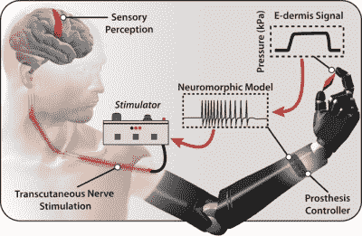

# 真皮:在你(假肢)指尖的感觉

> 原文：<https://hackaday.com/2018/06/24/e-dermis-feeling-at-your-prosthetic-fingertips/>

当我们失去一条肢体时，大脑真的一点也不聪明。它继续向外发送信号，但由于它们不再有目的地，这个人就陷入了单向通信和幻肢的感觉。就假肢而言，大脑继续运转的事实一直很有希望，因为这意味着电信号可能被用来以自然的方式控制新的肢体和手指。

A diagram of the e-dermis via [*Science Robotics*](http://robotics.sciencemag.org/content/3/19/eaat3818/tab-figures-data).

这对增加上肢假肢的触觉也是一个好消息。约翰霍普金斯大学的研究人员花了一年时间测试他们的电子真皮概念，这是一种多层方法，旨在扩展假肢的效用，可以检测物体的曲率和锐度。

像真实的皮肤一样，电子真皮有一个外部表皮层和一个内部真皮层。这两层都使用导电和压阻纺织品将有形物体的信息传输回肢体的周围神经。e-真皮通过使用[经皮电神经刺激](https://en.wikipedia.org/wiki/Transcutaneous_electrical_nerve_stimulation)，更好地被称为 TENS，通过皮肤非侵入性地做到这一点。[这里是发表在*科学机器人*上的完整文章](http://robotics.sciencemag.org/content/3/19/eaat3818.full)的链接。

首先，研究人员制作了一个向神经系统传递信号的所有神经和受体的神经形态模型。为了测试电子真皮，他们使用了设计用于拇指和食指之间抓握的 3d 打印物体，并通过脑电图监测受试者的大脑活动。

目前，电子真皮仅限于指尖。理想情况下，它将覆盖整个假体，并能够检测温度以及曲率。别走开，因为这是他们的下一个目标。

说到曲调，[这里有一个使用神经网络实现个人手指控制的假肢，并允许它的主人再次弹奏钢琴](https://hackaday.com/2018/01/08/ai-prosthesis-is-music-to-our-ears/)。

谢谢你的提示，[Qes]。