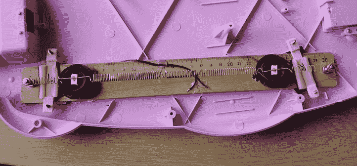

# 电路弯曲键盘是漂亮的粉红色

> 原文：<https://hackaday.com/2018/06/24/circuit-bent-keyboard-is-pretty-in-pink/>

如果你和我们一样，你的很多项目都是因为你有一些很难处理的设备急需重生。不管是旧的还是从垃圾堆里捡出来的，我们都曾有过这样的硬件，以目前的形式来看，它们可能一文不值，但却是预热烙铁的绝佳借口。

当[joekutz]得到这个特别幼稚的键盘玩具时，就发生了这样的事情。在最初的状态下，它是如此的简单，甚至不能可靠地检测到两个键同时被按下；对键盘来说有点问题。[于是他决定把它拆开，把它当成一个弯道游乐场](https://hackaday.io/project/159028-an-exercise-in-circuit-bending)。部分归功于机箱内的自由空间，他能够进行一些有趣的修改，他在 Hackaday.io 上详细介绍了这些修改。

【Joe kutz】一开始在设备上增加了一个耳机插孔，以及一个禁用键盘扬声器的开关。这不仅允许私下听数字音乐，还可以在连接到电脑时捕捉高质量的音频。然后，他开始用一个电阻在印刷电路板上戳来戳去，倾听变化。当键盘的音高发生变化时，他将一个电位计焊接到它的位置上，现在有了一种动态调整的方法。

特别值得注意的是他提出的巧妙的物理混响。麦克风和扬声器通过用旧吉他弦制成的弹簧相互连接。来自键盘 PCB 的音频在扬声器上播放，TDA2022 低压放大器增强来自麦克风的信号。最终的结果是一个非常酷的空灵的金属效果。

如果你正在寻找一个稍微大一点的 DIY 混响(T1)，我们[已经在过去](https://hackaday.com/2013/10/14/build-a-diy-plate-reverb/)中涵盖了一些构建，这应该会给你一些灵感。你可能想在废弃的当地玩具反斗城后面的垃圾箱[里找找捐赠的键盘。](https://hackaday.com/2018/03/22/geoffrey-the-giraffes-last-call-of-toys-for-hacking/)

 [https://www.youtube.com/embed/QOSRT6gxM-8?version=3&rel=1&showsearch=0&showinfo=1&iv_load_policy=1&fs=1&hl=en-US&autohide=2&wmode=transparent](https://www.youtube.com/embed/QOSRT6gxM-8?version=3&rel=1&showsearch=0&showinfo=1&iv_load_policy=1&fs=1&hl=en-US&autohide=2&wmode=transparent)

