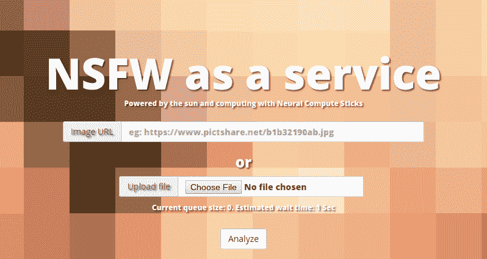

# 太阳能 Pi 集群搜索互联网裸体

> 原文：<https://hackaday.com/2018/07/06/solar-pi-cluster-scours-internet-for-nudes/>

互联网上似乎有一个普遍的真理:如果你向世界开放一项服务，最终会有人进来试图把它搞糟。如果你有一个评论区，巨魔就会进来，用迂腐的抱怨填满它(反正我们已经听说了，自然我们对这种事情没有经验)。如果你有一个人们可以上传文件的服务，那么它保证了一些令人讨厌的东西最终会占据你的服务器。

 不幸的是，这正是【克里斯蒂安·哈斯切克】在开发他的开源图片托管平台 PictShare 时发现的情况。PictShare 上一些令人讨厌的图片引起了他的注意，在他处理了这些图片后，他意识到这些可能是众所周知的冰山一角。但是系统上的图片太多了，无法手动检查。[他决定建立一个系统，利用训练有素的神经网络搜索 NSFW 图像](https://blog.haschek.at/post/f0a4e)。

裸体嗅探集群由三个 Raspberry Pi 计算机组成，每个计算机都有自己的 Movidius 神经计算棒来执行繁重的任务。[Christian]解释了他是如何安装 compute stick SDK 和雅虎的开源学习模块来识别有问题的图像的，这个模块被恰当地命名为 open_nsfw 。该系统可以通过向系统添加更多 pi 来扩展，由于它都是 ARM 处理器和计算棒，因此它的能效足够高，整个系统可以使用 10 瓦的太阳能电池板。

在用一个用户可以扫描他们自己的图像的公共网络界面打开这个系统后，他向一个大型图像托管提供商提供了他的系统服务，看看它会找到什么。令人震惊的是，该系统能够找到超过 3000 张包含可疑儿童色情内容的图片。相关部门得到了通知，[Christian]鼓励任何想在他们的服务器上搜索这类内容的人给他写信。真正的好黑客。

这不是我们第一次看到英特尔的 Movidius 计算棒在野外运行。，当然，我们已经看到了我们的树莓 Pi 集群的公平份额。从[的 750 个节点怪物](https://hackaday.com/2018/01/24/firing-up-750-raspberry-pis/)到[的建造远比围棋](https://hackaday.com/2017/10/11/terrible-cluster-of-pis/)更精彩。