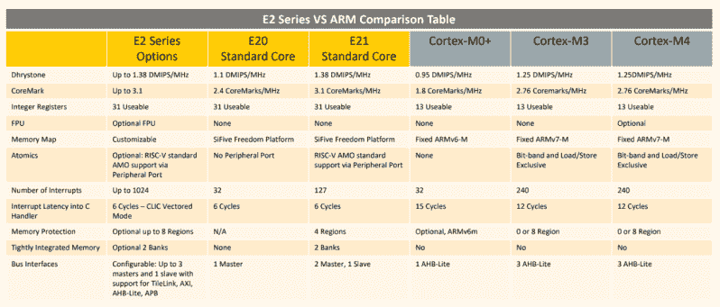

# SiFive 发布更小、更低功耗的 RISC-V 内核

> 原文：<https://hackaday.com/2018/06/25/sifive-releases-smaller-lower-power-risc-v-cores/>

今天，SiFive 发布了两款专为低端计算设计的新内核。这增加了该公司现有的基于开放 RISC-V ISA 的微控制器和 SOC 产品组合。在过去的两年里，SiFive 推出了许多基于 RISC-V ISA 的内核，这是一种开放架构 ISA，允许任何人设计和开发微控制器或微处理器平台。这两个新内核填补了 SiFive 内核组合的低功耗端。

宣布中包括的两个新内核是 [SiFive E20 和 E21](https://www.sifive.com/products/risc-v-core-ip/e2/) ，这两个内核都是针对低功耗应用的，根据 SiFive 的介绍，它们沿着 ARM Cortex-M0+和 ARM Cortex-M4 的路线。这是一个核心——它还不是一个芯片——但自从 SiFive 的第一批微控制器推出以来，许多公司都加入了 RISC-V 的行列。例如，Western Digital 已经承诺在 SOC 中使用 RISC-V 架构，并将其用作硬盘驱动器、固态硬盘和 NASes 的控制器。

SiFive 的第一款芯片是基于 SiFive E31 CPU 的 HiFive 1。去年初，我们得到了 HiFive 1 ，它是一个庞然大物。对于标准的基准补充，就原始功率而言，它大约是基于 180 MHz ARM Cortex-M4F 的 Kinetis K66 的 Teensy 3.6 的两倍。在每时钟纯计算的基础上，SiFive E31 的速度大约是 Teensy 3.6 的 1.5 倍。这很了不起，因为 Teensy 3.6 是我们的首选标准，当你想用一个便宜、现成的微控制器平台快速切换引脚时。

但是有时候你不需要最快或者最好的微控制器。为此，SiFive 正在寻找一种基于 RISC-V 内核的低功耗微控制器。新产品基于 E2 Core IP 系列构建，具有两个标准内核。E21 内核为微控制器提供主流性能，E20 内核是 SiFive 提供的最节能的内核。实际上，E21 内核是 ARM Cortex-M3 和 Cortex-M4 的替代品，而 E20 则是 ARM Cortex-M0+的替代品。

就在几个月前，SiFive 发布了一款巨大的多核 Linux 处理器[，名为 HiFive Unleashed](https://hackaday.com/2018/02/03/sifive-introduces-risc-v-Linux-capable-multicore-processor/) 。由于支持 DDR4 和千兆以太网，这种芯片将更适合放在台式机上，而不是物联网设备上。有史以来最受欢迎的发动机不是 7 升涡轮增压柴油发动机，而是本田 econobox 的任何部件；同样，更多的低功耗微控制器，如 Cortex-M0 和 Cortex-M3，比更新，更强大，更昂贵的芯片销售。即使它不像新的工作站 CPU 那样令人兴奋，但这个世界需要微控制器，而且越开放越好。