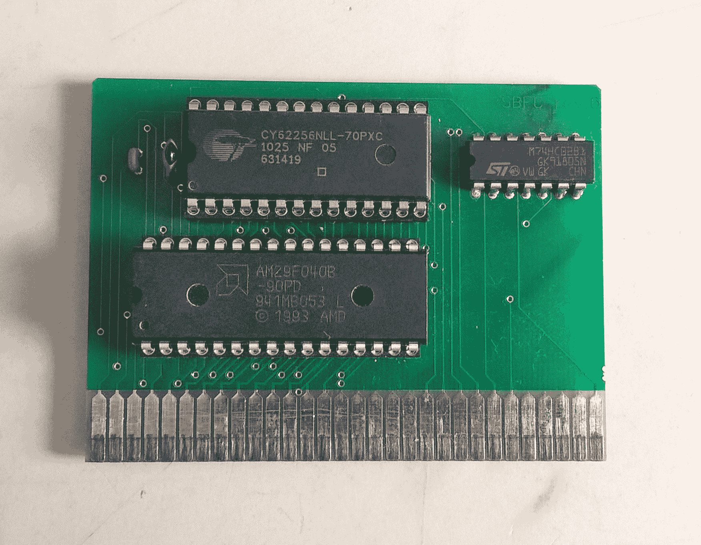

# ESP8266 家用电脑藏着意想不到的宝石

> 原文：<https://hackaday.com/2018/06/27/esp8266-home-computer-hides-unexpected-gems/>

ZX Spectrum 和 Commodore 64 这样的家用电脑有一个基本的解释器，而且在硬件上可以自由运行，这曾经是点燃黑客之火的普遍方式。随着像 Raspberry Pi 这样的廉价单板计算机的出现，专门用来模拟这些经典系统的设备已经变得相当普遍。[uli]以这种方式建造了一个名为[的基本引擎](https://basicengine.org/)的设备，它由一个微控制器和一些硬件外设驱动。像其他例子一样，它可以连接到键盘上，用 BASIC 编程，播放视频和声音等。但深入研究基本引擎会发现，它与其他设备的相似性只是表面现象。

为了方便起见，基本引擎的当前版本(“rev2”)位于 Raspberry Pi 3 外壳中。它有用于 NTSC 或 PAL 视频输出和单声道音频的 RCA 连接器，加上一组用于接入 GPIOs 的接头，键盘连接器等等。[uli]希望以极低的成本为目标，因此像 Raspberry Pi 这样相对结实的主板不符合要求，我们希望这是一个令人愉快的挑战。相反，它的解释器运行在 ESP8266 之上，但去掉了网络堆栈。[uli]甚至对一个“Hello world”程序的臃肿感到沮丧，并把它撕了出来，发现在它下面隐藏着一个非常强大且非常便宜的通用微控制器。视频由一个 [VS23S010](http://www.vlsi.fi/en/products/vs23s010.html) 驱动，作为 1 Mbit 并行 SRAM 出售，有一个巧妙的技巧；它还包括一个复合视频控制器！

这里真正的享受是【uli】的[历史记录](https://basicengine.org/history.html)关于基本引擎是如何产生的。我们建议泡一杯咖啡，坐下来通读一遍。第一个版本的灵感来自于 [PlayPower](http://playpower.org/) 项目，该项目将任天堂的 Famicom(美国人眼中的 nes)游戏控制台的克隆产品重新用于制造低成本家用电脑，配有键盘和游戏手柄输入。[uli]一开始是为运行 BASIC 解释程序的特定 Famicom 克隆构建一个定制的墨盒，但在向不感兴趣的成年人展示后，该项目就被搁置了。几年后，[乌里]被鼓励再次拿起这个项目，沿着一个扭曲的兔子洞走到我们今天的位置。

如果你想为自己构建一个基本的引擎，Gerbers 和构建说明可以在上面链接的页面上找到。

谢谢你的提示[抗体]！