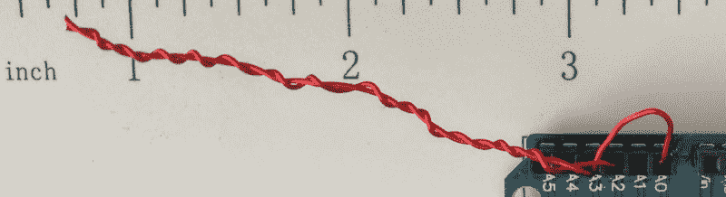
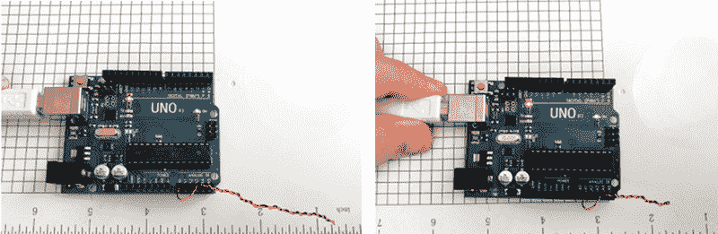

# 这些电容器是廉价的噱头

> 原文：<https://hackaday.com/2018/07/03/these-capacitors-are-a-cheap-gimmick/>

如果你搜索一本电气工程教科书，你可能找不到短语“噱头电容器”,但每个老业余无线电爱好者都知道它们。当你需要一个未知值的非常小的电容时，它们就派上了用场。例如，如果您试图平衡电路中的杂散电容，您可能不知道确切需要什么值，但您知道不会太多。那就是你想要一个噱头电容的时候了。

一个噱头电容器是用两股绝缘线绞在一起制成的；扭结的长度和松紧决定了电容。收紧或放松扭曲，或修剪掉一些电线，使其可调。

这种情况最常见于 RF 设备或高速逻辑，因为电容很小，通常约为每英寸绞线 1 至 2 pF 左右。绝缘层越厚，电容越小，所以通常使用磁线或其他薄绝缘层的东西。你可以更进一步，通过去掉一根电线来减小间距，只要它不会碰到其他任何东西。

显然，绝缘需要足够好，以适应其上的电压，例如，在电子管电路中这是一个重要的考虑因素。但除此之外，一个噱头电容器是一个简单的工具，在你的设计技巧盒。我们能更进一步吗？

## PC 板噱头

你可能想知道这项技术是否能应用于 PC 板。答案是肯定的——算是吧。除非使用非常薄的电路板，或者多层板中的薄层，否则即使是很小的电容也需要占用大量电路板空间。此外，典型的 PCB 材料会随着时间的推移因潮湿或其他因素而发生变化。实际上，除非你使用特殊的板材和厚度，它不是很有用。已经有工作在使用分形在 IC 衬底上布局[线性电容器，但是我们不确定这将如何转化为 PCB 布局。我们已经看到许多其它 PC 走线元件，如天线、分流电阻、电感和传输线。](http://smirc.stanford.edu/papers/isscc98s-Hirad.pdf)

你可以看到我做了一个比两英寸大的装置。然后，我在实验室里寻找能够测量如此小电容的东西。组件测试器不能。我有一个很好的数字万用表，它有一个特殊的插件，用于测量电容器和热电偶，但它不会可靠地读取 25 pF 以下的任何数据。当我意识到[我应该首先搜索 hack aday](https://hackaday.com/2014/01/22/capacitance-measurement-with-the-arduino-uno/)时，我正在考虑建立一个电路来测试。

## 黑客日拯救了世界

[Jonathan 的]电容计正是我所需要的，我甚至把它扔给了一个已经使用 Arduino Create web 界面连接的 Arduino，所以这很容易。我实际上使用了较新的“马克 2 号”代码，但它对我测量的低值也同样有效。我用花园品种 10 pF 陶瓷校准。它可能不是那么准确，但我真的只想看到比实际值更多的变化，所以我认为这已经足够了。

两英寸(称之为 6 厘米)的噱头读取约 5.5 pF。这可能不完全准确，但我预计约为 4.5 pF，磁线绝缘相当薄，所以它在正确的范围内。让我们把它作为衡量变化的基线。然后我切掉大约 1.5 厘米的电容——大约 25%——读数变成了 3.7 pF。再增加一厘米就降到了 2.6 pF。

当然，手动上弦的音高不是很准确，我的切割或测量也不是很准确，但那只是每厘米 1 pF 左右。显然，你的结果将取决于你的绕组和你使用的电线的种类。【Harry ly thall】[建议](http://213.114.131.21/begin/gimmik-0.htm)将一根金属丝折叠起来，用钳子夹住，然后扭转。然后你完成后切断循环。

## 那是一个包裹

 我们很容易忘记，任何两个彼此靠近的导体都会有电容。另一种常见的临时电容是一段同轴电缆，一端连接，另一端开路。例如，RG-8 约为每英尺电缆 30 pF。甚至有一个[在线计算器会告诉你对于任何给定的值，你需要多少哄](https://mikeyancey.com/hamcalc/capacitors_from_coax.php)。当然，这取决于同轴电缆的类型，所以记得剪短一点，修剪整齐！

下次你需要一个小的可调电容时，尤其是在实验室环境下，别忘了这个小玩意。如果你尝试更大的值，一定要试验不同种类的线。我们已经在 [RF 滤波器](https://hackaday.com/2017/03/30/real-world-rf-filter-design-and-construction/)中见过这种技巧。在这种噱头的情况下，你可能会想得很小，但当你真的在寻找[高压电容器](https://hackaday.com/2015/08/02/homemade-high-voltage-caps/)时，你也可以制造那些。